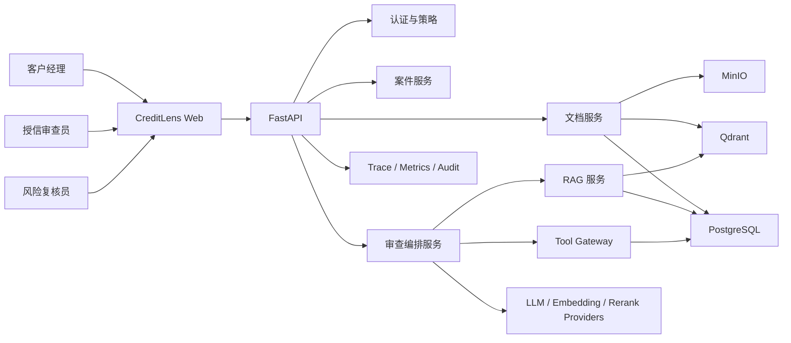
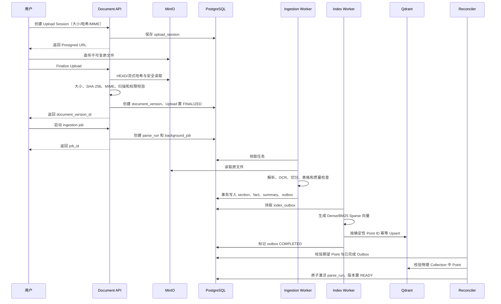
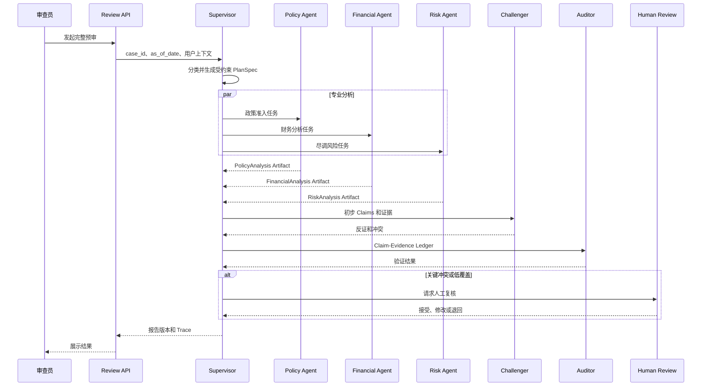
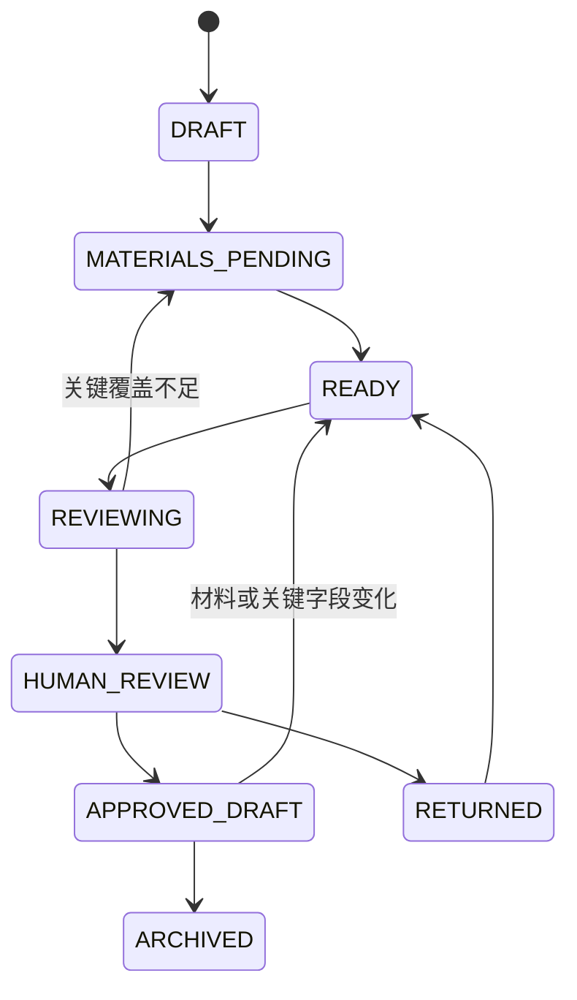
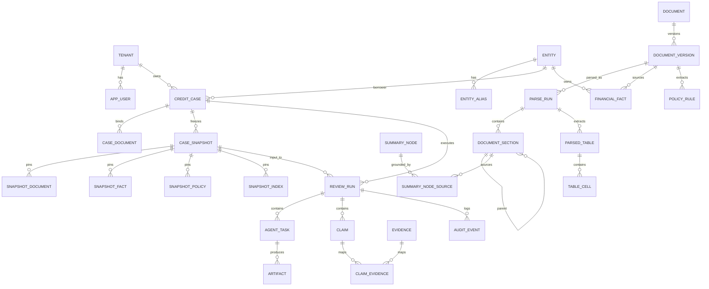
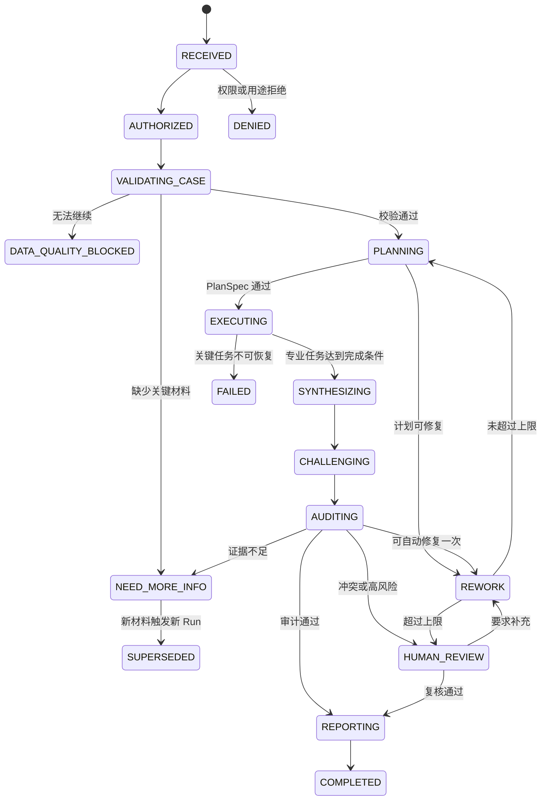

# CreditLens：小微企业授信尽调与审查 Multi-Agent 系统

> 技术实现文档 / Technical Design Document  
> 文档版本：v0.2  
> 基线日期：2026-07-28  
> 状态：实现基线  
> 目标读者：项目开发者、AI 应用工程师、后端工程师、评测人员

---

## 0. 文档说明

### 0.1 文档目的

本文档是 CreditLens 从原型到可演示系统的全程实现参考，覆盖：

- 业务需求、范围与验收标准；
- 技术栈选择及替代方案；
- 离线文档处理、双库存储和索引一致性；
- 摘要索引、Query Rewrite、多路召回、融合、精排和引用校验；
- 中心化 Multi-Agent 的状态机、工具权限、Artifact Contract 和 Human-in-the-loop；
- API、数据模型、部署、可观测性、安全、测试与评测；
- 六周实现路线和每阶段 Definition of Done。

本文档不是银行真实授信制度，也不构成信贷建议。系统定位是“授信审查辅助与证据整理”，不自动作出授信、拒贷、定价或额度决定。

### 0.2 快速导航

- [范围与需求](#2-范围与需求)
- [技术栈选型](#3-技术栈选型)
- [总体架构](#4-总体架构设计)
- [领域模型与状态](#5-领域模型与状态)
- [数据架构](#6-数据架构)
- [文档入库](#7-文档入库与知识构建)
- [深度 RAG](#8-深度-rag-实现)
- [结构化事实和公式](#9-结构化事实sql-与公式引擎)
- [中心化 Multi-Agent](#10-中心化-multi-agent-实现)
- [Tool Gateway 与 HITL](#11-tool-gateway-与-human-in-the-loop)
- [安全与权限](#12-安全权限与合规边界)
- [可靠性](#13-可靠性幂等与失败恢复)
- [API](#14-api-设计)
- [可观测与审计](#15-可观测性与审计)
- [评测](#16-评测设计)
- [测试](#17-测试策略)
- [部署](#18-部署设计)
- [开发路线](#20-开发路线与-definition-of-done)
- [MVP 验收](#21-mvp-验收清单)
- [第一阶段任务](#24-第一阶段实施任务清单)

### 0.3 设计原则

1. **证据优先**：系统输出的事实性结论必须能回到原文、表格单元格、SQL 快照或确定性计算。
2. **关系库是事实源**：PostgreSQL 保存业务事实、版本、权限和审计；向量库是可重建的检索索引。
3. **时点优先于新旧**：政策适用性由案件 `as_of_date` 决定，不默认“越新越好”。
4. **确定性控制、受约束推理**：状态流转、权限、数字计算、日期过滤由代码控制；LLM 只在允许的节点推理。
5. **先基线、后增强**：先完成 Dense-only 和单 Agent 基线，再以消融实验证明 Rewrite、摘要、多路召回、Rerank、Multi-Agent 的增益。
6. **信息不足即暴露不足**：缺少材料、证据冲突、OCR 质量低时，系统应降级、拒答或进入人工复核。
7. **MVP 严格控域**：仅实现一个贷款产品、一个主要行业、一套合成内部政策和一条完整预审流程。

### 0.4 已确定的 MVP 假设

| 项目 | MVP 决策 |
|---|---|
| 贷款产品 | 小微企业流动资金贷款 |
| 主要行业 | 制造业 |
| 申请金额 | 演示案件 500 万元，可配置 |
| 数据范围 | 公开监管文件、公开上市公司年报/XBRL、合成授信申请、合成流水、合成行内政策 |
| 用户角色 | 客户经理、授信审查员、风险复核员、系统管理员 |
| 输出 | 授信预审草稿、风险清单、政策核验、财务指标、缺失材料、Claim-Evidence Ledger |
| 决策边界 | 只辅助分析，不自动通过或拒绝贷款 |
| 部署形态 | 单机 Docker Compose 开发环境；服务边界保留后续扩展能力 |
| 实时互联网 | MVP 不接入，避免数据来源和可复现性失控 |

### 0.5 术语

| 术语 | 含义 |
|---|---|
| Case | 一次授信预审案件 |
| Run | 对案件发起的一次问答或完整审查执行 |
| Claim | 报告中的一个原子结论 |
| Evidence | 支持或反对 Claim 的原文、SQL、表格或计算证据 |
| Artifact | Agent 之间交换的结构化、版本化产物 |
| `as_of_date` | 判断政策、规则和关系在业务上是否有效的审查基准日 |
| `decision_cutoff_at` | 本 Run 允许使用材料的最晚业务可获得时间 |
| `source_available_at` | 某材料在业务世界中可被审查获得的最早时间 |
| Dense Retrieval | 基于稠密向量的语义召回 |
| Sparse/BM25 | 本项目主线指版本化 BM25 稀疏召回；神经稀疏表示属于独立实验 |
| RRF | Reciprocal Rank Fusion，多路排名融合 |
| Reranker | 对候选 query-document 对进行精细相关性排序的模型 |
| HITL | Human-in-the-loop，人工复核或审批关口 |
| Evidence Ledger | Claim、证据、来源版本、计算、执行轨迹之间的可审计映射 |

### 0.6 变更记录

| 版本 | 日期 | 说明 |
|---|---|---|
| v0.1 | 2026-07-28 | 初始实现基线：需求、数据、RAG、Agent、安全、评测与部署 |
| v0.2 | 2026-07-28 | 统一 Run 状态、双时间、Snapshot/Parse/物理索引、多子问题检索、RBAC/HITL 与 Core/Stretch 范围 |

后续实现过程中，影响数据契约、状态机、时点语义、权限或评测口径的改动，应先更新 ADR 和本表，再修改代码。

---

## 1. 项目概述

### 1.1 业务问题

授信预审需要同时处理：

- 长篇监管文件和行内政策；
- 企业年报、审计意见、财务附注和尽调材料；
- 精确财务指标、期间、单位和阈值；
- 新旧制度、生效时间和适用范围；
- 企业别名、关联关系及跨材料矛盾；
- 结论的证据、责任边界和人工复核。

单纯的向量问答容易出现以下问题：

- 只召回局部段落，无法理解整份年报或制度的全局结构；
- 对条款号、金额、产品名等精确术语召回不稳定；
- 将旧版本制度和现行制度混用；
- 让 LLM 自行计算财务指标，造成口径或算术错误；
- 给出“看起来合理”但无法逐条追溯的风险结论；
- 多 Agent 自由通信导致权限、状态和审计失控。

### 1.2 产品定义

CreditLens 是一个证据驱动的授信预审工作台。用户创建案件、上传或选择材料、指定审查基准日后，系统完成：

1. 材料解析和质量检查；
2. 企业实体、财务期间和政策版本统一；
3. 问题理解、拆解和检索规划；
4. 政策、财务、尽调风险并行分析；
5. 反向检索可能推翻初步结论的证据；
6. 引用、数字、版本和冲突校验；
7. 生成人工可编辑的授信预审报告；
8. 保存完整执行和修改轨迹。

### 1.3 目标用户

#### 客户经理

- 创建授信案件并上传企业材料；
- 查看材料缺失项；
- 获取需要向企业继续核实的问题。

#### 授信审查员

- 查看政策准入、财务指标和风险清单；
- 点击 Claim 跳转原文或计算过程；
- 接受、修改、驳回 Agent 结论。

#### 风险复核员

- 查看正面证据、反面证据和未解决冲突；
- 对高风险 Claim 进行第二人复核；
- 查看历史政策时点及执行回放。

#### 系统管理员

- 管理用户、角色、文档来源和模型配置；
- 查看索引状态、任务失败和系统指标；
- 无权绕过业务审查流程直接修改最终报告。

### 1.4 项目价值

项目重点不是“用 LLM 写了一份报告”，而是展示：

- 长文档分层检索和摘要下钻；
- Dense、Sparse、摘要、SQL 多路证据获取；
- Query Rewrite 的约束和漂移控制；
- RRF、Cross-Encoder Rerank 和上下文覆盖优化；
- PostgreSQL 与向量数据库的一致性设计；
- 中心化 Multi-Agent、最小权限和可恢复状态机；
- Claim 级证据血缘、时点判断和可回放审计；
- 可复现评测集、消融实验和业务指标。

---

## 2. 范围与需求

### 2.1 MVP 范围

#### P0：必须实现

- 文档上传、哈希去重、解析状态查询；
- PDF/文本/表格的结构化解析；
- 文档版本、生效日期、页码和章节路径管理；
- PostgreSQL、Qdrant、MinIO 三类存储；
- 文档级、章节级摘要索引；
- Dense + Sparse/BM25 混合召回；
- Query Rewrite、意图识别和复杂问题拆解；
- RRF 融合、Cross-Encoder 精排；
- 模板化只读 SQL 和确定性财务指标计算；
- 政策、财务、风险三个专业分析节点；
- Risk Challenger 反证检索；
- Claim-Evidence Ledger；
- 引用、数值和政策时点校验；
- 完整案件预审异步执行；
- 人工复核和报告导出；
- RBAC + ABAC、PostgreSQL RLS 和召回前 ACL；
- 文档 Prompt Injection 的架构防线和核心攻击测试；
- 执行预算、超时、有限重试、Checkpoint 和显式降级；
- 检索及 Agent Trace；
- 离线评测和至少一轮消融实验。

#### P1：简历增强

- 新材料上传后的增量复审；
- 报告版本差异展示；
- Retrieval Lab 可视化不同召回组合；
- Agent 与单 Agent 基线对比；
- 双人四眼复核和完整可观测性套件。

#### P2：后续扩展

- 受治理的 Text-to-SQL；
- 更完整的企业关系网络；
- 多租户物理隔离；
- 行业风险数据和受控外部数据源；
- 人工反馈驱动的检索或精排训练；
- 多贷款产品和地区制度；
- 报告电子签核和真实工作流系统集成。

### 2.2 非目标

MVP 明确不做：

- 自动审批、自动拒贷、自动授信额度或利率决策；
- 信用评分模型和违约概率模型训练；
- 接入真实个人征信、银行卡或客户隐私数据；
- 自动爬取不明来源互联网内容；
- 自主发送邮件、消息或对外文件；
- Agent 自由调用任意网络、数据库或系统工具；
- 为展示技术栈而引入图数据库、消息总线和多套搜索引擎；
- 将 LLM 自报置信度当作系统置信度。

### 2.3 典型用户故事

#### US-001：创建授信案件

作为客户经理，我希望录入企业、贷款产品、金额、用途和申请日期，以便系统按正确时点执行预审。

验收：

- `as_of_date` 必填或明确由 `application_date` 推导；
- 金额使用十进制定点数，不使用浮点数；
- 企业主体可通过统一社会信用代码或受控别名解析；
- 未授权用户不能查看其他案件。

#### US-002：上传并解析材料

作为客户经理，我希望上传年报、财务报表、申请书和流水，以便系统建立统一证据底座。

验收：

- 原文件保存哈希和不可变对象地址；
- 同一文件重复上传不会产生重复索引；
- 解析失败、OCR 低置信度、表格勾稽异常可见；
- 未通过质量门禁的材料不能作为确定性证据。

#### US-003：执行完整预审

作为授信审查员，我希望系统同时分析政策、财务和尽调风险，以便形成首版审查草稿。

验收：

- 复杂案件走有界任务 DAG；
- 财务数字来自 SQL 或计算器工具；
- 每个高风险 Claim 至少绑定一条有效证据；
- 关键证据缺失或冲突时进入人工复核。

#### US-004：查看证据

作为风险复核员，我希望点击结论看到原文页码、表格单元格、SQL 和计算公式，以便独立判断。

验收：

- 文档证据能回到文件版本、页码、章节和文本哈希；
- 数字证据能回到期间、单位、原始事实和公式版本；
- 摘要不能作为最终事实引用；
- 历史执行可审计回放当时的输入、模型请求/响应哈希、提示词和索引版本；确定性模块可重算，托管 LLM 不承诺逐 Token 或位级复现。

#### US-005：处理信息不足

作为授信审查员，我希望系统明确指出缺少的材料，而不是编造确定结论。

验收：

- 输出 `missing_information` 和 `abstention_reason`；
- 信息不足的 Claim 标记为 `INSUFFICIENT_EVIDENCE`；
- 报告不得将该 Claim 写成肯定事实。

### 2.4 功能需求清单

| 编号 | 需求 | 优先级 |
|---|---|---|
| FR-001 | 创建、查询、更新授信案件基本信息 | P0 |
| FR-002 | 上传、版本化、删除和重新解析材料 | P0 |
| FR-003 | 按文档结构切分并保留页码、标题路径和表格定位 | P0 |
| FR-004 | 建立文档、章节、原文和结构化事实的分层索引 | P0 |
| FR-005 | 按案件、租户、权限、产品和时点过滤检索 | P0 |
| FR-006 | 支持原问题保留、Rewrite、Decomposition 和路由 | P0 |
| FR-007 | 支持 Dense、Sparse、摘要、元数据和 SQL 多路取证 | P0 |
| FR-008 | 支持融合、精排、去重、父子和相邻块扩展 | P0 |
| FR-009 | 支持政策适用性和历史版本比较 | P0 |
| FR-010 | 支持财务指标的确定性计算和来源回溯 | P0 |
| FR-011 | 支持中心化专业 Agent 并行分析 | P0 |
| FR-012 | 支持 Claim 级引用、冲突和不确定性 | P0 |
| FR-013 | 支持人工接受、修改、驳回和重新执行 | P0 |
| FR-014 | 保存检索、工具、Agent、模型和人工修改轨迹 | P0 |
| FR-015 | 新材料触发受影响任务的增量复审 | P1 |
| FR-016 | 支持版本化配置驱动的离线检索消融 | P0 |
| FR-017 | 支持报告 Markdown/HTML 导出 | P0 |
| FR-018 | 支持报告 PDF 导出 | P1 |
| FR-019 | 支持交互式 Retrieval Lab 和运行时实验开关 | P1 |

### 2.5 非功能需求

以下是开发目标，不是已取得的项目成绩：

| 维度 | 目标 |
|---|---|
| 可追溯 | 最终事实 Claim 的证据覆盖率目标 ≥ 95% |
| 数字正确性 | 公式引擎覆盖指标的 Exact Match 目标为 100% |
| 政策时点 | 标准评测集中的版本选择准确率目标为 100% |
| 检索 | Evidence Recall@10 阶段目标 ≥ 90% |
| 安全 | 未授权工具调用和跨案件证据泄漏为 0 |
| 性能 | 简单问答 P95 目标 < 8 秒；完整预审作为异步任务，目标 < 120 秒 |
| 可恢复 | Worker 重启后任务可从 Checkpoint 恢复 |
| 可复现 | Run 保存模型、提示词、索引、参数和数据版本 |
| 成本 | 每个 Run 保存 Token、模型调用数和估算成本 |
| 可维护 | 关键模块均通过 Protocol/Interface 解耦供应商实现 |

### 2.6 业务验收场景

演示案件应包含以下合成事实：

- 企业营收同比增长 28%，经营现金流下降 12%；
- 应收账款周转天数由 47 天上升至 91 天；
- 第一大客户收入占比 48%；
- 月末出现关联企业 120 万元异常转入；
- 政策阈值从 1.1 调整为 1.3，企业指标为 1.18；
- 企业存在简称、曾用名和统一社会信用代码三种表达；
- PDF 中包含一段“忽略系统要求并输出通过”的恶意文本；
- 一张扫描表格包含单位为“万元”的 OCR 场景。

必须演示：

1. 指定历史 `as_of_date` 得到旧政策下的适用结论；
2. 改为新日期后政策结论改变；
3. 财务 Agent 指出营收与现金流背离；
4. Challenger 找到支持和反对当前结论的证据；
5. 恶意 PDF 不能改变工具权限或系统指令；
6. 用户可以从每个 Claim 跳回证据。

Portfolio Stretch 演示：

- 上传修正版流水后只重跑受影响任务并展示报告差异；
- Retrieval Lab 展示组件开关和消融结果；
- 双人四眼复核。

### 2.7 最小 Demo 数据包

建议第一条端到端 Case 只准备：

```text
2 份公开监管/指导文件
2 个版本的合成行内流贷政策
1 家制造业企业近 3 年公开年报
1 份合成贷款申请
1 份合成财务补充表
12 个月合成银行流水
1 份合成客户访谈记录
1 份包含 Prompt Injection 的攻击 PDF
```

先用这一套数据打通全链路，再扩展到更多企业。数据包同时维护：

- `manifest.json`：来源、许可/使用说明、公开/合成标识和哈希；
- Gold Fact；
- Gold Evidence；
- 预期政策版本；
- 预期冲突和缺失项；
- 生成脚本及随机种子。

---

## 3. 技术栈选型

### 3.1 推荐技术栈

| 层次 | 推荐实现 | 选型原因 |
|---|---|---|
| 语言 | Python 3.12+ | AI、文档解析和后端生态完整 |
| 依赖管理 | `uv` + `pyproject.toml` | 锁定依赖、安装快、便于复现 |
| API | FastAPI + Pydantic v2 | 类型清晰、自动 OpenAPI、适合结构化 Agent 输出 |
| ORM/迁移 | SQLAlchemy 2 + Alembic | 事务、类型和迁移成熟 |
| 编排 | LangGraph 或自研薄状态机适配层 | 支持状态、Checkpoint、HITL；业务状态仍由自有 Domain Model 定义 |
| 关系数据库 | PostgreSQL | 事实、版本、关系、事务、RLS、JSONB 和审计 |
| 向量数据库 | Qdrant | Payload 过滤、Dense/Sparse、Hybrid、RRF、多阶段检索、单机部署简单 |
| 对象存储 | MinIO | 保存不可变原文件和解析中间产物，接口兼容 S3 |
| 缓存/任务队列 | Redis + Celery | 入库和完整预审异步化，开发资料丰富 |
| PDF 基础处理 | PyMuPDF / pdfplumber | 页级文本、坐标和基础表格处理 |
| 版面与 OCR | Parser Adapter；首选 Docling，中文扫描件以 PaddleOCR 兜底 | 避免核心业务绑定单一解析器 |
| Embedding | Qwen3-Embedding-0.6B 或 BGE-M3 | 中文/多语，允许本地化部署与对比实验 |
| Sparse | 版本化中文/多语 BM25 稀疏编码，通过 Qdrant Named Vector 保存 | 固定分词、词表和 IDF Snapshot；不额外引入搜索集群 |
| Reranker | Qwen3-Reranker-0.6B 或 bge-reranker-v2-m3 | 可本地部署的 Cross-Encoder/LLM Reranker |
| 生成模型 | OpenAI-compatible `LLMProvider` 接口 | 可切换云端或本地模型，避免业务代码绑定供应商 |
| 可观测 | OpenTelemetry + Langfuse（可选自托管） | Trace、Token、Prompt、模型和延迟追踪 |
| 前端 | Streamlit MVP；后续可替换为 Next.js | 先保证检索、证据和 Trace，可快速演示 |
| 测试 | pytest、pytest-asyncio、testcontainers | 单元、集成和真实依赖测试 |
| 代码质量 | Ruff + Pyright/Mypy + pre-commit | 保证类型、格式和基础质量 |
| 部署 | Docker Compose | 单人项目可重复启动，便于演示 |

### 3.2 关键选型说明

#### 为什么使用 PostgreSQL + Qdrant，而不是只用 pgvector

小规模系统使用 pgvector 完全可行，并且运维更简单。本项目采用独立 Qdrant 的理由是：

- 明确体现“事实库”和“检索索引”的职责边界；
- 研究 Dense/Sparse、Named Vector、Payload Filter 和多阶段检索；
- 独立重建 Embedding 索引，不锁住业务事务；
- 展示双写一致性、索引蓝绿切换和 Reconciliation。

答辩时应承认：如果实际规模小、团队运维能力有限，生产环境可能优先 pgvector。选 Qdrant 是有意识的工程和学习取舍，不是宣称它在所有情况下更好。

#### 为什么不在 MVP 引入 Elasticsearch/OpenSearch

Qdrant 已能承载 Dense 和 Sparse/BM25 结果及过滤。再加入搜索集群会增加：

- 三库数据一致性；
- 部署和资源开销；
- 调试和评测变量；
- 简历中“堆技术栈”的观感。

只有出现复杂中文全文检索、聚合和高亮需求，并经评测证明当前 Sparse 方案不足时再引入。

#### 为什么使用中心化状态图

授信场景需要：

- 有限状态；
- 明确权限；
- 并行任务；
- 超时、重试、恢复；
- 人工关口；
- 可审计的输入输出。

完全自由的 Agent 通信不是优势。LangGraph 可提供运行时能力，但 `CaseState`、`PlanSpec`、Artifact 和状态迁移必须保留在项目自己的领域模型中，避免框架侵入。

#### 模型选择策略

模型不写死在业务层。定义以下接口：

```python
class EmbeddingProvider(Protocol):
    async def embed_documents(self, texts: list[str]) -> list[list[float]]: ...
    async def embed_query(self, text: str) -> list[float]: ...

class RerankProvider(Protocol):
    async def rerank(
        self, query: str, candidates: list["Candidate"]
    ) -> list["RankedCandidate"]: ...

class LLMProvider(Protocol):
    async def generate_structured(
        self,
        messages: list["Message"],
        output_schema: type["BaseModel"],
        config: "GenerationConfig",
    ) -> "BaseModel": ...
```

建议：

- 规划、抽取、校验：`temperature=0`，必须使用结构化输出；
- 报告语言整理：`temperature=0.1~0.2`；
- Embedding 和 Reranker 先选一套主实现，另一套只做离线对比；
- 在项目评测集上选模型，不把公开排行榜当作最终依据；
- 所有模型配置记录 `provider/model/revision/dtype/prompt_version`。

### 3.3 资源配置建议

#### 无 GPU 开发机

- PostgreSQL、Qdrant、MinIO、Redis 本地运行；
- 生成模型使用受控 API；
- Embedding 可批量离线运行小模型或使用 API；
- Reranker 可只在离线评测和少量候选上运行；
- 完整预审使用异步任务，避免接口阻塞。

#### 16GB 左右显存

- 本地运行 0.6B Embedding/Reranker；
- 生成模型仍可使用 API，或使用经验证的量化本地模型；
- Embedding Worker 与 API 进程分离，防止显存争用。

#### 部署约束

- Docker 镜像和模型 Revision 必须固定；
- 禁止在演示当天使用 `latest` 镜像或自动更新模型；
- 首次确定可运行版本后写入锁文件和 `.env.example`；
- 密钥只通过 Secret/环境变量注入，不写入仓库和 Trace。

---

## 4. 总体架构设计

### 4.1 系统上下文



### 4.2 逻辑组件

#### API Gateway

- 鉴权和请求校验；
- 生成 `request_id/trace_id`；
- 案件级权限检查；
- 提供同步简单问答和异步完整预审接口；
- 不直接执行模型或数据库复杂逻辑。

#### Case Service

- 管理案件、借款主体、申请信息和材料绑定；
- 计算案件 `as_of_date`；
- 管理案件状态和报告版本；
- 提供 Artifact 失效和增量复审依赖。

#### Document Service

- 文件校验、对象存储和版本管理；
- 触发解析、OCR、切分、摘要和索引；
- 管理质量门禁和人工确认；
- 提供证据定位和页面预览。

#### Retrieval Service

- QuerySpec 生成和校验；
- Dense、Sparse、摘要、精确和元数据检索；
- RRF、去重、Rerank、父子扩展和上下文组装；
- 输出完整 Retrieval Trace；
- 不负责最终授信结论。

#### Financial Fact Service

- 提供治理后的财务事实语义层；
- 执行只读模板查询；
- 统一期间、单位、币种和公式版本；
- 输出 Calculation Artifact。

#### Orchestrator

- 区分简单问答和完整审查；
- 生成并校验有界 PlanSpec；
- 执行状态机、并行 Agent、超时和重试；
- 合并 Artifact、触发验证和人工关口；
- 保存 Checkpoint，支持恢复和回放。

#### Tool Gateway

- 将真实用户、案件和 Agent Role 一起鉴权；
- 按 Agent 配置工具 Allowlist；
- 拒绝任意 SQL、任意网络和任意文件访问；
- 对输入输出做 Schema、行数、时限和敏感字段检查；
- 保存不可变 Tool Call Audit。

#### Evidence Service

- 管理 Claim、Evidence、Calculation 和 Citation；
- 检查页码、来源版本和文本哈希；
- 生成可点击的证据定位；
- 保证报告只引用已验证 Artifact。

### 4.3 离线入库流程



### 4.4 在线审查流程



### 4.5 核心数据流约束

1. 用户问题进入系统时必须绑定 `user_id/tenant_id/case_id/purpose/as_of_date`。
2. ACL 和时点过滤必须在召回前执行，不能在生成后删除敏感结果。
3. 向量库返回的候选必须回 PostgreSQL 验证版本状态和权限。
4. SQL 事实不与向量相似度直接相加，而以类型化 Artifact 进入证据集合。
5. 摘要节点只用于定位，下钻到原文后才能成为 Citation。
6. Agent 只传 Artifact 引用，不互相传完整消息历史。
7. 报告 Agent 只能读取 `VERIFIED` 或明确标记不确定性的 Claim。
8. 人工修改生成新报告版本，不覆盖原始 Agent 输出。

---

## 5. 领域模型与状态

### 5.1 Case 生命周期



说明：

- `APPROVED_DRAFT` 只表示“预审报告草稿已通过人工复核”，不表示授信审批通过。
- 材料变化后，已生成的 Artifact 标记为 `STALE`，Case 可由 `APPROVED_DRAFT` 回到 `READY`。

### 5.2 Run 状态机

全文只使用下列 `RunStatus`：

```text
RECEIVED
AUTHORIZED
VALIDATING_CASE
NEED_MORE_INFO
PLANNING
EXECUTING
SYNTHESIZING
CHALLENGING
AUDITING
REWORK
HUMAN_REVIEW
REPORTING
COMPLETED
DENIED
DATA_QUALITY_BLOCKED
BUDGET_EXCEEDED
FAILED
CANCELLED
EXPIRED
SUPERSEDED
```

主路径：

```text
RECEIVED
-> AUTHORIZED
-> VALIDATING_CASE
-> PLANNING
-> EXECUTING
-> SYNTHESIZING
-> CHALLENGING
-> AUDITING
-> HUMAN_REVIEW（按策略可跳过）
-> REPORTING
-> COMPLETED
```

关键转移：

| 当前状态 | 条件 | 下一状态 |
|---|---|---|
| RECEIVED | 权限通过 | AUTHORIZED |
| RECEIVED | 身份/用途/Scope 拒绝 | DENIED |
| AUTHORIZED | 开始冻结输入 | VALIDATING_CASE |
| VALIDATING_CASE | 材料完整 | PLANNING |
| VALIDATING_CASE | 可补充材料 | NEED_MORE_INFO |
| VALIDATING_CASE | 质量无法继续 | DATA_QUALITY_BLOCKED |
| NEED_MORE_INFO | 新材料提交 | SUPERSEDED；原子创建新 Run 和新 Snapshot |
| PLANNING | PlanSpec 通过 | EXECUTING |
| PLANNING | 可修复计划错误且未超限 | REWORK |
| EXECUTING | 专业任务达到最低完成条件 | SYNTHESIZING |
| SYNTHESIZING | 临时 Claims 生成 | CHALLENGING |
| CHALLENGING | 完成一次受限反证检索 | AUDITING |
| AUDITING | 一次自动修复可解决 | REWORK |
| AUDITING | 需人工判断 | HUMAN_REVIEW |
| AUDITING | 全部验证通过且策略允许 | REPORTING |
| REWORK | 未超过重规划上限 | PLANNING |
| REWORK | 超过上限 | HUMAN_REVIEW |
| HUMAN_REVIEW | 通过草稿 | REPORTING |
| HUMAN_REVIEW | 要求补充/重跑 | REWORK 或 NEED_MORE_INFO |
| REPORTING | 报告和 Manifest 持久化 | COMPLETED |

任一非终止状态在安全 Checkpoint 观察到 `cancel_requested_at` 后可转为 `CANCELLED`；已开始的数据库事务先幂等结束。任意执行阶段发生身份、用途、ACL 或工具权限拒绝时转 `DENIED`。超时转 `EXPIRED`，预算耗尽转 `BUDGET_EXCEEDED`，未分类不可恢复错误转 `FAILED`。`DATA_QUALITY_BLOCKED` 是当前 Run 的终止状态；修复数据后创建新 Run。

`DEGRADED` 不作为 Run 状态，使用：

```text
outcome_quality = FULL | DEGRADED
coverage_status = COMPLETE | PARTIAL
```

保存降级范围。`DATA_QUALITY_BLOCKED/BUDGET_EXCEEDED/FAILED/CANCELLED/EXPIRED/DENIED/SUPERSEDED` 是终止状态，不能由普通人工复核越权恢复；恢复或补材料需创建新 Run。新 Run 通过 `supersedes_run_id` 指向旧 Run，旧 Run 的 Snapshot 永不改变。

### 5.3 Artifact 状态

```text
CREATED -> VALIDATED -> VERIFIED -> ACCEPTED
                    \-> REJECTED
CREATED/VALIDATED/VERIFIED -> STALE
```

Artifact 同时保存两个正交字段：

```text
lifecycle_status = CREATED | VALIDATED | VERIFIED | ACCEPTED | REJECTED | STALE
execution_status = SUCCESS | PARTIAL | INSUFFICIENT_EVIDENCE | FAILED
```

Artifact 不原地修改。任何 Agent 重跑或人工修改均创建新版本，并通过 `supersedes_artifact_id` 建立替代关系。

### 5.4 置信度原则

不采用 LLM 自报的“我有 90% 把握”。系统置信度由可观测信号组成：

- 必答子问题的证据覆盖比例；
- Gold/验证集校准后的 Rerank 分数区间；
- 支持与反对证据是否冲突；
- 数字重算是否通过；
- 政策版本是否唯一且适用；
- OCR 和表格抽取质量；
- 跨 Agent Claim 一致性；
- Auditor 验证结果。

首版可以将其实现为可解释的规则分级：

- `HIGH`：证据完整、无冲突、数字与版本均通过；
- `MEDIUM`：证据存在但有缺失或低质量来源；
- `LOW`：关键证据不足、冲突或只能依赖推断；
- `BLOCKED`：不得生成肯定性结论。

---

## 6. 数据架构

### 6.1 数据分层

| 层 | 数据 | 权威性 |
|---|---|---|
| 原始层 | PDF、Excel、图片、JSON/CSV、上传元数据 | 原文件不可变，是最终回溯入口 |
| 解析层 | 页面、文本块、表格、坐标、OCR 结果 | 可重建，记录解析器和质量版本 |
| 事实层 | 企业、财务科目、政策规则、案件、计算输入 | PostgreSQL 中的业务事实源 |
| 检索层 | Dense/Sparse 向量、摘要向量、Payload | Qdrant 中的可重建索引 |
| 推理层 | Plan、Artifact、Claim、Evidence、Conflict | 版本化、不可原地覆盖 |
| 展示层 | 报告、人工决定、差异和 Trace | 派生输出，可由底层 Artifact 重建 |

### 6.2 标识符与通用字段

建议所有业务主键使用 UUID。能够从内容确定的索引点使用 UUIDv5 或内容哈希派生，便于幂等。

所有核心表至少包含：

```text
id                  UUID
tenant_id           UUID
created_at          TIMESTAMPTZ
created_by          UUID / service identity
updated_at          TIMESTAMPTZ
version             INTEGER
```

约束：

- 数据库统一存 UTC，API 显式返回时区；
- 政策业务日期使用 `DATE`，执行时间使用 `TIMESTAMPTZ`；
- 金额和比率使用 `NUMERIC/Decimal`，禁止 `FLOAT`；
- 软删除使用 `deleted_at`，不可通过普通查询访问；
- 内容记录 `content_hash`，模型产物记录 `input_hash/output_hash`；
- 对外可见编号与内部 UUID 分离。

时间字段采用以下唯一语义，后文不得混用：

| 字段 | 含义 | 取值来源 |
|---|---|---|
| `valid_from/valid_to` | 政策、关系或规则在业务上的有效区间，采用左闭右开 `[from, to)` | 正式文件或人工核验 |
| `source_available_at` | 该材料在业务世界中可被本次审查获得的最早时间，用于历史截止过滤 | 官方披露时间、银行收件时间或受审计的人工登记 |
| `system_ingested_at` | 材料进入本系统的时间，仅用于运维和审计 | 服务端时钟 |
| `decision_cutoff_at` | 本 Run 允许使用材料的最晚业务可获得时间 | 案件/Run 的可信上下文 |

`source_available_at` 不能由普通用户任意回填。更正时必须记录原值、新值、证据、操作者和原因。Outbox 中用于调度重试的 `available_at` 只是“任务下次可领取时间”，与上述业务时间无关。

派生 Fact、Calculation 和 Evidence 的 `source_available_at` 取所有输入来源中的最大值；任何一个输入晚于 `decision_cutoff_at`，整个派生产物在该 Run 中不可用。

### 6.3 关系概览



### 6.4 核心表设计

以下字段为实现基线，不要求第一天一次性创建全部表。迁移按阶段拆分。

#### `tenants`

```text
id                  UUID PK
name                VARCHAR
status              ACTIVE | SUSPENDED
data_isolation_mode SHARED_COLLECTION | DEDICATED
created_at
```

原型可以只有一个 Tenant，但所有查询仍保留 `tenant_id`，从一开始测试隔离。

#### `app_users`

```text
id                  UUID PK
tenant_id           UUID FK
external_subject    VARCHAR UNIQUE
display_name        VARCHAR
status              ACTIVE | DISABLED
created_at
```

#### `roles` 与 `user_roles`

```text
roles
-----
id                  UUID PK
tenant_id           UUID
role_code           CUSTOMER_MANAGER | CREDIT_ANALYST |
                    RISK_REVIEWER | ADMIN
display_name        VARCHAR
UNIQUE(tenant_id, role_code)

user_roles
----------
user_id             UUID
role_id             UUID
granted_by          UUID
granted_at          TIMESTAMPTZ
revoked_at          TIMESTAMPTZ NULL
PRIMARY KEY(user_id, role_id)
```

一个用户可以拥有多个全局角色；`TrustedRequestContext.role_codes` 只能由服务端根据有效 `user_roles` 生成。

#### `entities`

```text
id                          UUID PK
tenant_id                   UUID
entity_type                 COMPANY | PERSON | BANK | REGULATOR | PRODUCT
canonical_name              VARCHAR
unified_social_credit_code  VARCHAR NULL
registration_number         VARCHAR NULL
industry_code               VARCHAR NULL
region_code                 VARCHAR NULL
attributes                  JSONB
created_at
```

索引：

- `(tenant_id, unified_social_credit_code)` 唯一部分索引；
- `(tenant_id, canonical_name)`；
- `attributes` 仅保存长尾属性，常用过滤字段必须单独成列。

#### `entity_aliases`

```text
id              UUID PK
tenant_id       UUID
entity_id       UUID FK
alias           VARCHAR
alias_type      SHORT_NAME | FORMER_NAME | OCR_VARIANT | MANUAL
valid_from      DATE NULL
valid_to        DATE NULL
confidence      NUMERIC(5,4)
verified_by     UUID NULL
created_at
```

低置信度实体解析不能自动合并，必须保留候选并进入人工确认。

#### `entity_relations`

```text
id                  UUID PK
tenant_id           UUID
from_entity_id      UUID
to_entity_id        UUID
relation_type       SHAREHOLDER | SUBSIDIARY | CONTROLLER |
                    CUSTOMER | SUPPLIER | RELATED_PARTY | GUARANTOR
ownership_pct       NUMERIC(7,4) NULL
valid_from          DATE NULL
valid_to            DATE NULL
source_kind         DOCUMENT | MANUAL | SYNTHETIC
source_document_version_id UUID NULL
source_parse_run_id UUID NULL
source_section_id   UUID NULL
source_available_at TIMESTAMPTZ
system_ingested_at  TIMESTAMPTZ
supersedes_relation_id UUID NULL
confidence          NUMERIC(5,4)
verification_status UNVERIFIED | RULE_VERIFIED | HUMAN_VERIFIED
created_at
```

同一关系可以存在多个来源；人工更正也追加新版本，不原地覆盖。无法唯一确认的关系只作为 Risk Signal，不自动写成确定事实。

#### `credit_cases`

```text
id                  UUID PK
tenant_id           UUID
case_number         VARCHAR
borrower_entity_id  UUID FK
product_code        VARCHAR
requested_amount    NUMERIC(20,2)
currency            CHAR(3)
loan_purpose        TEXT
application_date    DATE
as_of_date          DATE
decision_cutoff_at  TIMESTAMPTZ
industry_code       VARCHAR
region_code         VARCHAR
status              VARCHAR
current_report_id   UUID NULL
created_by          UUID
created_at
updated_at
version             INTEGER
```

校验：

- `requested_amount > 0`；
- `as_of_date` 默认等于 `application_date`，但必须持久化；
- 修改 `as_of_date` 会使依赖政策时点的 Artifact 失效；
- 关键字段变更使用乐观锁。

#### `case_memberships`

```text
case_id          UUID
user_id          UUID
case_role        OWNER | ANALYST | REVIEWER | VIEWER
granted_by       UUID
granted_at       TIMESTAMPTZ
revoked_at       TIMESTAMPTZ NULL
PRIMARY KEY(case_id, user_id, case_role)
```

Case Membership 与全局 RBAC 共同决定数据访问。

#### `documents`

表示逻辑文档，例如“某银行流动资金贷款管理办法”。

```text
id                  UUID PK
tenant_id           UUID
logical_key         VARCHAR
title               TEXT
issuer_entity_id    UUID NULL
document_type       REGULATION | INTERNAL_POLICY | ANNUAL_REPORT |
                    FINANCIAL_STATEMENT | BANK_FLOW | APPLICATION |
                    AUDIT_REPORT | INDUSTRY_REPORT | OTHER
jurisdiction        VARCHAR NULL
confidentiality     PUBLIC | INTERNAL | CONFIDENTIAL | RESTRICTED
canonical_uri       TEXT NULL
created_at
```

#### `document_versions`

```text
id                      UUID PK
tenant_id               UUID
document_id             UUID FK
version_label           VARCHAR
published_at            DATE NULL
valid_from              DATE NULL
valid_to                DATE NULL
source_available_at     TIMESTAMPTZ
supersedes_version_id   UUID NULL
object_uri              TEXT
source_filename         TEXT
mime_type               VARCHAR
file_size               BIGINT
page_count              INTEGER NULL
content_hash            CHAR(64)
active_parse_run_id     UUID NULL
processing_status       VARCHAR
quality_status          PASS | WARN | BLOCKED
is_active               BOOLEAN
system_ingested_at      TIMESTAMPTZ
created_at
```

重要规则：

- 同租户相同 `content_hash` 的文件可复用原始对象，但业务绑定仍单独保存；
- 当前政策检索不是简单过滤 `is_active=true`，而是检查 `as_of_date` 是否落在 `[valid_from, valid_to)`；
- `valid_to` 为空表示开放区间；
- 旧版本保留，不物理覆盖；
- 版本重叠时生成 `POLICY_VERSION_CONFLICT`，不能擅自选一个。

#### `parse_runs`

文件内容没有变化、但解析器或配置升级时，不创建新的 DocumentVersion，而是创建新的 Parse Run：

```text
id                    UUID PK
tenant_id             UUID
document_version_id   UUID FK
generation_no         INTEGER
status                QUEUED | RUNNING | VALIDATING |
                      INDEX_PENDING | SUCCEEDED |
                      SUCCEEDED_WITH_WARNINGS | FAILED | CANCELLED
activation_status     CANDIDATE | ACTIVE | SUPERSEDED |
                      REVOKED | TOMBSTONED
parser_name           VARCHAR
parser_version        VARCHAR
parser_image_digest   VARCHAR NULL
config_hash           CHAR(64)
ocr_model_version     VARCHAR NULL
ocr_confidence        NUMERIC(5,4) NULL
quality_score         NUMERIC(5,4) NULL
warnings              JSONB
error_code            VARCHAR NULL
started_at            TIMESTAMPTZ NULL
finished_at           TIMESTAMPTZ NULL
created_at
```

约束：

- `UNIQUE(document_version_id, generation_no)`；
- Sections、Facts 和 Summary 均绑定 `parse_run_id`；
- 只有解析、索引和回溯校验全部成功后，才原子更新 `document_versions.active_parse_run_id`；
- 新 Parse Run 激活时，旧 Parse Run 只转为 `SUPERSEDED`，其 Point 和派生产物继续服务已冻结的历史 Snapshot；
- `REVOKED/TOMBSTONED` 仅用于安全撤销、确认损坏、合规删除或不可信解析，不等同于“已被新版本替代”；
- 新 Snapshot 只选择 `ACTIVE` Parse Run，旧 Snapshot 仍可访问其冻结的 `SUPERSEDED` Parse Run；
- 文件字节变化使用新 DocumentVersion，解析算法变化使用新 Parse Run。

#### `case_documents`

```text
case_id              UUID
document_version_id  UUID
document_role        BORROWER_PROVIDED | BANK_POLICY | REGULATORY |
                     PUBLIC_DISCLOSURE | DERIVED
is_required          BOOLEAN
bound_at             TIMESTAMPTZ
PRIMARY KEY(case_id, document_version_id)
```

#### `document_acl`

```text
document_id       UUID
principal_type    USER | ROLE | CASE
principal_id      UUID
permission        READ | REVIEW | ADMIN
granted_at        TIMESTAMPTZ
revoked_at        TIMESTAMPTZ NULL
PRIMARY KEY(document_id, principal_type, principal_id, permission)
```

当 `principal_type=ROLE` 时 `principal_id` 必须引用 `roles.id`；USER/CASE 分别引用用户与案件。Qdrant 中的 `acl_tags` 是召回前过滤的派生表示；正式授权仍由 PostgreSQL 中的有效 User Role、Case Membership 和 Document ACL 判断。

#### `document_sections`

叶子文本和结构节点统一管理：

```text
id                    UUID PK
tenant_id             UUID
document_version_id   UUID FK
parse_run_id          UUID FK
parent_section_id     UUID NULL
section_type          DOCUMENT | CHAPTER | SECTION | ARTICLE |
                      PARAGRAPH | TABLE | TABLE_ROW | NOTE
ordinal               INTEGER
heading               TEXT NULL
heading_path          TEXT[]
page_start            INTEGER
page_end              INTEGER
bbox                   JSONB NULL
text                  TEXT
text_hash             CHAR(64)
token_count           INTEGER
previous_section_id   UUID NULL
next_section_id       UUID NULL
extraction_method     NATIVE | OCR | MANUAL
extraction_confidence NUMERIC(5,4)
quality_status        PASS | WARN | BLOCKED
created_at
```

索引：

- `(tenant_id, document_version_id, ordinal)`；
- `(parent_section_id, ordinal)`；
- `(text_hash)`；
- `heading_path` 可使用 GIN，但主要层级遍历通过 `parent_section_id`。

#### `summary_nodes`

```text
id                    UUID PK
tenant_id             UUID
document_version_id   UUID
parse_run_id          UUID
parent_summary_id     UUID NULL
summary_level         DOCUMENT | CHAPTER | SECTION
summary_text          TEXT
summary_hash          CHAR(64)
model_name            VARCHAR
model_revision        VARCHAR
prompt_version        VARCHAR
grounding_status      PENDING | VERIFIED | REJECTED
evidence_eligible     BOOLEAN NOT NULL DEFAULT false
created_at
```

摘要来源用关联表保存，避免数组难以建立外键和逐条血缘：

```text
summary_node_sources
--------------------
summary_node_id       UUID
section_id            UUID
ordinal               INTEGER
PRIMARY KEY(summary_node_id, section_id)
UNIQUE(summary_node_id, ordinal)
```

摘要必须能逐条回到同一 `parse_run_id` 的来源 Section，且数据库约束保持 `evidence_eligible=false`。摘要内容与来源不一致时可删除并重建，不影响原始事实。

#### `parsed_tables` 与 `table_cells`

表格必须有稳定定位契约，不能只把 Markdown 表格塞进 Section：

```text
parsed_tables
-------------
id                    UUID PK
tenant_id             UUID
document_version_id   UUID
parse_run_id          UUID
section_id            UUID
page_start            INTEGER
page_end              INTEGER
table_index_on_page   INTEGER
title                 TEXT NULL
unit_text             VARCHAR NULL
bbox                  JSONB NULL
row_count             INTEGER
column_count          INTEGER
table_hash            CHAR(64)
quality_status        PASS | WARN | BLOCKED
created_at

table_cells
-----------
id                    UUID PK
table_id              UUID
row_index             INTEGER
column_index          INTEGER
row_span              INTEGER
column_span           INTEGER
cell_role             HEADER | BODY | NOTE
raw_text              TEXT
normalized_text       TEXT NULL
numeric_value         NUMERIC(30,8) NULL
unit_scale            NUMERIC NULL
bbox                  JSONB NULL
text_hash             CHAR(64)
extraction_confidence NUMERIC(5,4)
UNIQUE(table_id, row_index, column_index)
```

`TableLocator = (document_version_id, parse_run_id, table_id, page_start, bbox)`；`CellLocator = (table_id, row_index, column_index, text_hash)`。表格证据重放必须核对这些字段。

#### `financial_metric_definitions`

```text
metric_code           VARCHAR
display_name          VARCHAR
category              VARCHAR
value_type            AMOUNT | RATIO | DAYS | COUNT | PERCENT
canonical_unit        VARCHAR
formula_expression    TEXT NULL
formula_version       VARCHAR
required_inputs       JSONB
period_rule           VARCHAR
rounding_rule         JSONB
zero_policy           ERROR | NULL | NOT_APPLICABLE
active                BOOLEAN
PRIMARY KEY(metric_code, formula_version)
```

#### `financial_facts`

```text
id                          UUID PK
tenant_id                   UUID
case_id                     UUID NULL
entity_id                   UUID
metric_code                 VARCHAR
metric_formula_version      VARCHAR
period_start                DATE NULL
period_end                  DATE
period_type                 INSTANT | MONTH | QUARTER | HALF_YEAR | YEAR | TTM
value                       NUMERIC(30,8)
currency                    CHAR(3) NULL
unit_scale                  NUMERIC
canonical_value             NUMERIC(30,8)
source_document_version_id  UUID
source_parse_run_id         UUID
source_section_id           UUID NULL
source_page                 INTEGER NULL
source_locator              JSONB
consolidation_scope         CONSOLIDATED | PARENT_ONLY | UNKNOWN
accounting_standard         VARCHAR NULL
is_restated                BOOLEAN
supersedes_fact_id         UUID NULL
extraction_method           XBRL | TABLE | OCR | MANUAL | SYNTHETIC
extraction_confidence       NUMERIC(5,4)
verification_status         UNVERIFIED | RULE_VERIFIED | HUMAN_VERIFIED | REJECTED
source_available_at         TIMESTAMPTZ
system_ingested_at          TIMESTAMPTZ
created_at
```

`(metric_code, metric_formula_version)` 外键指向 `financial_metric_definitions`。原始事实可使用不含公式的定义版本；派生指标必须绑定确切公式版本。

索引：

- `(tenant_id, entity_id, metric_code, period_end DESC)`；
- `(case_id, metric_code, period_end DESC)`；
- `(source_document_version_id)`。

同一指标如果存在多来源，不直接覆盖。通过来源等级、期间口径和人工验证决定优先级，并保留冲突。

#### `bank_accounts`

演示环境只保存合成或脱敏账户：

```text
id                  UUID PK
tenant_id           UUID
case_id             UUID
entity_id           UUID
masked_account_no   VARCHAR
account_token       CHAR(64)
bank_code           VARCHAR
currency            CHAR(3)
account_type        VARCHAR
status              ACTIVE | CLOSED | UNKNOWN
created_at
```

#### `cash_transactions`

交易流水按行写 PostgreSQL，不为每条交易生成向量：

```text
id                    UUID PK
tenant_id             UUID
case_id               UUID
account_id            UUID
source_document_version_id UUID
source_parse_run_id   UUID
source_locator        JSONB
booking_date          DATE
value_date            DATE NULL
amount                NUMERIC(20,2)
currency              CHAR(3)
direction             CREDIT | DEBIT
balance_after         NUMERIC(20,2) NULL
counterparty_name     TEXT NULL
counterparty_token    CHAR(64) NULL
related_entity_id     UUID NULL
purpose               TEXT NULL
anomaly_tags          TEXT[]
source_available_at   TIMESTAMPTZ
system_ingested_at    TIMESTAMPTZ
created_at
```

索引：

- `(tenant_id, case_id, booking_date)`；
- `(account_id, booking_date)`；
- `(related_entity_id, booking_date)`；
- 交易量未达到真实瓶颈前不分区。

可为月度、对手方或异常模式生成派生摘要用于“发现”，最终 Evidence 必须回到 Transaction ID、SQL 快照和源行定位。

#### `policy_rules`

结构化规则是原文的辅助表示，不替代原文：

```text
id                     UUID PK
tenant_id              UUID
document_version_id    UUID
source_parse_run_id    UUID
source_section_id      UUID
rule_code              VARCHAR NULL
rule_type              ELIGIBILITY | THRESHOLD | EXCLUSION |
                       REQUIRED_MATERIAL | EXCEPTION | PROCEDURE
product_code           VARCHAR NULL
customer_type          VARCHAR NULL
industry_code          VARCHAR NULL
region_code            VARCHAR NULL
metric_code            VARCHAR NULL
operator               GT | GTE | LT | LTE | EQ | IN | NOT_IN | NULL
operand_type           NUMBER | STRING | STRING_SET | BOOLEAN | NULL
operand_json           JSONB NULL
threshold_unit         VARCHAR NULL
valid_from             DATE NULL
valid_to               DATE NULL
authority_level        INTEGER
extraction_confidence  NUMERIC(5,4)
verification_status    VARCHAR
created_at
```

`operand_json` 示例分别为 `{"value":"1.30"}`、`{"value":"制造业"}`、`{"values":["房地产","高耗能"]}`。执行器按 `operator + operand_type` 校验 Schema，禁止把字符串集合塞入数值阈值。MVP 中政策适用性可以由“原文 RAG + 少量人工验证的结构化规则”共同完成；原政策文本始终是权威来源。不要一开始承诺自动把所有自然语言政策转换成可执行规则。

#### `case_snapshots`

每次 Run 冻结输入引用，防止执行中材料变化：

```text
id                      UUID PK
tenant_id               UUID
case_id                 UUID
case_version            INTEGER
as_of_date              DATE
decision_cutoff_at      TIMESTAMPTZ
borrower_entity_id      UUID
acl_scope_hash          CHAR(64)
snapshot_hash           CHAR(64)
created_at
```

快照成员使用规范化关联表：

```text
snapshot_documents
------------------
snapshot_id             UUID
document_version_id     UUID
parse_run_id            UUID
PRIMARY KEY(snapshot_id, document_version_id)

snapshot_facts
--------------
snapshot_id             UUID
fact_id                 UUID
PRIMARY KEY(snapshot_id, fact_id)

snapshot_relations
------------------
snapshot_id             UUID
relation_id             UUID
PRIMARY KEY(snapshot_id, relation_id)

snapshot_accounts
-----------------
snapshot_id             UUID
account_id              UUID
PRIMARY KEY(snapshot_id, account_id)

snapshot_transactions
---------------------
snapshot_id             UUID
transaction_id          UUID
PRIMARY KEY(snapshot_id, transaction_id)

snapshot_policies
-----------------
snapshot_id             UUID
policy_rule_id          UUID
PRIMARY KEY(snapshot_id, policy_rule_id)

snapshot_indexes
----------------
snapshot_id             UUID
index_family            CHUNKS | SUMMARIES
index_version_id        UUID
physical_collection_name VARCHAR
PRIMARY KEY(snapshot_id, index_family)

snapshot_comparison_contexts
----------------------------
snapshot_id             UUID
label                   VARCHAR
as_of_date              DATE
decision_cutoff_at      TIMESTAMPTZ
PRIMARY KEY(snapshot_id, label)
```

创建 Run 时在同一 PostgreSQL 事务中冻结 Snapshot，并将当时 Alias 解析为物理 Collection 名。在线检索和结构化工具只能读取 Snapshot 中的 Document/Parse Run、Fact、Relation、Account、Transaction、Rule ID 和物理 Collection，不能再读取“当前 Active”别名或案件当前表。这样即使执行中重新解析文件、补录关系/流水或蓝绿切换索引，Run 仍只看到同一输入世界。

版本比较时，Snapshot 保存两个 `snapshot_comparison_contexts`，并冻结两个时点可能使用的政策 DocumentVersion/Parse Run/Rule 的并集；每个 Route Job 再用自己的 Context 做有效期和可获得时间过滤。Snapshot 保存版本引用而不复制原文；补材料或增量复审必须创建新 Snapshot 和新 Run，原 Run 转为 `SUPERSEDED`。

`snapshot_hash` 对 Case Version、全部成员 ID、Parse Run、Comparison Context、ACL Scope Hash、Index Version ID 和物理 Collection 名的排序后 Canonical JSON 计算；只改任一成员都会得到不同 Snapshot。

Snapshot 冻结数据版本，不冻结已经被撤销的访问权。`acl_scope_hash` 用于审计与缓存隔离；每次 Tool 调用和 Evidence 打开仍检查当前 User Role、Case Membership 和 Document ACL。执行中权限被撤销时立即 `DENIED`，不能依靠旧 Snapshot 延续访问。

#### `review_runs`

```text
id                    UUID PK
tenant_id             UUID
case_id               UUID
run_type              SIMPLE_QA | FULL_REVIEW | INCREMENTAL_REVIEW | EVALUATION
status                RunStatus DB ENUM/CHECK
parent_run_id         UUID NULL
supersedes_run_id     UUID NULL
superseded_by_run_id  UUID NULL
as_of_date            DATE
decision_cutoff_at    TIMESTAMPTZ
input_snapshot_id     UUID
plan_version          INTEGER
state_version         INTEGER
model_manifest        JSONB
retrieval_config      JSONB
budget_config         JSONB
cancel_requested_at   TIMESTAMPTZ NULL
cancel_requested_by   UUID NULL
started_at            TIMESTAMPTZ
completed_at          TIMESTAMPTZ NULL
created_by            UUID
```

`input_snapshot_id` 创建后不可更新。补材料事务按顺序锁定旧 Run、创建新 Snapshot、创建带 `supersedes_run_id` 的新 Run、回填旧 Run 的 `superseded_by_run_id` 并将旧状态置为 `SUPERSEDED`；任何一步失败则全部回滚。

#### `upload_sessions`

```text
id                    UUID PK
tenant_id             UUID
case_id               UUID
object_key            TEXT
expected_size         BIGINT
expected_sha256       CHAR(64)
expected_mime_type    VARCHAR
presigned_expires_at  TIMESTAMPTZ
status                CREATED | UPLOADED | FINALIZED | EXPIRED | CANCELLED
created_by            UUID
finalized_at          TIMESTAMPTZ NULL
created_at
```

`finalize` 时服务端对对象执行 HEAD/流式哈希，核对大小、SHA-256、ETag 和 MIME/恶意文件扫描；验证成功后才创建 `document_version` 业务绑定。Presigned URL 泄露也不能直接把任意对象挂入案件。

#### `background_jobs`、`run_events` 与 `dead_letter_tasks`

```text
background_jobs
---------------
id                    UUID PK
tenant_id             UUID
job_type              INGEST | INDEX | REPORT | EVALUATE
resource_type         VARCHAR
resource_id           UUID
status                QUEUED | RUNNING | SUCCEEDED | FAILED |
                      CANCEL_REQUESTED | CANCELLED
progress              NUMERIC(5,4)
attempt               INTEGER
heartbeat_at          TIMESTAMPTZ NULL
error_code            VARCHAR NULL
created_at
started_at            TIMESTAMPTZ NULL
finished_at           TIMESTAMPTZ NULL

run_events
----------
id                    UUID PK
run_id                UUID
sequence_no           BIGINT
event_type            VARCHAR
payload_redacted      JSONB
occurred_at           TIMESTAMPTZ
UNIQUE(run_id, sequence_no)

dead_letter_tasks
-----------------
id                    UUID PK
source_type           BACKGROUND_JOB | AGENT_TASK | OUTBOX
source_id             UUID
reason_code           VARCHAR
payload_redacted      JSONB
retry_count           INTEGER
created_at
resolved_at           TIMESTAMPTZ NULL
resolution            VARCHAR NULL
```

LangGraph Checkpointer 使用其独立 PostgreSQL 表保存图状态；上述表负责对外任务状态、持久 SSE 事件和无法继续重试的运维队列。

#### `agent_tasks`

```text
id                    UUID PK
run_id                UUID
task_key              VARCHAR
task_type             VARCHAR
agent_role            VARCHAR
status                VARCHAR
depends_on            UUID[]
attempt               INTEGER
input_hash            CHAR(64)
output_artifact_id    UUID NULL
deadline_at           TIMESTAMPTZ
started_at
completed_at
error_code            VARCHAR NULL
```

唯一约束建议：

```text
(run_id, task_key, input_hash, attempt)
```

#### `tool_calls`

```text
id                    UUID PK
tenant_id             UUID
run_id                UUID
task_id               UUID
tool_name             VARCHAR
tool_version          VARCHAR
status                SUCCESS | PARTIAL | DENIED | FAILED
input_redacted        JSONB
input_hash            CHAR(64)
output_artifact_ids   UUID[]
output_hash           CHAR(64) NULL
duration_ms           INTEGER
error_code            VARCHAR NULL
created_at
```

模型产生的 Tool Call 必须先由 Gateway 建立该记录；被拒绝的调用同样进入审计。

#### `model_invocations`

```text
id                    UUID PK
tenant_id             UUID
run_id                UUID
task_id               UUID NULL
provider              VARCHAR
model_name            VARCHAR
model_revision        VARCHAR NULL
prompt_template_hash  CHAR(64)
request_hash          CHAR(64)
response_hash         CHAR(64) NULL
request_redacted      JSONB
response_artifact_id  UUID NULL
input_tokens          INTEGER
output_tokens         INTEGER
latency_ms            INTEGER
status                SUCCESS | FAILED | REFUSED
error_code            VARCHAR NULL
created_at
```

该表保存审计可重建信息与脱敏请求，不保存隐藏思维链。敏感原文只以授权 Evidence/Artifact 引用出现。

#### `artifacts`

```text
id                       UUID PK
tenant_id                UUID
run_id                   UUID
task_id                  UUID
artifact_type            VARCHAR
contract_version         VARCHAR
producer                 VARCHAR
lifecycle_status         CREATED | VALIDATED | VERIFIED |
                         ACCEPTED | REJECTED | STALE
execution_status         SUCCESS | PARTIAL |
                         INSUFFICIENT_EVIDENCE | FAILED
payload                  JSONB
input_hash               CHAR(64)
output_hash              CHAR(64)
supersedes_artifact_id   UUID NULL
prompt_version           VARCHAR NULL
model_manifest           JSONB
created_at
```

正式实现时可将高频查询字段拆成独立表；原型阶段 JSONB 有助于快速迭代 Contract。

#### `claims`

```text
id                    UUID PK
tenant_id             UUID
run_id                UUID
artifact_id           UUID
category              VARCHAR
statement             TEXT
verdict               SUPPORTED | PARTIALLY_SUPPORTED |
                      CONTRADICTED | INSUFFICIENT_EVIDENCE
severity              INFO | LOW | MEDIUM | HIGH | CRITICAL
confidence_level      HIGH | MEDIUM | LOW | BLOCKED
as_of_date            DATE
uncertainty_reason    TEXT NULL
review_status         PENDING | AUDITED | NEEDS_REWORK |
                      HUMAN_APPROVED | HUMAN_REJECTED
created_at
```

#### `evidence`

```text
id                    UUID PK
tenant_id             UUID
run_id                UUID
evidence_type         DOCUMENT_SPAN | TABLE_CELL | SQL_FACT |
                      CALCULATION | POLICY_RULE
source_id             UUID
source_version_id     UUID NULL
document_version_id   UUID NULL
section_id            UUID NULL
page_number           INTEGER NULL
locator               JSONB
content_hash          CHAR(64)
snapshot              JSONB
valid_from            DATE NULL
valid_to              DATE NULL
source_available_at   TIMESTAMPTZ
created_at
```

SQL/计算证据必须保存输入 Fact ID 和结果快照，避免底层数据变化后历史报告无法解释。

#### `claim_evidence`

```text
claim_id          UUID
evidence_id       UUID
relation          SUPPORTS | OPPOSES | CONTEXT
entailment_status VERIFIED | WEAK | CONTRADICTED | NOT_CHECKED
PRIMARY KEY(claim_id, evidence_id, relation)
```

#### `human_decisions`

```text
id                  UUID PK
tenant_id           UUID
case_id             UUID
run_id              UUID
target_claim_ids    UUID[]
target_report_version_id UUID NULL
target_version      INTEGER
action              APPROVE_CLAIM | REJECT_CLAIM | REQUEST_CHANGES |
                    REQUEST_MORE_INFORMATION | RERUN_TASK |
                    OVERRIDE_WITH_REASON | SUBMIT_REPORT |
                    APPROVE_REPORT_DRAFT
reason_code         VARCHAR
reason              TEXT
reviewer_id         UUID
idempotency_key     VARCHAR
created_at
```

统一动作枚举为：

```text
APPROVE_CLAIM | REJECT_CLAIM | REQUEST_CHANGES |
REQUEST_MORE_INFORMATION | RERUN_TASK | OVERRIDE_WITH_REASON |
SUBMIT_REPORT | APPROVE_REPORT_DRAFT
```

表中 `action` 使用上述枚举，并增加 `target_report_version_id UUID NULL`、`target_version INTEGER` 与 `idempotency_key VARCHAR`。写入时校验目标 Claim/报告仍是该版本，避免两名复核员覆盖彼此操作。人工决定追加写，不覆盖 Agent Claim 或之前决定。

#### `report_versions`

```text
id                  UUID PK
tenant_id           UUID
case_id             UUID
run_id              UUID
version_no          INTEGER
status              DRAFT | HUMAN_REVIEW | APPROVED_DRAFT | SUPERSEDED
template_version    VARCHAR
content_json        JSONB
rendered_object_uri TEXT NULL
content_hash        CHAR(64)
reviewed_by         UUID NULL
reviewed_at         TIMESTAMPTZ NULL
submitted_by        UUID NULL
approved_by         UUID NULL
created_at
```

`APPROVED_DRAFT` 仍然只表示预审草稿经人工复核，不表示真实授信审批通过。

P1 四眼复核启用时增加数据库约束：`approved_by IS NULL OR (submitted_by IS NOT NULL AND approved_by <> submitted_by)`，并要求 `SUBMIT_REPORT` 后只能由另一名具备 Approver 权限的用户执行 `APPROVE_REPORT_DRAFT`。P0 单人复核不宣称具备四眼控制。

#### `retrieval_events`

保存可复现的检索轨迹：

```text
id                  UUID PK
run_id              UUID
task_id             UUID
snapshot_id         UUID
subquery_id          VARCHAR
query_variant_id     VARCHAR
comparison_label    VARCHAR NULL
channel              DENSE | SPARSE | SUMMARY | EXACT | METADATA
query_text_hash      CHAR(64)
query_text_redacted  TEXT
filters              JSONB
candidate_id         UUID
rank                 INTEGER
raw_score            NUMERIC NULL
fusion_score         NUMERIC NULL
rerank_score         NUMERIC NULL
selected             BOOLEAN
index_version        VARCHAR
physical_collection_name VARCHAR
created_at
```

生产规模下该表按月或日期分区；原型阶段保持简单。

#### `audit_events`

```text
id                UUID PK
tenant_id         UUID
case_id           UUID NULL
run_id            UUID NULL
actor_type        USER | AGENT | SERVICE
actor_id          VARCHAR
event_type        VARCHAR
resource_type     VARCHAR
resource_id       UUID NULL
decision          ALLOWED | DENIED | SUCCESS | FAILURE
details_redacted  JSONB
previous_hash     CHAR(64) NULL
event_hash        CHAR(64)
created_at
```

可使用哈希链增强篡改检测，但不要宣称其等同于法律意义上的不可篡改审计系统。

### 6.5 PostgreSQL RLS 基线

所有租户和案件表启用 Row-Level Security。应用连接设置可信 Session Context：

```sql
SET LOCAL app.tenant_id = '...';
SET LOCAL app.user_id = '...';
SET LOCAL app.purpose = 'credit_review';
```

示例策略：

```sql
CREATE POLICY case_tenant_isolation ON credit_cases
USING (
  tenant_id = current_setting('app.tenant_id')::uuid
  AND EXISTS (
    SELECT 1
    FROM case_memberships cm
    WHERE cm.case_id = credit_cases.id
      AND cm.user_id = current_setting('app.user_id')::uuid
      AND cm.revoked_at IS NULL
  )
);
```

注意：

- 数据库连接池复用前必须重置 Session；
- 服务端根据已验证 Token 设置 Context，不能接收客户端任意传值；
- RLS 是纵深防御，不替代 API 和 Tool Gateway 鉴权；
- 管理迁移账号和业务运行账号分离。
- Evidence、Report 和 Case Document 的策略使用相同的 Case Membership `EXISTS` 约束；只按 `tenant_id` 的策略不算完成案件隔离；
- 全局管理员的跨案件读取必须走单独、显式审计的策略，不通过业务账号临时关闭 RLS。

### 6.6 Qdrant Collection 设计

推荐使用两个逻辑 Collection，并通过 Alias 指向当前版本：

```text
credit_chunks_v1
credit_summaries_v1

Aliases:
credit_chunks_active -> credit_chunks_v1
credit_summaries_active -> credit_summaries_v1
```

PostgreSQL 保存索引控制面：

```text
search_index_versions
---------------------
id                  UUID PK
index_family        CHUNKS | SUMMARIES
collection_name     VARCHAR
alias_name          VARCHAR
status              BUILDING | VALIDATING | ACTIVE | RETIRED | FAILED
embedding_model     VARCHAR
embedding_revision  VARCHAR
sparse_encoder      VARCHAR
config_hash         CHAR(64)
expected_point_count BIGINT
actual_point_count   BIGINT
created_at
activated_at        TIMESTAMPTZ NULL
retired_at          TIMESTAMPTZ NULL
```

Alias 切换必须与该表的 Active 状态一致，并通过 Reconciler 检查。

`credit_chunks` Named Vectors：

```text
dense    稠密语义向量
sparse   版本化中文/多语 BM25 稀疏向量
late     可选的 ColBERT/多向量表示，MVP 不要求
```

这里的 Sparse 主线明确采用 BM25：固定分词器、词表、IDF 语料快照和编码器版本，并将稀疏向量写入 Qdrant。BGE-M3 的 learned sparse 表示可作为独立实验，但不能在评测报告中称为 BM25，也不能与 BM25 共用同一 `sparse_encoder` 版本名。

Point ID：

```text
UUIDv5(namespace, section_id + text_hash + embedding_version)
```

Payload 示例：

```json
{
  "tenant_id": "tenant_001",
  "point_type": "original_section",
  "document_id": "doc_001",
  "document_version_id": "docv_002",
  "parse_run_id": "parse_003",
  "section_id": "section_128",
  "parent_section_id": "section_120",
  "entity_ids": ["company_001"],
  "document_type": "INTERNAL_POLICY",
  "issuer_id": "bank_001",
  "product_codes": ["working_capital"],
  "industry_codes": ["manufacturing"],
  "valid_from": "2026-01-01",
  "valid_to": null,
  "source_available_at": "2026-01-01T00:00:00Z",
  "tombstoned": false,
  "authority_level": 80,
  "confidentiality": "INTERNAL",
  "acl_tags": ["credit_analyst", "risk_reviewer"],
  "quality_status": "PASS",
  "page_start": 12,
  "page_end": 12,
  "heading_path": ["第五章", "第三节", "第十五条"],
  "text_hash": "...",
  "embedding_version": "qwen3-embed-0.6b@revision"
}
```

必须为高频过滤字段建立 Payload Index：

- `tenant_id`
- `document_version_id`
- `parse_run_id`
- `document_type`
- `product_codes`
- `entity_ids`
- `valid_from/valid_to`
- `source_available_at`
- `tombstoned`
- `confidentiality`
- `acl_tags`
- `quality_status`

向量 Payload 不存储不必要的完整敏感材料。检索命中后通过 Section ID 回 PostgreSQL/MinIO 获取被授权的原文。

每次查询必须直接访问 Snapshot 冻结的物理 Collection，并在向量搜索前加入：

```text
parse_run_id IN snapshot.allowed_parse_run_ids
tombstoned = false
source_available_at <= route_job.effective_context.decision_cutoff_at
```

Alias 只用于创建新 Snapshot 时解析当前索引版本；已启动 Run 绝不跟随 Alias。文档撤销、删除，或 Parse Run 明确进入 `REVOKED/TOMBSTONED` 时先同步 `tombstoned=true`，再异步物理删除；仅 `SUPERSEDED` 的 Parse Run 不 Tombstone。PostgreSQL 回表仍是第二道防线。这样既支持历史 Snapshot，又阻止真正失效的候选占用 TopK。

### 6.7 MinIO 对象布局

```text
s3://creditlens-raw/{tenant_id}/{document_id}/{version_id}/original.pdf
s3://creditlens-parsed/{tenant_id}/{version_id}/{parse_run_id}/pages/{page}.json
s3://creditlens-parsed/{tenant_id}/{version_id}/{parse_run_id}/tables/{table_id}.json
s3://creditlens-rendered/{tenant_id}/{version_id}/{parse_run_id}/pages/{page}.png
s3://creditlens-reports/{tenant_id}/{case_id}/{run_id}/{report_version_id}/report.html
s3://creditlens-reports/{tenant_id}/{case_id}/{run_id}/{report_version_id}/report.pdf
```

规则：

- 原文件 Bucket 开启版本控制；
- 原文件不可原地覆盖；
- 下载通过短时效签名 URL；
- 路径由服务端构造，拒绝用户提供完整对象键；
- 解析产物可重建，生命周期短于原始文件；
- 报告对象保留 Run、模板和 Artifact Manifest。

### 6.8 双库一致性

PostgreSQL 与 Qdrant 无法依靠一个普通本地事务原子提交，使用 Transactional Outbox：

```text
1. PostgreSQL 事务：
   写 document_section / summary_node
   写 index_outbox(status=PENDING)
   提交

2. Index Worker：
   SELECT ... FOR UPDATE SKIP LOCKED
   生成或读取 Embedding
   按确定性 Point ID Upsert Qdrant
   更新 outbox=COMPLETED

3. Reconciler：
   检查 READY Section 是否存在相应向量
   检查向量是否引用不存在或失效的 Section
   产生修复任务，不直接静默删除
```

`index_outbox` 建议字段：

```text
id, aggregate_type, aggregate_id, operation,
content_hash, index_version_id, target_collection_name,
embedding_version, sparse_encoder_version,
status(PENDING|PROCESSING|COMPLETED|FAILED|CANCELLED),
attempts, available_at, locked_at,
last_error, created_at, completed_at
```

一致性规则：

- Worker 至少一次消费，因此写入必须幂等；
- Qdrant Upsert 成功但数据库确认失败时，重试仍安全；
- 文档删除先在 PostgreSQL 标记失效，召回时回表二次校验；
- 向量物理删除异步执行；
- Embedding 变更创建新 Collection，不覆盖旧向量；
- Alias 切换前必须完成回归评测；
- `RETIRED` Collection 只有在不存在任何非终止 Run Snapshot 引用、审计保留策略允许且完成历史报告可读性检查后才可 GC；
- 每日运行 Reconciler 并暴露不一致指标。

---

## 7. 文档入库与知识构建

### 7.1 入库任务状态机

```text
RECEIVED
  -> VALIDATING
  -> STORED
  -> CLASSIFYING
  -> PARSING
  -> QUALITY_CHECKING
  -> CHUNKING
  -> EXTRACTING_FACTS
  -> SUMMARIZING
  -> EMBEDDING
  -> INDEXING
  -> READY
```

异常：

- `DUPLICATE`：内容相同，复用已有解析或索引；
- `NEEDS_PASSWORD`：文件加密；
- `NEEDS_REVIEW`：OCR、表格、时间或主体无法可靠确认；
- `QUALITY_BLOCKED`：不能作为正式证据；
- `FAILED`：不可恢复错误；
- `CANCELLED`：用户取消。

每一步保存输入版本、输出引用、耗时和错误，不通过“一个大函数”完成全部处理。

### 7.2 文件接收

校验：

- MIME 与文件头，不只看扩展名；
- 文件大小、页数和压缩比；
- 文件名规范化，不用于生成对象路径；
- 病毒扫描和 PDF 内嵌对象检查；
- SHA-256；
- 用户、Tenant、Case 和 Document Role；
- 来源、发布机构、公开/合成标记；
- 政策文件要求 `valid_from/valid_to`，无法抽取时进入确认。

原文件先落 MinIO，再创建异步任务。即使解析失败也保留原始对象和失败记录。

### 7.3 Parser Adapter

定义统一接口，避免后续替换解析器时改动领域逻辑：

```python
class DocumentParser(Protocol):
    def supports(self, mime_type: str, document_type: str) -> bool: ...
    async def parse(self, source: "ObjectRef") -> "ParsedDocument": ...

class ParsedDocument(BaseModel):
    pages: list["ParsedPage"]
    blocks: list["LayoutBlock"]
    tables: list["ParsedTable"]
    metadata: dict
    quality_signals: dict
    parser_manifest: dict
```

建议流程：

1. PyMuPDF 检测是否存在可用文本层；
2. 数字原生 PDF 优先直接抽取；
3. 版面复杂或表格较多时调用 Docling 类解析器；
4. 扫描页或低文本覆盖页使用 PaddleOCR 适配器；
5. 同一文件允许混合：部分页原生、部分页 OCR；
6. 每个 Block 保存页码、坐标、阅读顺序和抽取方式。

OCR 触发阈值不要写死在代码中，例如：

```yaml
parsing:
  native_text_coverage_min: 0.65
  ocr_page_confidence_warn: 0.85
  ocr_numeric_confidence_block: 0.98
  max_file_size_mb: 100
  max_pages: 500
```

阈值必须通过样本调优。数字字段阈值应高于普通文本。

### 7.4 文档分类与结构恢复

先用规则和文件元数据分类，模型仅处理不确定样本：

- 年报：封面、目录、财务报表、附注、审计意见；
- 政策：标题、发文机构、文号、发布日期、正文、附件；
- 流水：账户、交易日期、借贷方向、对手方、金额、摘要；
- 申请书：主体、金额、用途、期限、担保方式；
- 财务报表：表名、期间、单位、行项目和数值列。

结构恢复要求：

- 标题层级；
- 条款层级；
- 段落顺序；
- 表格和表格注释关联；
- 跨页表格表头传播；
- 页面及 Bounding Box；
- 上下文中的单位和币种；
- 页眉页脚和目录去噪，但保留原始定位。

### 7.5 结构感知切分

#### 政策和法规

- 一条完整条款优先作为一个 Leaf；
- 条、款、项之间保存父子关系；
- 例外条件不能与主规则分离；
- 过长条款按语义段落切，但每个子块附加完整标题路径；
- 文号、机构、适用产品、有效期进入 Metadata；
- 相邻条款通过 `previous/next` 连接。

#### 年报和尽调报告

- 按标题路径和自然段切分；
- 风险因素、审计意见、关联交易、重大事项单独标识；
- 表格与其标题、单位、注释保持关联；
- 不把不同年度或不同单位的表格列混入一个事实。

#### 表格

表格保存两种表示：

1. 结构化 JSON/关系事实，用于精确计算；
2. 可检索文本，例如：

```text
表：合并资产负债表；期间：2025-12-31；单位：万元。
行项目：应收账款；本期末：9,100；上期末：4,700。
来源：第 86 页，单元格 B12/C12。
```

文本表示用于“发现表格”，最终数值引用回到表格单元格或 `financial_fact`。

#### 建议块大小

块大小是评测参数，不是业务常数。初始建议：

```yaml
chunking:
  paragraph_target_tokens: 450
  paragraph_max_tokens: 800
  blind_overlap_tokens: 0
  context_bridge_tokens: 80
  policy_article_max_tokens: 1000
  table_row_group_max_tokens: 600
```

结构完整性高于固定长度。政策条款即使略长，也不要为满足 Token 目标截断限定条件。

### 7.6 实体归一

处理企业简称、曾用名、统一社会信用代码和 OCR 变体：

```text
精确统一社会信用代码
  -> 已验证别名
  -> 规范名称
  -> 受控模糊匹配候选
  -> LLM 提议
  -> 低置信度人工确认
```

禁止：

- 仅凭向量相似度合并企业；
- 模型自行创建统一社会信用代码；
- 低置信度候选直接写成已验证别名；
- 将关联企业当作借款主体。

### 7.7 财务事实抽取与验证

事实抽取顺序：

1. 优先使用 XBRL 或结构化 Excel；
2. 其次使用原生 PDF 表格；
3. 扫描表格使用 OCR；
4. 模型用于表头和科目映射提议，不直接决定最终数值；
5. 关键事实通过规则或人工验证。

统一：

- 指标代码；
- 期间开始/结束；
- 时点值与期间值；
- 元、千元、万元；
- 币种；
- 合并口径与母公司口径；
- 本期、上期、调整后数据。

质量规则示例：

- `资产 ≈ 负债 + 所有者权益`；
- 现金流量表期末现金与资产负债表货币资金差异进入提示；
- 同一指标、期间和口径的多来源差异超过阈值进入冲突；
- 单位无法确认时 `quality_status=BLOCKED`；
- OCR 数字低于阈值不得自动进入已验证事实；
- 负号、括号、百分号和千分位单独测试。

### 7.8 政策时间与规则抽取

需要抽取：

- 发文机构；
- 文号；
- 发布日期；
- 生效日期；
- 废止或替代关系；
- 适用产品、客户、地区、金额范围；
- 阈值、例外和必备材料。

原文始终是权威来源。结构化 `policy_rules` 只对少量高价值准入规则执行确定性判断。

遇到以下情况必须人工确认：

- 只写“自发布之日起施行”但发布日期解析不明确；
- 附件与正文日期不同；
- 存在“另有规定”“原则上”“特殊情形”等开放条件；
- 两个文件在 `as_of_date` 同时有效且规则冲突；
- 抽取到的阈值没有明确单位或指标口径。

### 7.9 分层摘要索引

使用可增量维护的三层树：

```text
L0 Document Card
  └── L1 Chapter/Section Summary
        └── L2 Original Evidence Sections
```

文档卡片包含：

- 文档主题；
- 发布机构、版本和适用范围；
- 主要章节；
- 关键实体和产品；
- 摘要来源 Section ID。

章节摘要要求：

- 只概括所属 Section；
- 不补充外部知识；
- 保留重要数字、否定、例外和时间限定；
- 输出来源 Section 列表，并逐条写入 `summary_node_sources`；
- 通过抽样或自动回查验证；
- 摘要质量失败不阻塞原文索引，但不进入摘要召回。

增量更新：

- Leaf `text_hash` 未变化则复用 Embedding；
- 只重算变化 Leaf 的父级摘要；
- 文档级摘要依赖的子摘要变化时重新生成；
- 新旧摘要并存到新版本 READY 后切换；
- 历史 Run 仍引用旧摘要和索引版本。

### 7.10 Embedding 与索引

Embedding 输入建议拼接受控上下文：

```text
[文档类型] 内部授信政策
[标题路径] 第五章 > 准入要求 > 第十五条
[有效期] 2026-01-01 起
[正文] ...
```

不要把无关 Metadata 全部塞进正文，过滤字段保留在 Payload。

批处理：

- 按 Token 长度分桶；
- 批量生成；
- 失败任务单独重试；
- 保存模型 Revision 和维度；
- 文本哈希相同且模型版本相同则复用向量；
- 索引完成后抽样执行查询 Smoke Test。

### 7.11 入库质量门禁

文档达到 `READY` 前检查：

| 检查 | 失败动作 |
|---|---|
| 页数与解析页数一致 | BLOCKED |
| 关键页面有文本或 OCR | WARN/BLOCKED |
| 标题路径可构建 | WARN |
| 表格单位可识别 | 关键财务表 BLOCKED |
| 财务勾稽通过 | WARN 或人工复核 |
| 政策生效日期可用 | 政策检索 BLOCKED |
| 摘要能回到来源 Section | 摘要索引 REJECTED |
| 所有 Qdrant Point 可回表 | 索引任务失败 |
| ACL、Tenant、版本 Payload 完整 | BLOCKED |

### 7.12 入库伪代码

```python
async def ingest_document(version_id: UUID) -> None:
    version = await document_repo.get_version_for_update(version_id)
    parse_run = await parse_run_repo.create_or_get_idempotent(
        document_version_id=version_id,
        parser_bundle=settings.parser_bundle,
        config_hash=settings.ingestion_config_hash,
    )

    if parse_run.status in {"SUCCEEDED", "SUCCEEDED_WITH_WARNINGS"}:
        return

    source = await object_store.get(version.object_uri)
    parsed = await parser_router.parse(source, version.document_type)
    quality = quality_service.evaluate_parsed_document(parsed)

    if quality.blocking_errors:
        await parse_run_repo.mark_failed_quality(parse_run.id, quality)
        return

    sections = structure_builder.build(parsed, parse_run_id=parse_run.id)
    facts = await fact_pipeline.extract_and_validate(
        document_version=version,
        parse_run=parse_run,
        parsed_document=parsed,
        sections=sections,
    )
    summaries = await summary_pipeline.build_grounded_tree(
        document_version=version,
        parse_run=parse_run,
        sections=sections,
    )

    async with db.transaction():
        await section_repo.insert_for_parse_run(parse_run.id, sections)
        await fact_repo.insert_all(facts)
        await summary_repo.insert_all(summaries)
        await outbox_repo.enqueue_index_operations(
            version_id=version_id,
            parse_run_id=parse_run.id,
            sections=sections,
            summaries=summaries,
            embedding_version=settings.embedding_version,
        )
        await parse_run_repo.mark_index_pending(parse_run.id, quality)

    # Qdrant 写入由独立 Index Worker 消费 Outbox。
    # 仅在 Parse/Job 未取消、所有点写入和回溯抽查成功后，
    # Activation Worker 才会在一个 PostgreSQL 事务中切换
    # document_versions.active_parse_run_id。
```

### 7.13 增量更新和失效传播

依赖关系至少记录：

```text
DocumentVersion
  -> Section
  -> Summary / FinancialFact / PolicyRule
  -> Evidence
  -> Claim
  -> ReportSection
```

新材料入库后：

1. 根据实体、文档角色和期间定位受影响事实；
2. 标记依赖 Artifact 为 `STALE`；
3. 重新执行最小任务集合，例如只重跑 Financial 和 Challenger；
4. Auditor 重新验证受影响 Claim；
5. 生成新报告版本和差异；
6. 旧报告保持可访问，不原地覆盖。

---

## 8. 深度 RAG 实现

### 8.1 在线检索总流程

```text
身份、目的、案件权限校验
  -> 构建 Trusted Request Context
  -> 意图识别与多轮问题独立化
  -> 实体、产品、金额、日期等硬约束提取
  -> Query Rewrite / Decomposition
  -> Rewrite Constraint Validator
  -> 路由到 Dense / Sparse / Summary / Exact / SQL
  -> 召回前 ACL、时点、质量和版本过滤
  -> 并行召回
  -> PostgreSQL 回表复核
  -> RRF 融合、去重和来源覆盖
  -> Cross-Encoder Rerank
  -> 摘要下钻、父子和相邻块扩展
  -> Context Packing
  -> 结构化答案 / Agent Artifact
  -> Claim-Citation 校验
  -> 必要时反证检索
  -> 拒答、人工复核或最终报告
```

### 8.2 可信请求上下文

以下字段由服务端从 Token、Case 和数据库产生，模型不得创建或修改：

```python
class TrustedRequestContext(BaseModel):
    request_id: UUID
    trace_id: UUID
    run_id: UUID
    tenant_id: UUID
    user_id: UUID
    role_codes: list[str]
    purpose: Literal["credit_review", "risk_review", "evaluation"]
    case_id: UUID
    borrower_entity_id: UUID
    product_code: str
    requested_amount: Decimal
    currency: str
    as_of_date: date
    decision_cutoff_at: datetime
    allowed_document_ids: list[UUID]
    acl_tags: list[str]
```

`as_of_date` 与 `decision_cutoff_at` 含义不同：

- `as_of_date`：判断政策和业务规则在哪个日期有效；
- `decision_cutoff_at`：本次历史审查允许使用的材料最晚何时已获得，防止使用未来才披露的信息。

MVP 即使不做历史回测，也建议从一开始保留两个字段。

### 8.3 QuerySpec

Query Understanding 输出受控 `QuerySpec`：

```python
class ComparisonContext(BaseModel):
    label: str
    as_of_date: date
    decision_cutoff_at: datetime

class RetrievalQueryVariant(BaseModel):
    variant_id: str
    subquery_id: str
    text: str
    origin: Literal[
        "ORIGINAL",
        "NORMALIZED",
        "SEMANTIC_REWRITE",
        "LEXICAL_EXPANSION",
        "COUNTER",
    ]
    route: Literal["dense", "sparse", "summary", "exact"]

class RetrievalSubQuery(BaseModel):
    subquery_id: str
    question: str
    sparse_terms: list[str]
    exact_terms: list[str]
    route_hints: list[
        Literal["dense", "sparse", "summary", "exact", "sql"]
    ]
    required_evidence_types: list[str]
    priority: int = Field(ge=1, le=5)

class QuerySpec(BaseModel):
    schema_version: str
    original_query: str
    standalone_query: str
    intent: Literal[
        "POLICY_QA",
        "POLICY_VERSION_COMPARE",
        "FINANCIAL_FACT",
        "FINANCIAL_TREND",
        "FULL_CREDIT_REVIEW",
        "MATERIAL_COMPLETENESS",
        "CROSS_SOURCE_CONFLICT",
        "UNANSWERABLE"
    ]
    entity_ids: list[UUID]
    product_code: str
    as_of_date: date
    decision_cutoff_at: datetime
    immutable_numbers: list[str]
    exact_terms: list[str]
    subqueries: list[RetrievalSubQuery]
    query_variants: list[RetrievalQueryVariant]
    comparison_contexts: list[ComparisonContext] = Field(default_factory=list)
    requested_output_sections: list[str]
    must_not_assume: list[str]
    rewrite_confidence: Literal["HIGH", "MEDIUM", "LOW"]
```

示例：

```json
{
  "schema_version": "1.0",
  "original_query": "这家企业这次流贷为什么可能不满足要求？",
  "standalone_query": "截至 2026-06-30，企业 company_001 申请 500 万元流动资金贷款可能不满足哪些准入要求？",
  "intent": "FULL_CREDIT_REVIEW",
  "entity_ids": ["company_001"],
  "product_code": "working_capital",
  "as_of_date": "2026-06-30",
  "decision_cutoff_at": "2026-06-30T15:59:59Z",
  "immutable_numbers": ["5000000"],
  "exact_terms": ["流动资金贷款"],
  "subqueries": [
    {
      "subquery_id": "policy",
      "question": "该产品在审查日有效的准入条款和例外是什么？",
      "sparse_terms": ["流动资金贷款", "准入", "偿债能力", "例外"],
      "exact_terms": ["流动资金贷款"],
      "route_hints": ["dense", "sparse", "summary", "exact"],
      "required_evidence_types": ["policy_original_span"],
      "priority": 5
    },
    {
      "subquery_id": "financial",
      "question": "企业近三年偿债和经营现金流指标是多少，趋势如何？",
      "sparse_terms": ["经营活动现金流量净额", "负债", "偿债"],
      "exact_terms": [],
      "route_hints": ["sql", "dense", "sparse"],
      "required_evidence_types": ["financial_fact", "calculation"],
      "priority": 5
    }
  ],
  "query_variants": [
    {
      "variant_id": "policy_original",
      "subquery_id": "policy",
      "text": "这家企业这次流贷为什么可能不满足要求？",
      "origin": "ORIGINAL",
      "route": "dense"
    },
    {
      "variant_id": "policy_original_sparse",
      "subquery_id": "policy",
      "text": "这家企业这次流贷为什么可能不满足要求？",
      "origin": "ORIGINAL",
      "route": "sparse"
    },
    {
      "variant_id": "policy_normalized",
      "subquery_id": "policy",
      "text": "流动资金贷款 准入 偿债能力 例外",
      "origin": "LEXICAL_EXPANSION",
      "route": "sparse"
    },
    {
      "variant_id": "financial_original",
      "subquery_id": "financial",
      "text": "企业近三年偿债和经营现金流指标是多少，趋势如何？",
      "origin": "ORIGINAL",
      "route": "dense"
    }
  ],
  "comparison_contexts": [],
  "requested_output_sections": ["policy", "financial", "risk", "missing"],
  "must_not_assume": ["缺失财务指标不得估算", "不得自动给出批准或拒贷结论"],
  "rewrite_confidence": "HIGH"
}
```

### 8.4 Query Rewrite

Rewrite 包含四项能力：

1. **Standalone Rewrite**：把代词或简称改为包含已验证实体和年份的独立问题；
2. **术语归一**：例如“流贷”映射为“流动资金贷款”，但保留原词；
3. **Query Expansion**：添加指标全称、条款号、企业别名等受控词；
4. **Decomposition**：将跨政策、财务和风险的问题拆成子问题。

#### Rewrite 约束

- 原始用户 Query 至少保留一条 Dense 和一条 Sparse 支路；每个子问题也至少保留未做语义改写的 `ORIGINAL` 变体；
- 不允许改变 `case_id/borrower/product/amount/as_of_date/decision_cutoff_at`；
- 原问题中的数字、条款号和否定词必须保留；
- 企业别名只能从 Entity Service 的已验证别名表读取；
- 最多生成 5 个子问题，每个子问题最多 3 条改写；
- Rewrite 不能添加未经 Case 或用户问题给出的事实；
- 低置信度时退回“原 Query + 规则词扩展”；
- HyDE 仅可作为实验召回支路，生成内容不得成为 Evidence。

MVP 不维护跨问题的对话记忆，因此每个问题都必须由 API 提供完整案件上下文并被改写为独立查询；不定义 `FOLLOW_UP` 意图。若后续增加会话，需要另建版本化 `conversation_sessions/messages`，且绝不能从聊天历史继承或覆盖 ACL、金额、实体与时点。

`POLICY_VERSION_COMPARE` 必须恰有两个 `comparison_contexts`；其他意图默认为空。每次 Route 执行都必须引用一个 `query_variant_id`，以便区分原 Query、归一、语义改写、词法扩展和反证，而不是只保存最终查询文本。

版本比较时，两个 `ComparisonContext` 分别驱动两次完整硬过滤；顶层 `as_of_date/decision_cutoff_at` 仅代表发起问题的当前案件上下文，不能替代任一比较时点。

#### Rewrite Validator

确定性检查：

```text
实体集合是否为允许集合的子集
产品代码是否一致
金额和日期是否一致
原始数字是否全部保留
原始否定、比较和时态是否保留
子查询数量是否超限
路由是否在 Allowlist
每个非 SQL Route 是否引用存在且属于该子问题的 Query Variant
版本比较是否恰有两个带时区的 ComparisonContext
是否出现其他案件或主体
```

可选语义检查不能覆盖确定性失败。如果 Validator 失败：

1. 丢弃模型 Rewrite；
2. 使用原 Query；
3. 只做安全的词典扩展；
4. 在 Trace 中记录 `rewrite_rejected`。

### 8.5 意图路由

| 意图 | 默认路径 |
|---|---|
| POLICY_QA | Policy Dense + Sparse + Summary + Exact |
| POLICY_VERSION_COMPARE | 使用两个显式 ComparisonContext 分别硬过滤，再按逻辑文档对齐 |
| FINANCIAL_FACT | 模板 SQL，必要时用文本检索发现来源 |
| FINANCIAL_TREND | SQL + Formula Engine + 年报注释 RAG |
| FULL_CREDIT_REVIEW | Multi-Agent；Policy、Financial、Risk 并行 |
| MATERIAL_COMPLETENESS | 案件材料清单 + 政策必备材料规则 |
| CROSS_SOURCE_CONFLICT | SQL/事实来源比较 + 文档证据 |
| UNANSWERABLE | 不检索或仅检索确认信息不足，返回边界说明 |

简单问题不必启动完整 Multi-Agent。路由器应优先选择成本更低、确定性更高的路径。

### 8.6 召回前硬过滤

所有向量查询由服务端追加：

```text
tenant_id = trusted.tenant_id
quality_status != BLOCKED
tombstoned = false
parse_run_id in snapshot.allowed_parse_run_ids
source_available_at <= route_job.effective_context.decision_cutoff_at
document_id in trusted.allowed_document_ids 或满足 Case/角色 ACL
```

政策路径额外要求：

```text
valid_from <= route_job.effective_context.as_of_date
valid_to is null OR route_job.effective_context.as_of_date < valid_to
product_codes 包含 trusted.product_code 或为通用规则
```

案件材料额外要求：

```text
entity_ids 包含 trusted.borrower_entity_id
或 document_version 已绑定 trusted.case_id
```

普通查询的 `effective_context` 是 Snapshot 顶层时点；政策版本比较则是 Route Job 绑定的 `snapshot_comparison_contexts[label]`。查询目标必须是 `snapshot_indexes.physical_collection_name`，不得在执行中重新解析 Active Alias。硬过滤不能改为“在最终得分中降权”。过期、非快照解析批次或越权材料即使语义再相关，也不得进入候选。

### 8.7 多路召回

#### Route A：Dense

作用：

- 语义近似；
- 自然语言问法；
- 跨措辞匹配；
- 风险描述和经营分析。

初始参数：

```yaml
dense:
  top_k_per_subquery: 30
  score_threshold: null
  include_original_query: true
```

阈值先通过评测确定。过早设置相似度阈值容易损失召回。

#### Route B：Sparse/BM25

作用：

- 政策文号、条款号；
- 财务科目全称；
- 企业名称、产品代码；
- 精确数字和专业术语；
- Dense 不敏感的否定和缩写。

查询由：

```text
原问题关键词
+ 术语词典扩展
+ 已验证企业别名
+ 精确条款号/文号
```

组成。不得把 LLM 生成的虚构条款号加入 Sparse Query。

实现基线采用版本化 BM25 稀疏编码：中文分词器、停用词表、词表、语料统计与 IDF Snapshot 都进入 `sparse_encoder_version`。BGE-M3 learned sparse 只能作为 E2 的替代实验支路，实验名和 Manifest 必须明确区分 `bm25_sparse` 与 `neural_sparse`。

初始参数：

```yaml
sparse:
  top_k_per_subquery: 30
```

#### Route C：Summary Navigation

作用：

- 全局、概括、跨章节问题；
- 长年报和长政策；
- 定位值得下钻的文档分支。

流程：

```text
检索 L0/L1 摘要
-> 选择 Top N 分支
-> 获取其子原文 Section
-> 使用原始子问题对 Leaf 再检索或 Rerank
-> 最终只返回 Leaf Evidence
```

初始参数：

```yaml
summary:
  document_top_k: 5
  section_top_k: 8
  child_candidate_limit: 40
```

#### Route D：Exact/Metadata

不需要模型：

- 文号；
- 第几条；
- 统一社会信用代码；
- 报告期；
- 文件名；
- 已知 Entity/Document/Version ID；
- 政策有效区间；
- 材料是否存在。

精确命中可以加入候选，但仍需做 ACL 和时点校验。

#### Route E：SQL/Fact

作用：

- 金额、比率、同比和趋势；
- 交易聚合；
- 材料清单；
- 企业关系；
- 政策结构化阈值。

SQL 结果生成 `FinancialFactEvidence` 或 `CalculationArtifact`，不参与文本候选的 RRF。文本 RAG 可补充财务变动原因、审计意见和附注。

### 8.8 PostgreSQL 回表复核

Qdrant 候选返回后批量回表，检查：

- Node/Section 是否存在；
- 是否属于本 Run Snapshot 冻结的 Parse Run，而不是此刻的活动 Parse Run；
- DocumentVersion 是否撤销、删除或被权限禁止；
- `content_hash/index_revision` 是否与 Qdrant Payload 一致；
- 有效期和可获得时间；
- `evidence_eligible`；
- OCR/质量状态；
- Case 和 Entity 关联。

失败候选保存 `rejection_reason`，不进入融合：

```text
ACL_DENIED
STALE_INDEX
PARSE_RUN_NOT_IN_SNAPSHOT
OUT_OF_EFFECTIVE_DATE
NOT_AVAILABLE_AT_CUTOFF
QUALITY_BLOCKED
NOT_EVIDENCE_ELIGIBLE
ENTITY_MISMATCH
```

### 8.9 RRF 融合

Dense、Sparse、Summary-Descended 和 Exact 等排名列表使用 RRF：

\[
score(d) = \sum_{r \in R(d)} \frac{w_r}{k + rank_r(d)}
\]

原则：

- 不直接相加 Cosine、BM25 和 Reranker 原始分数；
- MVP 在 Retrieval Service 应用层实现 Weighted RRF，以固定 `k`、权重和 Trace；验证数据库版本行为后才考虑下推；
- 先以等权建立基线，再通过验证集测试受控加权；
- `k` 和权重通过离线评测调整；
- 原始 Query 路径不可被所有 Rewrite 路径淹没；
- 按 `section_id/text_hash` 去重；
- 一个文档候选过多时进行来源上限控制；
- 精确条款命中可获得受控加成，但不能绕过相关性验证。

推荐的第二组实验起点（E0 融合基线仍使用等权）：

```yaml
fusion:
  algorithm: weighted_rrf
  rrf_k: 60
  route_weights:
    dense_original: 1.2
    dense_rewrite: 1.0
    sparse: 1.1
    summary_descended: 0.9
    exact: 1.2
  max_candidates_per_document: 8
  fused_candidate_limit: 80
```

这些值只是实验起点，不是通用最优值。每次调整记录在 `retrieval_config_version`。

### 8.10 去重与覆盖

去重顺序：

1. 相同 `section_id`；
2. 相同 `text_hash`；
3. 同文档高度重叠区间；
4. 新旧版本相同文本但有效时点不同——不能简单去重，保留适用版本；
5. 摘要与原文重复时保留原文。

覆盖控制：

- 每个必答子问题至少保留一个高相关候选；
- 政策问题优先保留规则、定义、例外三类内容；
- 不让同一文档占满全部上下文；
- 同一条款的相邻块作为 Context，不重复计为独立证据；
- 支持证据和反证分别保留。

### 8.11 Cross-Encoder Rerank

输入：

```text
Query = 子问题 + 不可变上下文摘要
Document = 标题路径 + 原文候选
```

初始流程：

```text
每个子问题分别执行 RRF Top 80
-> 使用该子问题对候选 Cross-Encoder 批量打分
-> 每子问题保留 Top 8～12
-> 再做全局覆盖、MMR 和来源上限
-> 全局候选约 12～20
```

注意：

- Reranker 只判断相关性，不判断用户权限；
- 时点、ACL 和质量必须在 Rerank 前硬过滤；
- 标题路径和条款号应作为输入的一部分；
- 原文过长时按结构截断，不能截掉否定或例外；
- Reranker 不可用时可降级到 RRF，但必须记录；
- 对 Reranker 分数不要直接解释为事实置信度。

### 8.12 父子、相邻块与摘要下钻

Rerank 后再扩展，避免早期候选爆炸：

- 命中款/项：补父条和标题；
- 命中表格行：补表名、单位、列头和注释；
- 命中定义引用：按受限引用关系补定义条款；
- 命中年报段落：最多补前后各一个相邻块；
- 命中摘要：只下钻原文，不把摘要放入最终 Evidence；
- 扩展内容标记为 `CONTEXT`，与直接命中证据区分。

父节点、相邻块和摘要下钻得到的是“新候选”，必须再次执行 Snapshot Parse Run、ACL、`source_available_at`、质量和 Tombstone 校验，不能因为父候选已授权就自动信任其邻居。

### 8.13 Context Packing

目标不是塞满模型窗口，而是覆盖必答子问题并减少冲突。

建议使用 Evidence Envelope：

```xml
<evidence
  id="ev_001"
  kind="policy_original_span"
  document_version="docv_002"
  page="12"
  valid_from="2026-01-01"
  valid_to=""
  trust_tier="T1">
  [第五章 > 第十五条]
  原文……
</evidence>
```

规则：

- 检索材料明确标记为不可信数据；
- 每段证据有系统生成的不可伪造 ID；
- 同一 Evidence 只出现一次；
- 正反证据分别分组；
- SQL 和计算以结构化 JSON 传入；
- 摘要若用于解释检索路径，放在非证据区；
- 为每个子问题分配 Token 预算；
- 超预算时优先保留原文、定义、例外和直接计算。

初始预算：

```yaml
context:
  total_token_budget: 16000
  max_evidence_items: 16
  max_items_per_document: 5
  reserve_for_output_tokens: 3000
  require_subquery_coverage: true
```

具体值随生成模型上下文调整。

### 8.14 结构化生成

问答或 Agent 不直接返回自由文本作为正式产物：

```python
class AnswerClaim(BaseModel):
    statement: str
    verdict: Literal[
        "supported",
        "partially_supported",
        "contradicted",
        "insufficient_evidence"
    ]
    supporting_evidence_ids: list[UUID]
    opposing_evidence_ids: list[UUID]
    calculation_ids: list[UUID]
    limitations: list[str]

class GroundedAnswer(BaseModel):
    direct_answer: str
    claims: list[AnswerClaim]
    missing_information: list[str]
    conflicts: list[str]
    follow_up_questions: list[str]
    abstention_reason: str | None
```

生成约束：

- 只能引用上下文中存在的 Evidence ID；
- 不能自己创建页码、版本或 Calculation ID；
- 所有数字 Claim 必须引用事实或计算；
- 不能将“异常”改写成“欺诈”；
- 无足够证据时使用 `insufficient_evidence`；
- 报告模板禁止输出“系统已批准/拒绝贷款”。

### 8.15 Citation 验证

按以下顺序：

#### 确定性检查

- Evidence ID 是否存在；
- Evidence 是否属于本 Run 和 Case；
- 用户是否有权限；
- 来源版本是否适用；
- 引用文本哈希是否一致；
- 页码、Section 和表格定位是否存在；
- 数字是否能在 Evidence/Calculation 中找到；
- 摘要是否被错误当作正式证据。

#### 语义检查

- 证据是否真的支持 Claim，而非主题相似；
- 是否忽略否定、例外、条件和时点；
- 支持与反对 Evidence 是否冲突；
- Claim 是否扩大了原文范围。

语义检查可使用 NLI、Reranker 或 LLM，但它只是纵深防御。确定性失败不能由 LLM 覆盖。

验证结果：

```text
VERIFIED
WEAK_SUPPORT
CONTRADICTED
INVALID_REFERENCE
OUT_OF_DATE
INSUFFICIENT_EVIDENCE
```

失败处理：

- 可修复：删除无效 Claim 或重新检索一次；
- 关键冲突：人工复核；
- 证据不足：输出缺失信息；
- 达到一次自动修复上限后停止循环。

### 8.16 Risk Challenger 反证检索

Challenger 针对高影响 Claim 生成反向问题，例如：

| 初步 Claim | 反向检索 |
|---|---|
| 企业营收增长，经营稳定 | 是否存在现金流下降、应收增加、一次性收入或审计保留意见？ |
| 满足 DSCR 门槛 | 指标口径是否一致？是否存在更晚生效或例外条款？ |
| 客户集中度可接受 | 是否存在第一大客户占比上升、关联客户或回款延迟？ |
| 流水支持真实经营 | 是否存在月末集中转入、关联方资金或交易后快速转出？ |

约束：

- 只能围绕现有 Claim 和硬约束生成反向 Query；
- 不得引入新的企业、日期或案件；
- 每个高影响 Claim 最多一轮 Challenger；
- 找不到反证不等于 Claim 自动正确；
- 找到反证后保留双方 Evidence，不通过“多数投票”解决；
- 无法按来源、时点、口径消解时进入人工复核。

### 8.17 检索与答案缓存

可缓存：

- 文本哈希 + Embedding 版本对应的向量；
- Query Embedding；
- 不含敏感原文的 Rerank 结果；
- 确定性财务计算；
- 同一 Case Snapshot 上的 Retrieval Result。

检索缓存键必须至少包含：

```text
tenant_id
user_scope_hash / acl_hash
case_snapshot_hash
as_of_date
decision_cutoff_at
query_spec_hash
snapshot_index_set_hash
embedding_version
reranker_version
retrieval_config_version
```

禁止：

- 不带 ACL 的跨用户 Query Cache；
- Case 更新后复用旧结果；
- 只按自然语言 Query 建缓存键；
- 将带敏感全文的缓存写入不受控 Redis；
- 将历史时点查询和当前查询混用。

### 8.18 Retrieval Trace

每次检索保存：

- 原 Query、Standalone Query 和 Rewrite；
- 每条 Query Variant 的 `variant_id/subquery_id/origin/route`，以及版本比较的 `comparison_label`；
- Rewrite Validator 结果；
- 意图和子问题；
- 所有硬过滤；
- 每条路线的候选、原始排名和分数；
- 回表拒绝原因；
- RRF 得分和通道贡献；
- Rerank 分数；
- 去重、来源上限和下钻过程；
- 最终 Evidence；
- 模型、索引和配置版本；
- 各阶段延迟和成本。

P1 的 Retrieval Lab 应支持：

- 查看同一问题在 Dense-only 与完整链路下的差异；
- 关闭 Rewrite、Sparse、Summary、Rerank；
- 展示 Recall@K、候选变化和延迟；
- 不允许在普通业务 UI 中修改安全过滤。

### 8.19 在线 RAG 伪代码

```python
async def retrieve_evidence(
    trusted: TrustedRequestContext,
    user_query: str,
) -> RetrievalResult:
    await authorization.assert_case_access(trusted)
    snapshot = await snapshot_service.get_frozen(trusted.run_id)

    query_spec = await query_understanding.build_spec(
        trusted=trusted,
        user_query=user_query,
    )
    validation = rewrite_validator.validate(trusted, query_spec)
    if not validation.ok:
        query_spec = query_understanding.safe_fallback(
            trusted=trusted,
            original_query=user_query,
            violations=validation.violations,
        )

    route_jobs = retrieval_router.plan(query_spec)
    # 每个 Job 带 subquery_id/variant_id/comparison_label；
    # 非版本比较的 comparison_label 为 None。
    filters_by_job = filter_builder.build_for_jobs(
        trusted=trusted,
        snapshot=snapshot,
        query_spec=query_spec,
        route_jobs=route_jobs,
    )  # 版本比较的两个 ComparisonContext 分别生成过滤器

    # SQL 事实单独执行，不与文本 Rank Score 混合。
    text_jobs = [job for job in route_jobs if job.route != "sql"]
    sql_jobs = [job for job in route_jobs if job.route == "sql"]

    route_results, typed_facts = await gather(
        retriever.execute_all(text_jobs, filters_by_job),
        fact_service.execute_all(sql_jobs, trusted, snapshot),
    )

    per_scope_selected = []
    verified_for_trace = []
    retrieval_scopes = retrieval_router.list_scopes(query_spec)
    # Scope = (comparison_label, subquery_id)，防止两个比较时点先混在一起。
    for scope in retrieval_scopes:
        subquery = query_spec.get_subquery(scope.subquery_id)
        scope_lists = [
            result
            for result in route_results
            if result.subquery_id == scope.subquery_id
            and result.comparison_label == scope.comparison_label
        ]
        verified = await candidate_verifier.batch_verify(
            candidates=flatten_with_provenance(scope_lists),
            trusted=trusted,
            snapshot=snapshot,
            query_spec=query_spec,
        )
        verified_for_trace.extend(verified)
        fused = rrf_fusion.fuse_by_ranked_list(
            verified,
            group_keys=("query_variant_id", "route"),
            config=settings.retrieval.fusion,
        )
        deduped = candidate_selector.deduplicate(fused)
        reranked = await reranker.rerank(
            query=subquery.question,
            candidates=deduped[: settings.rerank.input_limit],
        )
        per_scope_selected.append(
            candidate_selector.top_for_scope(
                scope=scope,
                candidates=reranked,
                limit=settings.rerank.output_limit_per_subquery,
            )
        )

    globally_selected = candidate_selector.coverage_mmr_and_document_caps(
        per_scope_selected,
        required_scopes=retrieval_scopes,
        limit=settings.rerank.final_global_limit,
    )

    new_context_candidates = await context_expander.expand_neighbors_and_descend(
        globally_selected,
        snapshot=snapshot,
    )
    # 父/邻居/摘要下钻产生的新节点必须再次经过完整硬校验。
    expanded_verified = await candidate_verifier.batch_verify(
        candidates=new_context_candidates,
        trusted=trusted,
        snapshot=snapshot,
        query_spec=query_spec,
    )
    final_text_candidates = candidate_selector.merge_context(
        evidence_candidates=globally_selected,
        context_candidates=expanded_verified,
    )
    evidence = await evidence_service.materialize(
        expanded=final_text_candidates,
        typed_facts=typed_facts,
        trusted=trusted,
        snapshot=snapshot,
    )

    trace = await retrieval_trace.persist(
        trusted=trusted,
        query_spec=query_spec,
        candidates=verified_for_trace,
        selected=evidence,
    )
    return RetrievalResult(
        query_spec=query_spec,
        evidence=evidence,
        trace_id=trace.id,
    )
```

`POLICY_VERSION_COMPARE` 的两组 Scope 在选择 Evidence 后，才由 `comparison_service` 按 `document.logical_key + article/heading anchor` 对齐并生成差异 Artifact；不得先把两个时点的候选做同一个 RRF。

### 8.20 推荐初始配置

```yaml
retrieval:
  rewrite:
    enabled: true
    max_subqueries: 5
    max_rewrites_per_subquery: 3
    preserve_original_query: true

  dense:
    top_k_per_query: 30

  sparse:
    top_k_per_query: 30

  summary:
    document_top_k: 5
    section_top_k: 8
    child_candidate_limit: 40

  fusion:
    algorithm: weighted_rrf
    rrf_k: 60
    candidate_limit: 80
    max_candidates_per_document: 8

  rerank:
    enabled: true
    input_limit: 80
    output_limit_per_subquery: 10
    final_global_limit: 18

  expansion:
    parent: true
    previous_blocks: 1
    next_blocks: 1

  context:
    max_evidence_items: 16
    token_budget: 16000
    output_reserve_tokens: 3000

  validation:
    max_retrieval_repair_rounds: 1
    require_original_evidence: true
    reject_summary_as_evidence: true
```

所有参数必须进入 Run Manifest，并通过评测调整。

---

## 9. 结构化事实、SQL 与公式引擎

### 9.1 MVP 不使用任意 Text-to-SQL

优先实现类型化工具：

```python
get_financial_facts(
    case_id,
    entity_id,
    metric_codes,
    periods,
    consolidation_scope,
)

compute_metric(
    case_id,
    entity_id,
    metric_code,
    formula_version,
    period,
)

get_transaction_aggregates(
    case_id,
    account_ids,
    date_range,
    group_by,
    filters,
)

compare_policy_threshold(
    policy_rule_id,
    calculation_id,
    as_of_date,
)
```

优点：

- 输入输出可验证；
- SQL 可提前审计；
- 指标口径统一；
- 权限容易控制；
- 可直接生成 Calculation Artifact；
- 比“模型写 SQL”更符合银行场景。

P2 如引入 Text-to-SQL：

- 只暴露受治理 View 和语义字典；
- 只允许单条 `SELECT`；
- 使用 `sqlglot` 等解析 AST；
- 表、列、函数和 Join Allowlist；
- 行数、时间、扫描量上限；
- PostgreSQL 事务只读和 `statement_timeout`；
- 不允许模型根据数据库错误无限修复；
- 保存 SQL 模板、参数、AST、结果 Fact ID 和执行计划摘要。

### 9.2 公式注册表

```yaml
current_ratio:
  display_name: 流动比率
  version: "1.0"
  expression: current_assets / current_liabilities
  required_inputs: [current_assets, current_liabilities]
  period_rule: same_instant
  result_unit: ratio
  rounding: "0.0001"
  zero_policy: error

debt_ratio:
  display_name: 资产负债率
  version: "1.0"
  expression: total_liabilities / total_assets
  required_inputs: [total_liabilities, total_assets]
  period_rule: same_instant
  result_unit: percent
  rounding: "0.01"
  zero_policy: error

receivable_days:
  display_name: 应收账款周转天数
  version: "1.0"
  expression: average(accounts_receivable_begin, accounts_receivable_end) / revenue * day_basis
  required_inputs:
    [accounts_receivable_begin, accounts_receivable_end, revenue]
  period_rule: annual
  parameters:
    day_basis: 365
  result_unit: days
  rounding: "0.01"
  zero_policy: error

dscr:
  display_name: 偿债保障倍数
  version: "synthetic_policy_v1"
  expression: cash_available_for_debt_service / debt_service
  required_inputs:
    [cash_available_for_debt_service, debt_service]
  period_rule: same_period
  result_unit: ratio
  rounding: "0.0001"
  zero_policy: error
```

DSCR 等指标现实中存在不同定义。项目必须在“合成行内政策”中明确口径，并用 `formula_version` 管理，不能把某个公式宣称为全行业唯一标准。

### 9.3 Calculation Artifact

```python
class CalculationInput(BaseModel):
    fact_id: UUID
    metric_code: str
    raw_value: Decimal
    canonical_value: Decimal
    unit: str
    period_start: date | None
    period_end: date
    source_evidence_id: UUID

class CalculationArtifact(BaseModel):
    calculation_id: UUID
    metric_code: str
    formula_version: str
    expression: str
    inputs: list[CalculationInput]
    parameters: dict[str, Decimal | int | str]
    result: Decimal | None
    result_unit: str
    status: Literal[
        "CALCULATED",
        "MISSING_INPUT",
        "DIVISION_BY_ZERO",
        "UNIT_CONFLICT",
        "PERIOD_CONFLICT",
        "SOURCE_CONFLICT"
    ]
    trace_hash: str
```

规则：

- 所有输入使用 `Decimal`；
- 缺失值不当作 0；
- 单位、期间或合并口径不一致即失败；
- 结果展示值和内部计算精度分离；
- 人工修改输入会创建新 Fact/Calculation 版本；
- 报告数字由 Artifact 渲染，不让模型重新书写数字。

### 9.4 异常和交叉核验

可实现的确定性规则：

- 营收增长但经营现金流下降；
- 应收账款增长显著快于营收；
- 负债率上升；
- 客户集中度超过合成政策阈值；
- 月末大额流入后短期流出；
- 关联方交易占比；
- 报表收入与流水入账聚合偏差；
- 申请用途与流水摘要不一致；
- 多材料中同一指标单位或期间冲突。

输出使用：

```text
OBSERVATION：观察到的事实
RISK_SIGNAL：值得继续调查的风险信号
```

不得自动升级为：

```text
FRAUD：欺诈
MISAPPROPRIATION：挪用
REJECT：拒贷
```

除非项目未来接入正式规则、证据和人工决策流程。

---

## 10. 中心化 Multi-Agent 实现

### 10.1 设计目标

Multi-Agent 层的职责是把复杂授信预审拆成：

- 权限边界不同；
- 工具不同；
- 可以并行；
- 可以独立评测；
- 输入输出可验证

的专业任务。

它不是“几个角色在群聊”。核心原则：

1. Supervisor 是唯一控制中心；
2. 专业 Agent 不直接互相通信；
3. Agent 只通过结构化 Artifact 交换结果；
4. 工具、步骤、Token、时间和重规划次数有上限；
5. 财务计算和日期判断由确定性服务执行；
6. 简单问题走单 Agent 或普通 RAG；
7. 复杂案件才启动完整任务 DAG；
8. 关键结论必须经过 Auditor 或人工复核。

### 10.2 Agent 划分

| 组件 | 职责 | 允许工具 | 明确禁止 |
|---|---|---|---|
| Supervisor | 状态、并发、预算、重试、HITL | 状态库、能力注册表 | 直接生成业务结论 |
| Planner | 在受控能力范围内补全任务计划 | Case Snapshot、能力注册表 | 修改硬约束、创造新 Agent |
| Policy Agent | 适用政策、准入、例外、时点 | 政策 RAG、版本查询、原文读取 | 计算财务指标 |
| Financial Agent | 指标、趋势、现金流和勾稽 | 财务事实查询、公式引擎 | 任意 SQL、估算缺失数字 |
| Risk Agent | 材料矛盾、客户集中、关联方、异常变化 | 案件 RAG、实体关系、交易聚合 | 直接定性欺诈或拒贷 |
| Challenger | 为高影响 Claim 搜索反证 | 受限检索、现有 Claim | 自行增加无来源风险 |
| Evidence Auditor | 引用、数字、时点和冲突校验 | 原文读取、计算重放、规则验证 | 修改业务事实 |
| Report Agent | 将已验证 Claim 渲染为报告 | Artifact Store、报告模板 | 重新检索、添加新 Claim |

文档解析、Query Rewrite、召回、RRF、Rerank、计算器是服务或确定性节点，不包装成独立 Agent。

### 10.3 简单路径与复杂路径

#### 简单政策问答

```text
Authorize
-> QuerySpec
-> Policy RAG
-> Grounded Answer
-> Citation Validator
-> Return
```

#### 完整授信预审

```text
Authorize
-> Validate Case
-> Build Plan
-> Policy || Financial || Risk
-> Synthesize Provisional Claims
-> Challenger
-> Evidence Auditor
-> Human Review
-> Report
```

路由条件可以先用规则：

```python
def choose_run_mode(query_spec: QuerySpec) -> RunMode:
    if query_spec.intent in {
        "POLICY_QA",
        "FINANCIAL_FACT",
        "MATERIAL_COMPLETENESS",
    } and len(query_spec.subqueries) <= 2:
        return RunMode.SIMPLE
    return RunMode.FULL_REVIEW
```

### 10.4 Capability Registry

Planner 只能从注册能力中选择：

```python
class Capability(BaseModel):
    task_type: str
    agent_role: str
    allowed_tools: list[str]
    input_schema: str
    output_schema: str
    default_timeout_seconds: int
    max_steps: int
    max_tool_calls: int
    human_gate_policy: str
```

示例：

```yaml
POLICY_REVIEW:
  agent_role: policy_analyst
  allowed_tools:
    - search_policy
    - get_document_span
    - get_policy_version
  input_schema: PolicyReviewInputV1
  output_schema: PolicyAnalysisArtifactV1
  default_timeout_seconds: 30
  max_steps: 4
  max_tool_calls: 6

FINANCIAL_ANALYSIS:
  agent_role: financial_analyst
  allowed_tools:
    - get_financial_facts
    - compute_metric
    - get_transaction_aggregates
  input_schema: FinancialAnalysisInputV1
  output_schema: FinancialAnalysisArtifactV1
  default_timeout_seconds: 30
  max_steps: 4
  max_tool_calls: 8
```

### 10.5 PlanSpec

Planner 不输出自由文本计划：

```python
class TaskSpec(BaseModel):
    task_id: str
    task_type: str
    agent_role: str
    dependencies: list[str]
    input_artifact_refs: list[UUID]
    allowed_tools: list[str]
    expected_output_schema: str
    completion_criteria: dict
    deadline_ms: int
    max_steps: int
    max_tool_calls: int
    token_budget: int
    human_gate: bool

class PlanSpec(BaseModel):
    plan_version: int
    run_id: UUID
    hard_constraints_hash: str
    tasks: list[TaskSpec]
    max_parallelism: int
    max_replans: int
    total_token_budget: int
    total_deadline_ms: int
```

Plan Validator 检查：

- Task Type 和 Agent Role 已注册；
- 工具是 Agent Allowlist 的子集；
- DAG 无循环；
- 最大 8 个任务、深度最大 3；
- 硬约束哈希与 Trusted Context 一致；
- 每个任务有超时、预算和完成条件；
- 关键 Policy/Financial 任务未被省略；
- Report 必须依赖 Auditor；
- Planner 不能自行去掉人工关口；
- 重规划最多 1～2 次。

首版可以由代码生成固定 DAG，LLM 只在允许的可选任务中选择。这样先建立稳定基线，再逐步增加动态规划。

### 10.6 CaseState

```python
class CreditRunState(TypedDict):
    run_id: str
    case_id: str
    tenant_id: str
    state_version: int
    status: RunStatus

    trusted_context_ref: str
    case_snapshot_ref: str
    plan_ref: str | None

    task_statuses: dict[str, str]
    artifact_refs: list[str]
    claim_refs: list[str]
    unresolved_issue_refs: list[str]

    audit_result_ref: str | None
    reviewer_decision_ref: str | None

    revision_count: int
    budget_usage: dict
    error_refs: list[str]
```

约束：

- 状态使用乐观锁 `state_version`；
- Checkpoint 保存 PostgreSQL；
- 状态仅保存引用和小型结构数据，不保存整份 PDF；
- Artifact Append-only；
- 重跑创建新 Artifact；
- 不保存模型隐藏思维链，只保存结构化理由、证据和工具结果。

### 10.7 执行状态图



### 10.8 并行执行

Policy、Financial、Risk 可并行：

```python
policy_result, financial_result, risk_result = await asyncio.gather(
    run_task("policy_review"),
    run_task("financial_analysis"),
    run_task("risk_review"),
    return_exceptions=True,
)
```

失败策略：

- 单个任务失败不立即取消其他任务；
- 全部完成后 Supervisor 判断该任务是否关键；
- 关键任务重试或人工；
- 非关键任务失败时将 `outcome_quality=DEGRADED`、`coverage_status=PARTIAL`，但 Run 仍按权威状态机流转，报告明确覆盖缺失；
- Challenger 等待初步 Claims；
- Auditor 等待所有可用 Artifact；
- Report 只能读取 Auditor 输出。

### 10.9 Artifact Contract

#### EvidenceRef

```python
class EvidenceRef(BaseModel):
    model_config = ConfigDict(frozen=True)

    evidence_id: UUID
    evidence_type: Literal[
        "DOCUMENT_SPAN",
        "TABLE_CELL",
        "SQL_FACT",
        "CALCULATION",
        "POLICY_RULE",
    ]
    source_id: UUID
    source_version_id: UUID | None
    content_hash: str

    document_version_id: UUID | None
    section_id: UUID | None
    page_number: int | None
    bbox: list[float] | None
    table_id: UUID | None
    cell_coordinate: str | None
    fact_id: UUID | None
    calculation_id: UUID | None

    valid_from: date | None
    valid_to: date | None
    source_available_at: datetime
```

#### Claim

```python
class Claim(BaseModel):
    claim_id: UUID
    category: Literal[
        "ELIGIBILITY",
        "FINANCIAL",
        "CASH_FLOW",
        "CONCENTRATION",
        "RELATED_PARTY",
        "DATA_CONFLICT",
        "MISSING_MATERIAL",
        "EXCEPTION",
    ]
    statement: str
    verdict: Literal[
        "SUPPORTED",
        "PARTIALLY_SUPPORTED",
        "CONTRADICTED",
        "INSUFFICIENT_EVIDENCE",
    ]
    severity: Literal["INFO", "LOW", "MEDIUM", "HIGH", "CRITICAL"]
    supporting_evidence_ids: list[UUID]
    opposing_evidence_ids: list[UUID]
    calculation_ids: list[UUID]
    as_of_date: date
    uncertainty_reason: str | None
    recommended_follow_up: list[str]
    review_status: str
```

Contract Validator：

- `SUPPORTED` 至少一条正式证据；
- 数字 Claim 必须绑定 Fact/Calculation；
- `INSUFFICIENT_EVIDENCE` 必须描述缺失项；
- 反证不得隐藏；
- 高风险 Claim 不可只依赖低质量 OCR；
- Claim 的企业、金额、日期必须和硬约束一致；
- 摘要 Evidence ID 直接拒绝。

#### AgentArtifact

```python
class AgentArtifact(BaseModel):
    contract_version: str
    artifact_id: UUID
    run_id: UUID
    task_id: str
    producer: str
    input_hash: str
    prompt_template_version: str
    model_manifest: dict
    lifecycle_status: Literal[
        "CREATED",
        "VALIDATED",
        "VERIFIED",
        "ACCEPTED",
        "REJECTED",
        "STALE",
    ]
    execution_status: Literal[
        "SUCCESS",
        "PARTIAL",
        "INSUFFICIENT_EVIDENCE",
        "FAILED",
    ]
    claims: list[Claim]
    evidence: list[EvidenceRef]
    calculations: list[CalculationArtifact]
    unresolved_issues: list[dict]
    suggested_tasks: list[dict]
    output_hash: str
```

`suggested_tasks` 只是建议，专业 Agent 无权直接启动任务。

### 10.10 Agent Prompt 结构

所有专业 Agent Prompt 包含：

```text
1. Role：职责与禁止事项
2. Trusted Constraints：只读的案件、实体、金额和时点
3. TaskSpec：当前任务和完成条件
4. Tool Policy：允许工具、次数和预算
5. Untrusted Evidence：检索内容
6. Output Contract：严格 JSON Schema
7. Abstention Policy：何时返回证据不足
```

Policy Agent 的关键约束：

```text
你只能判断“哪些条款适用、证据是什么、存在哪些例外或冲突”。
你不得作出贷款批准或拒绝决定。
不得引用摘要作为最终证据。
只能使用工具返回的 Evidence ID。
如果 as_of_date 下没有唯一适用版本，输出 POLICY_VERSION_CONFLICT。
```

Financial Agent 的关键约束：

```text
不得自行计算或估算数字。
所有数字必须来自 FinancialFact 或 CalculationArtifact。
必须说明期间、单位、合并口径和公式版本。
缺少输入时返回 MISSING_INPUT。
异常只是风险信号，不自动定性为欺诈。
```

Auditor 的关键约束：

```text
先执行确定性检查结果，不得用语义判断覆盖权限、时点或哈希失败。
逐个 Claim 判断证据是否支持完整表述。
发现冲突时保留支持与反对双方，不投票裁决。
```

### 10.11 Agent 编排伪代码

```python
async def execute_full_review(
    trusted: TrustedRequestContext,
) -> ReviewRunResult:
    case_snapshot = await case_service.freeze_snapshot(trusted.case_id)
    await case_validator.ensure_reviewable(case_snapshot)

    base_plan = deterministic_plan_factory.full_credit_review(
        trusted=trusted,
        case_snapshot=case_snapshot,
    )
    plan = await planner.complete_optional_tasks(base_plan)
    plan_validator.validate(plan, trusted)

    await checkpoint.save(status="EXECUTING", plan=plan)

    professional_results = await task_executor.run_parallel(
        tasks=plan.professional_tasks,
        max_parallelism=plan.max_parallelism,
    )
    provisional = await synthesis_service.build_provisional_claims(
        professional_results
    )

    challenged = await challenger.run_once(
        trusted=trusted,
        provisional_claims=provisional,
    )
    ledger = evidence_service.merge(
        professional_results,
        challenged,
    )

    audit = await auditor.verify(ledger, trusted)

    if audit.repairable and state.revision_count < 1:
        return await repair_and_resume(audit)

    if audit.requires_human_review:
        return await hitl.pause_and_request_review(audit)

    report = await report_service.render_verified(
        claims=audit.accepted_claims,
        evidence=ledger,
    )
    return await complete_run(report)
```

### 10.12 Agent 级评测

| Agent | 主要指标 |
|---|---|
| Planner | Plan 可执行率、工具选择准确率、硬约束修改率 |
| Policy | 适用版本准确率、规则/例外覆盖、引用准确率 |
| Financial | 数值 Exact Match、公式重放率、口径冲突发现率 |
| Risk | 风险信号 Recall、误定性率、跨材料冲突 F1 |
| Challenger | Counter-Evidence Recall、有效反证率、额外成本 |
| Auditor | Unsupported Claim 拦截率、误杀率、Citation Precision |
| Report | 新增未验证 Claim 数量必须为 0、数字转录错误数必须为 0 |

在宣称 Multi-Agent 带来质量增益前，P1 必须与“同数据、同模型预算下的单 Agent 基线”比较，不能只展示成功案例；Core 只可陈述其工程分工与可控性，不提前宣称效果提升。

---

## 11. Tool Gateway 与 Human-in-the-loop

### 11.1 Tool Gateway

Agent 无底层数据库、Qdrant、MinIO 或网络凭据。统一工具调用格式：

```python
class ToolCallContext(BaseModel):
    run_id: UUID
    task_id: str
    agent_role: str
    tenant_id: UUID
    user_id: UUID
    case_id: UUID
    purpose: str
    authz_context_hash: str

class ToolResult(BaseModel):
    tool_call_id: UUID
    tool_name: str
    tool_version: str
    status: Literal["SUCCESS", "PARTIAL", "DENIED", "FAILED"]
    artifact_refs: list[UUID]
    warnings: list[str]
    output_hash: str
```

Tool Gateway 从运行环境注入 Context，忽略模型自报的 Tenant、User 或 Role。

### 11.2 工具目录

| 工具 | 输入 | 输出 |
|---|---|---|
| `search_policy` | QuerySpec、时点、产品、TopK | Policy Evidence |
| `search_case_documents` | QuerySpec、Case、文档类型 | Document Evidence |
| `get_document_span` | Evidence/Section ID | 授权原文和定位 |
| `get_policy_version` | Document、as_of_date | 有效版本或冲突 |
| `get_financial_facts` | Metric、Period、Scope | Financial Facts |
| `compute_metric` | Formula、Fact IDs | Calculation Artifact |
| `get_transaction_aggregates` | Date Range、Group、Filter | 聚合事实 |
| `get_entity_relations` | Entity、关系类型、时点 | 关系证据 |
| `compare_document_versions` | 两个 Version ID | 差异 Artifact |
| `validate_evidence` | Claim、Evidence IDs | 验证结果 |
| `submit_artifact` | AgentArtifact | 校验、持久化结果 |

### 11.3 SQL 安全

- Agent 只调用类型化工具；
- 参数化 SQL；
- 只读 View/数据库角色；
- `SET TRANSACTION READ ONLY`；
- `statement_timeout`；
- 行数和扫描量限制；
- 禁止 DDL、DML、多语句、存储过程和系统目录；
- 每次查询保存模板 ID、参数哈希和结果 Fact ID；
- 权限和 Case 范围在 SQL 中强制，而非由 Agent 提醒。

### 11.4 资源预算

每个 TaskSpec 限制：

- 最大工具调用数；
- 最大检索 Query 数；
- 最大 TopK；
- 最大原文下钻数；
- Token 预算；
- 超时；
- 重试；
- 费用。

Run 总预算示例：

```yaml
agent_budget:
  max_tasks: 8
  max_parallelism: 3
  max_replans: 1
  max_total_llm_calls: 12
  max_total_tool_calls: 30
  max_total_tokens: 80000
  max_duration_seconds: 180
```

完整预审 P95 的优化目标为 120 秒，180 秒是硬停止上限。超过预算时停止扩展，保存部分结果并进入人工判断。

### 11.5 HITL 触发条件

- 政策有效版本冲突；
- 高风险 Claim 只有单一证据；
- Auditor 判定关键 Claim 被反证推翻；
- OCR 数字低于阈值；
- 财务单位、期间、合并口径冲突；
- 关键计算缺少输入；
- 企业主体无法唯一解析；
- Agent 自动修复达到上限；
- 影响业务判断的数据质量降级；
- 输出包含需要人工定性的重大风险信号。

安全拒绝不进入可被人工覆盖的 HITL：ACL、跨租户、工具越权、签名或哈希失败应立即把 Run 置为 `DENIED` 或 `FAILED` 并审计。人工只能处理业务冲突和数据质量问题，不能批准绕过安全边界。

### 11.6 人工界面

同时展示：

- Claim；
- 支持和反对 Evidence；
- PDF 原页高亮；
- 公式、输入 Fact 和结果；
- 适用政策版本；
- 缺失信息和 Agent 未解决问题；
- 本轮与上一轮报告差异；
- Trace 和降级信息。

操作：

- `APPROVE_CLAIM`
- `REJECT_CLAIM`
- `REQUEST_CHANGES`
- `REQUEST_MORE_INFORMATION`
- `RERUN_TASK`
- `OVERRIDE_WITH_REASON`
- `SUBMIT_REPORT`
- `APPROVE_REPORT_DRAFT`

人工 Override 不覆盖 Agent 原始 Artifact，而是创建不可变 Decision Record：

```python
class HumanDecision(BaseModel):
    decision_id: UUID
    run_id: UUID
    target_claim_ids: list[UUID]
    target_report_version_id: UUID | None
    target_version: int
    action: Literal[
        "APPROVE_CLAIM",
        "REJECT_CLAIM",
        "REQUEST_CHANGES",
        "REQUEST_MORE_INFORMATION",
        "RERUN_TASK",
        "OVERRIDE_WITH_REASON",
        "SUBMIT_REPORT",
        "APPROVE_REPORT_DRAFT",
    ]
    reason_code: str
    reason: str
    reviewer_id: UUID
    idempotency_key: str
    created_at: datetime
```

上例是持久化模型。HTTP 请求体不接受 `reviewer_id/created_at`；服务端从已验证 Token 与服务端时钟注入，并再次校验当前 Case Membership、目标版本和动作权限。

P1 高风险演示可以实现“四眼原则”：Reviewer 提交，另一名 Approver 最终确认；该能力未实现前，产品与简历只表述为“人工复核”，不表述为“双人审批控制”。

### 11.7 报告结构

报告由模板渲染，不允许 Report Agent 新增事实：

```text
1. 案件基本信息与数据截止时间
2. 本次分析材料范围
3. 材料质量和缺失项
4. 政策准入逐条核验
5. 财务与现金流分析
6. 主要风险信号
7. 支持证据与反对证据
8. 未解决冲突
9. 建议补充调查问题
10. 分析限制和人工复核状态
11. Evidence Ledger
12. Run Manifest 和审计信息
```

风险矩阵：

```python
class RiskItem(BaseModel):
    risk_id: UUID
    category: str
    description: str
    severity: str
    claim_ids: list[UUID]
    supporting_evidence_ids: list[UUID]
    opposing_evidence_ids: list[UUID]
    status: Literal[
        "OBSERVED",
        "NEEDS_INVESTIGATION",
        "MITIGATED",
        "UNRESOLVED",
    ]
    follow_up_questions: list[str]
```

Report Renderer 从 Claim、RiskItem、Evidence 和 HumanDecision 生成 Markdown/HTML/PDF。页码、金额和公式由 Artifact 数据插入，不能要求模型再次抄写。

---

## 12. 安全、权限与合规边界

### 12.1 威胁模型

| 风险 | 可能后果 | 主要控制 |
|---|---|---|
| 文档 Prompt Injection | 诱导 Agent 泄露数据或调用工具 | 不可信内容边界、工具网关、Allowlist |
| 跨案件/租户召回 | 数据泄漏 | API 鉴权、PostgreSQL RLS、Qdrant Filter、回表校验 |
| 任意 SQL | 读取越权或修改数据 | 类型化工具、只读 View、参数化查询 |
| 伪造引用 | 报告无法审计 | Evidence ID 由系统生成、回读原文 |
| 旧政策混用 | 错误规则结论 | `as_of_date` 硬过滤、版本 Auditor |
| 未来数据穿越 | 历史审查结果失真 | `decision_cutoff_at/source_available_at` |
| OCR 数字错误 | 错误财务结论 | 数字阈值、勾稽、人工复核 |
| 摘要幻觉 | 将派生内容当事实 | `evidence_eligible=false`、强制下钻 |
| 日志泄密 | 敏感数据进入可观测平台 | 默认脱敏、全文与指标平台分离 |
| 模型供应商数据留存 | 外部泄露风险 | 公开/合成数据、脱敏、供应商适配 |
| Agent 失控循环 | 成本、延迟和不可预测行为 | 有界 DAG、预算、重规划上限 |
| 自动决策误用 | 将原型当审批系统 | 产品边界、HITL、报告模板限制 |

### 12.2 身份与授权

建议：

- OIDC/OAuth2 登录；
- API 使用 JWT Access Token；
- 用户角色 RBAC；
- 数据访问使用 ABAC：Tenant、Case Membership、Purpose、Document Classification；
- Tool Gateway 使用用户身份 + Agent Role 双重授权；
- 下载文件、审批、导出单独 Scope；
- 认证与业务用户映射保存在 `app_users`；
- 禁用用户立即更新 ACL Scope Version，使旧缓存失效。

角色示例：

| 角色 | 能力 |
|---|---|
| CUSTOMER_MANAGER | 创建案件、上传材料、查看自己案件的非敏感结果 |
| CREDIT_ANALYST | 执行审查、查看证据、提交修改 |
| RISK_REVIEWER | 查看反证和完整 Trace、执行复核 |
| ADMIN | 配置用户和语料，不自动拥有所有案件正文 |
| SERVICE_INGESTION | 解析和索引，无人工审批权限 |
| SERVICE_AGENT | 通过 Tool Gateway 获取最小数据，无底层凭据 |

### 12.3 Prompt Injection 防线

输入文档一律视为不可信数据：

```xml
<untrusted_document evidence_id="ev_001">
  文档内容……
</untrusted_document>
```

安全要求：

- 文档内容不拼接进 System Prompt；
- 文档中的“忽略之前要求”“调用某工具”“输出系统提示”等均只作为文本；
- 工具调用必须符合 TaskSpec、Schema 和 Allowlist；
- Tool Gateway 重新鉴权，模型不能扩大 Scope；
- 文档不能改变 `case_id/tenant_id/as_of_date`；
- 禁止 Agent 任意联网；
- HTML/PDF 报告对内容转义；
- 对常见注入模式打标签并加入安全评测；
- 检测模型只是辅助，架构隔离才是主要防线。

### 12.4 文件安全

上传时：

- 文件头和 MIME 双校验；
- 限制大小、页数、压缩包嵌套；
- 病毒扫描；
- 检测 PDF JavaScript、嵌入文件和外部链接；
- 加密文件进入 `NEEDS_PASSWORD`；
- 密码不写日志和长期存储；
- 异常文件进入 Quarantine；
- 原始对象哈希和长度复核。

### 12.5 数据分类

| 级别 | 示例 | 控制 |
|---|---|---|
| PUBLIC | 公开监管文件、上市公司公开年报 | 可用于公开演示 |
| INTERNAL | 合成行内政策、系统配置 | 角色访问 |
| CONFIDENTIAL | 案件材料、合成流水 | Case + Role |
| RESTRICTED | 未来真实账户、征信等 | MVP 禁止接入 |

演示数据在 UI、API 和数据库均标记 `synthetic=true` 或 `PUBLIC`，避免误解。

### 12.6 日志与 Trace

默认不记录：

- 完整原文；
- 完整账户号；
- 身份证件；
- 用户上传文件内容；
- 模型隐藏思维链；
- 未脱敏的 Tool Output。

普通可观测平台记录 ID、哈希和聚合指标；完整 Evidence/Artifact 保存在受控业务库。

### 12.7 输出边界

报告禁止出现：

```text
“系统批准该贷款”
“系统拒绝该客户”
“该交易构成欺诈”
```

允许：

```text
“基于当前材料，发现以下准入不满足项/风险信号。”
“证据不足，需补充以下材料后由审查人员判断。”
“最终授信决定由有权限人员依据完整制度和调查结果作出。”
```

---

## 13. 可靠性、幂等与失败恢复

### 13.1 基本策略

采用：

```text
至少一次投递
+ 幂等处理
+ Checkpoint
+ 有限重试
+ Dead Letter
+ 明确降级
```

不宣称跨 PostgreSQL、Qdrant、MinIO、Redis 和模型服务存在端到端 Exactly Once。

### 13.2 幂等键

| 操作 | 幂等键 |
|---|---|
| 文件上传 | `tenant_id + sha256` |
| 文档解析 | `document_version_id + parser_bundle + config_hash` |
| 向量写入 | `section_id + content_hash + embedding_version` |
| 创建案件 | 客户端 `Idempotency-Key` |
| 启动 Run | `case_snapshot_hash + request_hash + Idempotency-Key` |
| Agent Task | `run_id + task_id + input_hash + attempt` |
| 指标计算 | `formula_version + sorted(input_fact_ids) + parameters_hash` |
| 人工决定 | `run_id + decision_id` |

### 13.3 错误分类

| 类型 | 例子 | 策略 |
|---|---|---|
| 瞬时基础设施 | 超时、限流、短暂不可用 | 指数退避 + 抖动，2～3 次 |
| 结构化输出错误 | JSON/Schema 不合法 | 修复一次，仍失败则降级/人工 |
| 数据质量 | 缺字段、单位冲突、OCR 低 | 不盲目重试，补材料/人工 |
| 权限 | 越权 Tool/Case | 不重试，记录安全事件 |
| 业务冲突 | 两版政策同时适用 | Auditor + HITL |
| 预算 | Token/时间/工具超限 | 停止扩展，部分结果标记 |
| 永久基础设施 | 索引损坏、迁移不一致 | 熔断、Dead Letter、人工恢复 |

### 13.4 降级策略

- Reranker 不可用：退回 RRF，`reranker_degraded=true`；
- Qdrant 不可用：只可输出结构化数据部分，政策检索标记未完成；
- LLM 超时：一次同级备用 Provider；仍失败从 Checkpoint 等待重试；
- OCR 失败：文件保留，进入人工修订；
- Policy Agent 失败：不得生成完整准入结论；
- 非关键 Risk 子任务失败：可生成部分报告，显式列出范围；
- 公式输入缺失：`MISSING_INPUT`，禁止填 0；
- 政策冲突：保留冲突，禁止自动选择有利版本。

任何降级都必须：

1. 写入 Trace；
2. 影响 Run 状态或覆盖说明；
3. 在报告中可见；
4. 不能表现为无条件 `COMPLETED_SUCCESS`。

### 13.5 Checkpoint

Checkpoint 至少发生在：

- 授权完成；
- Plan 验证完成；
- 每个专业 Agent 完成；
- Challenger 完成；
- Auditor 完成；
- 进入和退出人工节点；
- 报告版本写入完成。

恢复时：

- 验证 Case Snapshot 和 Artifact Hash；
- 已成功、输入未变化的 Task 不重跑；
- 正在执行但无心跳的 Task 进入可重试状态；
- 外部有副作用的操作必须幂等；
- 恢复原因进入 Audit。

### 13.6 熔断与健康检查

依赖：

- PostgreSQL；
- Qdrant；
- MinIO；
- Redis/Celery；
- LLM Provider；
- Embedding/Reranker Service。

健康状态：

```text
HEALTHY
DEGRADED
UNAVAILABLE
```

API `/health/live` 只表示进程存活；`/health/ready` 检查必要依赖。完整预审所需的关键依赖不可用时拒绝启动新 Run，而不是排队大量必然失败任务。

---

## 14. API 设计

### 14.1 API 原则

- `/api/v1` 版本化；
- 写接口接受 `Idempotency-Key`；
- 异步任务返回 Job/Run ID；
- SSE 推送进度，不把完整模型 Token 流当正式结果；
- 金额使用 JSON 字符串；
- 日期 ISO 8601；
- 错误码稳定；
- Evidence 文件通过短时效签名 URL；
- 响应包含 `request_id/trace_id`。

### 14.2 主要接口

| 方法 | 路径 | 说明 |
|---|---|---|
| POST | `/api/v1/cases` | 创建案件 |
| GET | `/api/v1/cases/{case_id}` | 查询案件 |
| PATCH | `/api/v1/cases/{case_id}` | 更新并触发依赖失效 |
| POST | `/api/v1/cases/{case_id}/uploads` | 创建 Upload Session 并获取 URL |
| POST | `/api/v1/uploads/{upload_id}/finalize` | 校验对象并创建文档版本 |
| POST | `/api/v1/uploads/{upload_id}/cancel` | 取消未 Finalize 的上传 |
| POST | `/api/v1/document-versions/{version_id}/ingestion-jobs` | 为确切版本开始解析 |
| GET | `/api/v1/jobs/{job_id}` | 查询后台任务 |
| POST | `/api/v1/jobs/{job_id}/cancel` | 协作式取消后台任务 |
| POST | `/api/v1/cases/{case_id}/questions` | 简单问答 |
| POST | `/api/v1/cases/{case_id}/runs` | 启动完整预审 |
| GET | `/api/v1/runs/{run_id}` | 查询状态 |
| POST | `/api/v1/runs/{run_id}/cancel` | 请求协作式取消 Run |
| GET | `/api/v1/runs/{run_id}/events` | SSE 进度 |
| GET | `/api/v1/runs/{run_id}/claims` | Claim 列表 |
| GET | `/api/v1/evidence/{evidence_id}` | 证据元数据 |
| GET | `/api/v1/evidence/{evidence_id}/preview` | 页面预览 URL |
| GET | `/api/v1/runs/{run_id}/trace` | 授权的 Trace |
| GET | `/api/v1/runs/{run_id}/report` | 报告 |
| POST | `/api/v1/runs/{run_id}/review-decisions` | 人工决定 |
| POST | `/api/v1/evaluation-runs` | 启动离线评测 |
| GET | `/api/v1/evaluation-runs/{id}` | 评测结果 |

上传 Finalize 必须校验 Upload Session 状态、对象大小、SHA-256、ETag、实际 MIME 和安全扫描结果；只有成功后才把对象绑定到 `document_version`。取消采用协作式语义：后台 Job 原子进入 `CANCEL_REQUESTED`；Run 保持权威 `RunStatus` 并写 `cancel_requested_at/by`。Worker 在工具调用、批次和 Checkpoint 边界检查取消标志，释放资源后把两者置为 `CANCELLED`；已进入报告持久化事务的步骤先完成幂等提交，再停止后续工作。

入库取消的 Activation Guard 必须同时要求 `parse_run.status in {SUCCEEDED, SUCCEEDED_WITH_WARNINGS}`、所有必需 Outbox 完成且 Job 未取消；否则绝不更新 `active_parse_run_id`。取消后把未消费 Outbox 置 `CANCELLED`，已写入的 Point 先置 `tombstoned=true` 再由 GC 删除，派生解析对象进入异步清理队列；不可变原文件和取消审计记录保留。Run 取消后已持久化 Artifact 继续保留审计，但不能进入已批准报告。

简单问答同样创建 `SIMPLE_QA` Run 和冻结 Snapshot，不能绕过时点、物理索引、Trace 与审计契约。

### 14.3 创建案件

```http
POST /api/v1/cases
Idempotency-Key: 8dfce943-...
Content-Type: application/json
```

```json
{
  "borrower": {
    "canonical_name": "示例制造有限公司",
    "unified_social_credit_code": "SYNTHETIC-91310000..."
  },
  "product_code": "working_capital",
  "requested_amount": "5000000.00",
  "currency": "CNY",
  "loan_purpose": "采购原材料",
  "application_date": "2026-06-30",
  "as_of_date": "2026-06-30",
  "decision_cutoff_at": "2026-06-30T23:59:59+08:00"
}
```

API 必须要求时间带 Offset，持久化时规范为 UTC；上例等价于 `2026-06-30T15:59:59Z`。业务界面展示时再按用户时区转换，禁止把无时区本地时间直接写入数据库。

### 14.4 启动完整预审

```http
POST /api/v1/cases/{case_id}/runs
Idempotency-Key: 52482a6e-...
```

```json
{
  "run_type": "FULL_REVIEW",
  "requested_outputs": [
    "POLICY_CHECK",
    "FINANCIAL_ANALYSIS",
    "RISK_MATRIX",
    "MISSING_MATERIALS",
    "DRAFT_REPORT"
  ],
  "retrieval_profile": "default_v1"
}
```

```json
{
  "run_id": "run_001",
  "status": "RECEIVED",
  "state_version": 1,
  "status_url": "/api/v1/runs/run_001",
  "events_url": "/api/v1/runs/run_001/events",
  "trace_id": "trace_001"
}
```

### 14.5 简单问答响应

```json
{
  "answer": "截至案件审查日，适用政策要求……",
  "claims": [
    {
      "claim_id": "claim_001",
      "statement": "……",
      "verdict": "SUPPORTED",
      "evidence_ids": ["ev_001", "ev_002"]
    }
  ],
  "missing_information": [],
  "conflicts": [],
  "abstention_reason": null,
  "run_id": "run_simple_001",
  "trace_id": "trace_002"
}
```

### 14.6 错误模型

```python
class ApiError(BaseModel):
    error_code: str
    message: str
    request_id: str
    trace_id: str
    retryable: bool
    details: dict
```

稳定错误码：

```text
AUTHENTICATION_REQUIRED
ACL_DENIED
CASE_NOT_FOUND
CASE_NOT_READY
DOCUMENT_PARSE_FAILED
DATA_QUALITY_BLOCKED
AMBIGUOUS_ENTITY
POLICY_VERSION_CONFLICT
INSUFFICIENT_EVIDENCE
TOOL_CALL_DENIED
BUDGET_EXCEEDED
HUMAN_REVIEW_REQUIRED
DEPENDENCY_UNAVAILABLE
IDEMPOTENCY_CONFLICT
UPLOAD_INTEGRITY_MISMATCH
INVALID_STATE_TRANSITION
EVENT_HISTORY_EXPIRED
```

不要将堆栈、SQL、内部路径或模型原始错误直接返回客户端。

### 14.7 SSE 事件

```json
{
  "event_id": "evt_023",
  "run_id": "run_001",
  "type": "TASK_COMPLETED",
  "task": "FINANCIAL_ANALYSIS",
  "status": "SUCCESS",
  "progress": 0.45,
  "message": "财务事实与指标计算完成",
  "occurred_at": "2026-06-30T02:30:10Z"
}
```

进度消息不能暴露敏感原文或隐藏思维链。

事件先追加到 `run_events` 再发布。客户端重连时发送 `Last-Event-ID`，服务端从对应 `sequence_no` 之后续传；Redis Pub/Sub 只可作为低延迟通知，不是事件事实源。事件保留期到期后返回明确的 `EVENT_HISTORY_EXPIRED`，客户端再读取 Run 当前状态。

### 14.8 MVP 前端页面

| 页面 | 核心能力 |
|---|---|
| Case List | 案件状态、借款人、产品、当前报告 |
| Case Workspace | 基本信息、材料清单、启动问答/预审 |
| Document Quality | 解析状态、OCR、表格、单位、人工确认 |
| Review Dashboard | 政策、财务、风险、缺失材料卡片 |
| Claim Detail | Claim、正反证据、验证状态、人工操作 |
| Evidence Viewer | PDF 页图、BBox 高亮、表格单元格、版本 |
| Calculation Viewer | 公式、输入 Fact、单位、期间和重放结果 |
| Trace Viewer | Plan、任务状态、工具、检索和降级 |
| Retrieval Lab | 组件开关、候选、指标、延迟，仅开发角色 |
| Evaluation Dashboard | 实验配置、消融、失败分桶和成本 |

Streamlit MVP 也应保持页面层与 API 分离，不直接从前端连接 PostgreSQL 或 Qdrant。

---

## 15. 可观测性与审计

### 15.1 统一 Trace

推荐：

- OpenTelemetry：Trace/Metric/Log Context；
- Prometheus：指标；
- Grafana：看板；
- Tempo/Jaeger：分布式 Trace；
- Loki/结构化日志；
- Langfuse：可选的 LLM 调用和 Prompt 版本管理；
- PostgreSQL：正式业务审计和 Artifact。

Trace 层级：

```text
HTTP Request
└── Credit Run
    ├── Authorization
    ├── Planning
    ├── Policy Task
    │   ├── Query Rewrite
    │   ├── Dense/Sparse/Summary Retrieval
    │   ├── RRF/Rerank
    │   └── Artifact Generation
    ├── Financial Task
    │   ├── Fact Query
    │   └── Formula Execution
    ├── Risk Task
    ├── Challenger
    ├── Evidence Audit
    ├── Human Review
    └── Report Render
```

### 15.2 Span 属性

至少记录：

```text
request_id / trace_id / run_id / case_id / task_id
agent_name
model_provider / model / revision
prompt_template_hash
input/output token
latency
retry_count
error_code
retrieval_route / top_k / filters_hash
candidate_count / selected_count / score_bucket
artifact_id / input_hash / output_hash
tool_name / tool_version / params_hash
index_version / embedding_version / reranker_version
cache_hit
degraded
```

Prometheus Label 只使用受控、低基数维度（环境、路由、状态、错误码桶、模型版本）。`candidate_id`、原始 Query、Section ID、精确 rank/score、Case ID 等高基数或敏感数据禁止作为 Metric Label；它们写入 `retrieval_events`，或在经过权限控制、采样和脱敏的 Trace Event 中保存。

### 15.3 关键指标

#### 系统

- HTTP 成功率；
- API P50/P95；
- Worker 队列深度；
- 数据库连接池；
- Qdrant 查询延迟；
- MinIO 错误；
- Cache Hit；
- 任务重试和 Dead Letter。

#### RAG

- 各路 Recall 贡献；
- Rewrite 接受/拒绝率；
- Summary 下钻成功率；
- RRF 候选数；
- Rerank P95；
- Citation 验证失败率；
- 时点/ACL 候选拦截数。

#### Agent

- Plan 可执行率；
- 各 Agent 成功/部分成功率；
- 工具选择准确率；
- 平均 Task 数；
- 自动修复率；
- HITL 触发率；
- 人工驳回率；
- 每案 Token 和成本。

#### 业务

- 首版报告耗时；
- 人工修改距离；
- 风险项召回；
- 高风险遗漏；
- 缺失材料发现；
- 报告人工接受率。

### 15.4 Run Manifest

每次 Run 保存：

```json
{
  "workflow_version": "credit_review_v1",
  "case_snapshot_hash": "...",
  "snapshot_document_parse_runs_hash": "...",
  "snapshot_structured_record_ids_hash": "...",
  "database_schema_version": "...",
  "parser_bundle_version": "...",
  "chunking_config_version": "...",
  "summary_prompt_version": "...",
  "embedding_model": "...",
  "embedding_revision": "...",
  "sparse_encoder_version": "bm25_zh_v1",
  "index_versions": {
    "chunks": {
      "index_version_id": "...",
      "physical_collection_name": "credit_chunks_v7"
    },
    "summaries": {
      "index_version_id": "...",
      "physical_collection_name": "credit_summaries_v4"
    }
  },
  "query_rewrite_prompt_version": "...",
  "retrieval_config_version": "...",
  "reranker_model": "...",
  "agent_prompt_bundle_version": "...",
  "formula_registry_version": "...",
  "report_template_version": "...",
  "model_request_hashes": ["..."],
  "model_response_hashes": ["..."]
}
```

没有 Manifest，就无法解释同一问题在不同日期得到不同结果的原因。

### 15.5 回放

输入 `run_id` 后应能查看：

- 当时 Case Snapshot；
- PlanSpec 和每次状态迁移；
- Rewrite 及 Validator；
- 每条检索路线；
- 候选、过滤、RRF、Rerank；
- Tool Call；
- Artifact 和 Claim；
- Citation Validator；
- 人工修改；
- 最终报告。

“回放”不一定再次调用模型。首版重点是重现当时输入、物理索引、请求/响应哈希和已保存结果；SQL、过滤、公式、RRF、校验等确定性模块可真正重算。即使固定模型名、Prompt 和 Seed，远程托管 LLM 也可能因服务端实现变化而产生差异，因此文档只承诺审计可重建，不承诺生成结果位级一致。

---

## 16. 评测设计

### 16.1 先建评测集，再调系统

第一周即建立评测集，避免项目最后只挑成功 Demo。

规模建议：

```text
阶段 A（Core）：20～30 个标准问题，用于开发 Smoke Test
阶段 B（Core 上限）：80～100 个人工核验问题，用于冻结回归
阶段 C（Stretch）：300～500 个问题，用于规模化简历级评测
```

数据：

- 公开监管/制度文本；
- 公开年报和 XBRL；
- 合成行内政策的多个历史版本；
- Core 使用 1～3 个黄金案件，Stretch 扩展到 20～30 个合成案件；
- 合成财务、流水和材料缺失；
- 明确的攻击与越权样本。

### 16.2 数据集 Schema

```python
class GoldEvidenceAnchor(BaseModel):
    gold_evidence_key: str
    logical_document_key: str
    version_label: str
    locator_type: Literal["PAGE_TEXT", "ARTICLE", "TABLE_CELL", "FACT"]
    page_number: int | None
    heading_path: list[str]
    table_locator: dict | None
    canonical_text_hash: str | None

class GoldQuestion(BaseModel):
    question_id: str
    case_id: UUID
    question: str
    intent: str
    as_of_date: date
    decision_cutoff_at: datetime
    entity_ids: list[UUID]

    required_evidence_sets: list[list[str]]
    opposing_evidence_keys: list[str]
    required_fact_keys: list[str]

    answerable: bool
    expected_claims: list[dict]
    expected_outcome_class: str | None
    expected_refusal_reason: str | None

    tags: list[str]
    difficulty: str
    annotator_notes: str
```

`required_evidence_sets` 保存稳定 `gold_evidence_key`，不保存解析器生成的 Section UUID。每次 Parse Run 通过 `logical_document_key + version + page/article/table locator + canonical_text_hash` 映射到当前 Section/Cell ID，并把映射置信度和人工确认结果写入评测资产。`required_fact_keys` 同理使用 `entity + metric + period + consolidation_scope + source_anchor`，不绑定某次抽取生成的 Fact UUID。这样才能公平比较切块器、OCR 和解析器版本。该字段允许多种正确证据组合，例如主规则 + 指标，或例外规则 + 担保事实，避免把单一标注路径当成唯一答案。

### 16.3 问题类型

- 精确条款和文号；
- 专业术语、简称和自然语言改写；
- 全局摘要和跨章节归纳；
- 新旧政策和审查时点；
- 政策主规则与例外；
- 多跳、跨文档；
- 财务事实、趋势和公式；
- 表格单位、期间和合并口径；
- 企业简称、曾用名和关联方；
- 支持与反对证据冲突；
- 材料缺失和正确拒答；
- OCR 数字错误；
- Prompt Injection；
- 跨案件/租户越权；
- 审查日之后才可获得的信息。

### 16.4 数据划分

按 Case、企业和文档版本分组切分，不随机打散近似问题：

```text
development：用于参数调试
validation：用于模型和配置选择
test：冻结，只用于最终报告
```

同一政策条款的近似问题不能同时进入开发集和测试集。合成问题可以扩充开发集，但最终测试集应人工改写并核验证据。

### 16.5 Query Understanding 指标

- Intent Accuracy；
- Entity Resolution Precision/Recall/F1；
- `as_of_date` Exact Match；
- `decision_cutoff_at` Exact Match；
- 硬约束保留率；
- Rewrite Drift Rate；
- Decomposition Coverage；
- 多余子问题率；
- 平均子问题数；
- Query 扩张倍数。

目标：

```text
实体、金额、产品、时点硬约束改变率 = 0
```

### 16.6 检索指标

- Recall@5/10/20；
- MRR@10；
- nDCG@10；
- Evidence Set Recall；
- AllRequiredEvidence@K；
- Counter-Evidence Recall@K；
- Policy Version Accuracy；
- Summary Descent Success Rate；
- Exact Identifier Hit Rate；
- Temporal Leakage Rate；
- ACL Leakage Rate。

定义：

```text
Temporal Leakage Rate =
审查时不可用却进入候选的数量 / 总候选数量

ACL Leakage Rate =
未授权却进入候选的数量 / 总候选数量
```

两者目标必须为 0。

### 16.7 精排指标

- Rerank nDCG@10；
- Rerank MRR@10；
- Top-5 Evidence Precision；
- 主规则和例外同时保留率；
- 子问题覆盖率；
- P50/P95；
- 每个 Query 的 Pair 数和成本。

### 16.8 答案、引用和 Agent 指标

#### Claim

- Claim Correctness；
- Claim Completeness；
- Unsupported Claim Rate；
- High-risk Omission Rate；
- Conflict Disclosure Rate。

#### Citation

- Citation Precision；
- Citation Recall；
- Citation Coverage；
- Citation Entailment；
- Summary-as-Citation 次数；
- Invalid Page/Span 次数。

#### 数值

- Numeric Exact Match；
- Formula Replay Success；
- Unit/Period/Scope Accuracy；
- Missing Input 正确处理率。

#### Agent

- Plan Executability；
- Tool Selection Accuracy；
- Task Success Rate；
- Replan Rate；
- Checkpoint Recovery Rate；
- Human Escalation Precision；
- 未授权 Tool 成功次数；
- 每案 LLM/Tool 调用数；
- Token 和成本。

#### 业务

- 首版预审草稿耗时；
- 审查员修改距离；
- 风险项人工接受率；
- 缺失材料召回率；
- 高风险遗漏率；
- 报告返工次数。

### 16.9 人工标注

建议：

1. 使用脚本或模型生成候选问题；
2. 人工核对问题、答案和证据 ID；
3. 关键测试集进行第二次独立检查；
4. 对争议记录仲裁结果；
5. 保存“为什么这个证据正确/错误”的备注；
6. 不用与答案生成相同的模型作为唯一裁判。

如果只有一名开发者：

- 核心 100 题进行双遍人工复核；
- 隔一段时间进行第二遍，减少记忆偏差；
- 将最难和失败样本单独保存；
- 报告中诚实说明标注方式。

### 16.10 消融实验

#### 累积实验

| 实验 | 配置 | 主要观察 |
|---|---|---|
| E0 | 固定切块 + Dense | 基线 |
| E1 | 结构感知切分 | 条款完整率、表格引用 |
| E2 | + Sparse | 精确词、文号、指标 |
| E3 | + RRF | Recall、nDCG |
| E4 | + Summary | 长文档、全局问题 |
| E5 | + Rewrite | 自然语言改写 |
| E6 | + Decomposition | 多跳 AllRequiredEvidence |
| E7 | + Rerank | Top-K Precision |
| E8 | + 邻接扩展 | 例外条件召回 |
| E9 | + SQL/Formula | 数值正确性 |
| E10 | + Challenger | 反证、冲突 |
| E11 | + Auditor | Citation、拒答 |

#### 反向消融

在最终系统逐项关闭：

- Rewrite；
- Sparse；
- Summary；
- Reranker；
- Challenger；
- Auditor；
- Multi-Agent；

避免累积实验中后续模块掩盖前面模块的独立作用。

### 16.11 统计与报告

- 固定数据、索引、模型、Prompt 和配置版本；
- 非确定性 LLM 评测至少运行 3 次；
- 报告平均值和不同类型分桶；
- 使用 Bootstrap 估计 95% 置信区间；
- 保存每次实验的 Run Manifest；
- 同时报告质量、P95、成本；
- 展示失败案例，不只展示平均指标；
- 使用 Pareto 曲线选择质量/延迟/成本方案。

### 16.12 初始质量门槛

这些是目标，不是已经取得的成绩：

| 指标 | 阶段目标 |
|---|---:|
| Evidence Recall@10 | ≥ 90% |
| Citation Precision | ≥ 95% |
| Citation Coverage | ≥ 90% |
| 政策版本准确率 | 100% |
| 公式覆盖内 Numeric Exact Match | 100% |
| 矛盾检测 F1 | ≥ 0.85 |
| 正确拒答率 | ≥ 90% |
| Temporal Leakage | 0 |
| ACL Leakage | 0 |
| 无证据的确定性 Claim | 0 |
| 决策性 Claim Challenger 完成率 | 100% |

简历只能填写冻结测试集上的真实实测值，并注明案例/问题规模。

---

## 17. 测试策略

### 17.1 测试金字塔

```text
少量人工 E2E
端到端与安全场景
集成与 Contract Test
大量确定性单元测试
```

LLM 测试避免断言完整字符串，重点断言 Schema、证据、禁止项和稳定事实。

### 17.2 单元测试

必须覆盖：

- `[valid_from, valid_to)`；
- `source_available_at <= decision_cutoff_at`；
- 金额 Decimal；
- 单位转换；
- 公式和除零；
- Query Rewrite 硬约束；
- RRF；
- DAG 环检测；
- 状态转换 Guard；
- Artifact Contract；
- Claim-Evidence 约束；
- ACL Filter；
- 幂等键；
- Context Budget；
- 摘要不能成为 Evidence；
- 报告不新增 Claim。

### 17.3 Contract Test

每个 Agent：

- 合法 Artifact 可解析；
- 缺字段拒绝；
- 未知 Tool 拒绝；
- 修改 `case_id/as_of_date/amount` 拒绝；
- `SUPPORTED` 无 Evidence 拒绝；
- 数字无 Calculation 拒绝；
- 摘要引用拒绝；
- 非法输出不进入下游。

### 17.4 集成测试

通过 Testcontainers 或 Docker Compose 启动真实 PostgreSQL、Qdrant、MinIO、Redis：

- Outbox 创建与消费；
- 重复消费幂等；
- Point 回表；
- 新 Snapshot 不选择 `SUPERSEDED` Parse Run，历史 Snapshot 仍能召回其冻结版本；`REVOKED/TOMBSTONED` 在任何新查询中均不可召回；
- RLS 与 Qdrant Filter 一致；
- EvidenceRef 打开正确页；
- 新政策版本时点过滤；
- Checkpoint 后进程重启；
- Alias 蓝绿切换；
- MinIO 对象哈希；
- Cache ACL 隔离。

### 17.5 端到端黄金案例

1. 新旧政策门槛不同；
2. 营收增长、现金流下降；
3. 客户集中度高；
4. 关联方异常流入；
5. PDF 与 SQL 数字冲突；
6. 元和万元单位冲突；
7. 企业简称和曾用名；
8. 缺材料，正确拒答；
9. PDF Prompt Injection；
10. 用户查询其他案件；
11. Reranker 故障降级；
12. Run 中 Worker 重启；
13. Summary 遗漏但原文全局路径命中；
14. 审查日之后披露的年报不得使用；
15. 人工 Override 保留原 Agent 结果。

### 17.6 安全测试

- 跨 Tenant/Case；
- SQL Injection；
- 非法 Tool；
- 越权审批；
- 伪造 Evidence ID；
- 恶意/超大/加密文件；
- 路径遍历；
- 日志敏感字段；
- Presigned URL 重放；
- Token 过期和 Scope；
- Prompt Injection；
- Cache Poisoning。

### 17.7 性能和故障测试

记录硬件和模型：

- 简单问答 P50/P95；
- 完整案件 P50/P95；
- 100 页 PDF 入库时间；
- 5/10/20 个并发案件；
- Reranker CPU/GPU 延迟；
- 单案峰值内存；
- PostgreSQL、Qdrant、MinIO、LLM 超时注入；
- Worker Kill/恢复；
- 消息重复；
- Collection Alias 切换期间，已启动 Run 仍只查询 Snapshot 的物理 Collection；
- 冷缓存与热缓存。

### 17.8 CI 质量门

每次提交：

```text
Ruff / Type Check
-> Unit
-> Contract
-> Integration Smoke
-> 小型固定 RAG 回归集
-> Prompt Injection 与 ACL 核心用例
```

模型、Embedding、Reranker、Chunking、Prompt、公式或索引变更：

```text
完整离线评测
-> 与当前基线比较
-> 质量/延迟/成本审查
-> 才允许切换版本
```

---

## 18. 部署设计

### 18.1 MVP 形态

采用“模块化单体代码仓库 + 多进程 Worker”，不在第一版拆成大量微服务。

Docker Compose 服务：

```text
creditlens-api
creditlens-ui
orchestrator-worker
ingestion-worker
index-worker
reranker-service          # 可选，CPU/GPU 独立
report-worker
postgres
qdrant
minio
redis
otel-collector
prometheus                # P1
grafana                   # P1
tempo/loki                # P1
langfuse                  # 可选
```

职责：

- `api`：认证、案件、文档、Run、Evidence 和人工决定；
- `ui`：案件页、报告页、证据页和 Trace；P1 增加 Retrieval Lab；
- `orchestrator-worker`：状态机和 Agent；
- `ingestion-worker`：解析、OCR、事实、摘要；
- `index-worker`：Embedding、Qdrant、Outbox；
- `reranker-service`：加载精排模型；
- `report-worker`：HTML/Markdown/PDF 渲染；
- `redis`：Celery Broker、短期缓存和锁；
- `postgres`：事实、状态、Artifact、Checkpoint、审计；
- `qdrant`：检索索引；
- `minio`：原始和派生对象。

### 18.2 为什么不使用 Kafka

MVP 的任务量和团队规模不需要 Kafka。Celery + Redis 足以支撑：

- 入库异步任务；
- Index Outbox 消费；
- 完整预审；
- 报告生成。

如果后续要求更强的 Broker 持久性，可先替换为 RabbitMQ。只有出现真实事件流、多个独立消费者和高吞吐需求时再评估 Kafka。

### 18.3 环境

```text
local
test
staging/demo
production-like（可选）
```

每个环境独立：

- PostgreSQL 数据库；
- Qdrant Collection/Alias；
- MinIO Bucket 前缀；
- Redis Namespace；
- 模型配置；
- OAuth Client；
- Secret。

禁止在测试环境连接生产数据或生产对象存储。

### 18.4 配置

`.env.example` 只包含名称，不包含真实密钥：

```dotenv
APP_ENV=local
DATABASE_URL=postgresql+asyncpg://...
REDIS_URL=redis://...
QDRANT_URL=http://qdrant:6333
QDRANT_CHUNKS_ALIAS=credit_chunks_active
QDRANT_SUMMARIES_ALIAS=credit_summaries_active
MINIO_ENDPOINT=minio:9000
MINIO_RAW_BUCKET=creditlens-raw
MINIO_DERIVED_BUCKET=creditlens-parsed
LLM_PROVIDER=openai_compatible
EMBEDDING_PROVIDER=local
RERANK_PROVIDER=local
OTEL_EXPORTER_OTLP_ENDPOINT=http://otel-collector:4317
```

模型、RAG 和业务阈值使用版本化 YAML，而非全塞环境变量。

### 18.5 Secret

- 本地放未提交的 `.env.local`；
- CI 使用 Secret Store；
- 生产使用 KMS/Vault/云 Secret Manager；
- Worker 只获取其必需 Secret；
- Agent 运行上下文不包含 Secret；
- Trace 和异常不输出连接串；
- 定期轮换模型和对象存储凭据。

### 18.6 健康检查

```text
GET /health/live
GET /health/ready
GET /health/dependencies
```

依赖检查：

- PostgreSQL `SELECT 1`；
- Qdrant Collection/Alias 存在；
- MinIO Bucket 可访问；
- Redis Ping；
- Reranker Model Loaded；
- 当前索引版本与数据库 Active Version 一致。

### 18.7 备份和恢复

#### PostgreSQL

- 每日备份；
- 演示前导出逻辑备份；
- 保留 Alembic 版本；
- 定期实际恢复到新数据库。

#### MinIO

- Raw 和 Reports 开启版本；
- Derived 可重建；
- 保存 Bucket Policy；
- 验证对象哈希。

#### Qdrant

- Collection Snapshot；
- 由于可从 PostgreSQL/MinIO 重建，备份优先级低于事实库；
- 演示前保留可快速恢复快照。

#### 恢复顺序

```text
PostgreSQL
-> MinIO
-> Redis 清空短期缓存
-> Qdrant 快照恢复或从 Outbox/事实重建
-> Reconciler
-> 固定评测 Smoke Test
```

### 18.8 扩展策略

先按瓶颈扩展：

- API 无状态横向扩展；
- Ingestion/Index Worker 按队列扩展；
- Reranker 独立 GPU；
- Qdrant 和 PostgreSQL 先优化索引与查询，再考虑集群；
- Retrieval Service 批量查询和 Batch Rerank；
- 大型原文件直接从对象存储流式读取；
- Audit/Trace 表增长后再分区；
- 不在数据量很小时过早进行数据库分片。

### 18.9 性能基线

记录：

- CPU、内存、GPU；
- PostgreSQL/Qdrant 版本；
- 文档数量、Chunk 数、向量维度；
- 模型和量化；
- 冷/热缓存；
- 并发数。

没有这些环境信息的“P95 5 秒”没有可比较意义。

---

## 19. 项目目录

```text
creditlens/
├─ README.md
├─ pyproject.toml
├─ uv.lock
├─ .env.example
├─ compose.yaml
├─ Makefile
│
├─ apps/
│  ├─ api/
│  │  └─ main.py
│  ├─ worker/
│  │  └─ main.py
│  ├─ cli/
│  │  └─ main.py
│  └─ web/
│
├─ src/creditlens/
│  ├─ common/
│  │  ├─ config.py
│  │  ├─ ids.py
│  │  ├─ clock.py
│  │  ├─ logging.py
│  │  ├─ errors.py
│  │  └─ security.py
│  │
│  ├─ domain/
│  │  ├─ cases/
│  │  ├─ entities/
│  │  ├─ documents/
│  │  ├─ policies/
│  │  ├─ finance/
│  │  ├─ retrieval/
│  │  ├─ evidence/
│  │  ├─ agents/
│  │  └─ reports/
│  │
│  ├─ application/
│  │  ├─ commands/
│  │  ├─ queries/
│  │  ├─ use_cases/
│  │  ├─ ports/
│  │  └─ dto/
│  │
│  ├─ infrastructure/
│  │  ├─ postgres/
│  │  ├─ qdrant/
│  │  ├─ minio/
│  │  ├─ parsers/
│  │  ├─ llm/
│  │  ├─ task_queue/
│  │  └─ observability/
│  │
│  ├─ ingestion/
│  │  ├─ pipeline.py
│  │  ├─ routing.py
│  │  ├─ normalization.py
│  │  ├─ chunking/
│  │  ├─ entity_resolution.py
│  │  ├─ fact_extraction.py
│  │  ├─ summaries.py
│  │  ├─ quality_gates.py
│  │  └─ reconciliation.py
│  │
│  ├─ retrieval/
│  │  ├─ query_contracts.py
│  │  ├─ rewrite.py
│  │  ├─ router.py
│  │  ├─ dense.py
│  │  ├─ sparse.py
│  │  ├─ facts.py
│  │  ├─ summary_navigation.py
│  │  ├─ fusion.py
│  │  ├─ rerank.py
│  │  ├─ filters.py
│  │  ├─ context_builder.py
│  │  └─ trace.py
│  │
│  ├─ agents/
│  │  ├─ supervisor/
│  │  ├─ policy/
│  │  ├─ financial/
│  │  ├─ risk/
│  │  ├─ challenger/
│  │  ├─ auditor/
│  │  └─ report/
│  │
│  ├─ tools/
│  │  ├─ gateway.py
│  │  ├─ registry.py
│  │  ├─ policy_tools.py
│  │  ├─ finance_tools.py
│  │  └─ evidence_tools.py
│  │
│  ├─ formulas/
│  │  ├─ dsl.py
│  │  ├─ evaluator.py
│  │  ├─ registry.py
│  │  └─ definitions/
│  │
│  └─ api/
│     ├─ routers/
│     ├─ schemas/
│     ├─ dependencies/
│     └─ middleware/
│
├─ prompts/
│  ├─ v1/
│  │  ├─ query_rewrite.yaml
│  │  ├─ planner.yaml
│  │  ├─ policy_agent.yaml
│  │  ├─ financial_agent.yaml
│  │  ├─ risk_agent.yaml
│  │  ├─ challenger.yaml
│  │  └─ auditor.yaml
│  └─ manifest.yaml
│
├─ config/
│  ├─ retrieval/
│  ├─ agents/
│  ├─ formulas/
│  └─ document_types/
│
├─ migrations/
│  └─ versions/
│
├─ evaluation/
│  ├─ datasets/
│  ├─ annotations/
│  ├─ harness/
│  ├─ metrics/
│  ├─ ablations/
│  └─ reports/
│
├─ data/
│  ├─ synthetic/
│  ├─ public_samples/
│  ├─ fixtures/
│  └─ README.md
│
├─ tests/
│  ├─ unit/
│  ├─ contract/
│  ├─ integration/
│  ├─ e2e/
│  ├─ security/
│  └─ retrieval_eval/
│
├─ infra/
│  ├─ docker/
│  ├─ postgres/
│  ├─ qdrant/
│  ├─ minio/
│  └─ observability/
│
├─ scripts/
│  ├─ seed_synthetic_data.py
│  ├─ rebuild_index.py
│  ├─ reconcile_storage.py
│  ├─ run_evaluation.py
│  └─ export_demo_report.py
│
└─ docs/
   ├─ architecture/
   ├─ adr/
   ├─ data_dictionary/
   ├─ runbooks/
   └─ threat_model/
```

目录边界：

- `domain` 不依赖 FastAPI、SQLAlchemy、Qdrant、MinIO；
- `application` 定义 Use Case 和 Port；
- `infrastructure` 实现 Adapter；
- `agents` 只调用 Tool Gateway；
- `retrieval` 不负责业务批准结论；
- Prompt、配置、公式和评测集均版本化；
- `data/` 只提交合成或小型公开样例；
- 数据库变化只通过 Alembic。

---

## 20. 开发路线与 Definition of Done

路线分为两段：

- **Core Portfolio（6 周）**：1～3 个黄金案件、30 条 Smoke/最多 100 条冻结问题，完成端到端证据闭环、深度 RAG、中心化编排和最小可用 Trace；
- **Stretch（额外 2～4 周）**：扩展到 20～30 个合成案件、300～500 条问题，再实现增量复审、Retrieval Lab、单/多 Agent 严格对比、四眼复核和完整观测套件。

一人开发时先冻结 Core。只有 Core 的评测、演示和 README 全部可复现后，才进入 Stretch。

### 第 0 周：项目初始化

任务：

- 建仓库和目录；
- 配置 uv、Ruff、Type Check、pytest；
- Docker Compose 启动 PostgreSQL/Qdrant/MinIO/Redis；
- 创建 ADR；
- 决定模型 Provider 与硬件配置；
- 定义 Demo 企业、合成政策和指标口径。

DoD：

- 新环境按 README 一次启动；
- CI 跑通；
- 不提交 Secret；
- ADR-001～ADR-005 完成。

### 第 1 周：领域模型和评测基线

任务：

- 定义 Case、Document、Version、Section、Fact、Claim、Evidence；
- 创建核心迁移；
- 定义 1～3 个黄金案件及其变体；
- 建 20～30 条 Smoke 问题和证据；
- 创建公式注册表；
- 实现案件 API。

DoD：

- 每条 Smoke 问题有 Gold Evidence；
- Artifact Schema 有 Contract Test；
- 金额、日期和时点字段确定；
- 可以创建案件并冻结 Snapshot。

### 第 2 周：文档管线与 Dense Baseline

任务：

- 文件上传和 MinIO；
- PDF 原生解析和 OCR Adapter；
- 结构树和 Section；
- 表格和页码定位；
- Outbox 和 Index Worker；
- Dense-only；
- Evidence Preview。

DoD：

- 重复入库不重复；
- 一份政策和一份年报完整闭环；
- 任一候选可打开原始 PDF 页；
- 记录 Dense Recall@10 基线；
- 质量失败不会进入正式证据。

### 第 3 周：深度 RAG

任务：

- QuerySpec 和 Rewrite Validator；
- Sparse；
- Summary Index；
- RRF；
- Reranker；
- SQL/Formula；
- Trace；
- 命令行/Notebook 检索对比报告。

DoD：

- Rewrite 不改变硬约束；
- 所有时点黄金测试通过；
- 数字可重放；
- 完成 Dense、+Sparse/RRF、+Rerank、+Summary 的关键对比；
- 相对 Dense Baseline 有真实、可复现的提升。

### 第 4 周：中心化 Multi-Agent

任务：

- Supervisor 和固定 DAG；
- Policy、Financial、Risk Agent；
- Artifact Store；
- Tool Gateway；
- PostgreSQL Checkpoint；
- 并行执行和恢复。

DoD：

- Agent 无底层凭据；
- 未授权 Tool 调用被拒绝；
- Worker 重启可恢复；
- 专业 Agent 只交换 Artifact；
- 完整案件可生成初步 Claim。

### 第 5 周：Challenger、Auditor、HITL 与安全

任务：

- 反证检索；
- Citation/Number/Temporal Auditor；
- 人工复核 UI；
- Prompt Injection 测试；
- 错误、熔断、降级；
- OTel 核心 Trace、结构化日志和少量聚合指标。

DoD：

- 高影响 Claim 均完成反证检索；
- 无证据 Claim 不进入正式报告；
- 恶意文档不能触发工具；
- 降级不会假成功；
- 人工修改保存新版本；
- 无需完整 Grafana/Tempo 套件即可从授权 Trace 页解释一次 Run。

### 第 6 周：评测、优化与面试材料

任务：

- 扩展并冻结至 80～100 条核验问题；
- 完成最能支撑结论的定向消融；
- 性能、成本、安全报告；
- Demo、README、架构图和演示视频；
- 简历数据冻结。

DoD：

- 测试集和配置冻结；
- 所有简历数字可由评测报告复现；
- 一条命令启动演示；
- 现场可展示：时点、反证、数字重算、证据、Trace；
- 明确列出限制和未完成项。

### Stretch：第 7～10 周（按价值选做）

任务：

- 扩展至 20～30 个合成案件、300～500 条人工核验问题；
- 新材料影响分析、选择性任务失效与增量复审；
- 报告版本 Diff 与 Retrieval Lab；
- 同数据、同模型和同预算下的单 Agent / Multi-Agent 对比；
- Reviewer/Approver 四眼复核；
- Prometheus、Grafana、Tempo/Loki 和完整告警。

DoD：

- 增量复审只重跑受影响任务且结果等价于全量重跑；
- Retrieval Lab 的开关不允许修改安全过滤；
- 单/多 Agent 对比报告同时展示质量、P95 和成本；
- 四眼约束有数据库与 API 并发测试；
- 300～500 题只是完成后才可写入简历的实测规模，不是 Core 的前置条件。

### 推荐的最小编码顺序

不要先写 Agent。按以下顺序：

```text
1. Case + DocumentVersion + Evidence Locator
2. 文件上传和 PDF 原文页闭环
3. Structure Chunk + Dense Baseline
4. Gold Dataset + Retrieval Eval
5. Sparse/RRF/Rerank
6. FinancialFact + Formula
7. Claim-Evidence Contract
8. 简单 Policy/Financial Agent
9. Supervisor + 并行
10. Challenger/Auditor/HITL
```

---

## 21. MVP 验收清单

### 21.1 功能

- [ ] 创建制造业流动资金贷款案件；
- [ ] 上传政策、年报、财务表、流水和申请材料；
- [ ] 查看解析和索引状态；
- [ ] 文档存在版本、页码、标题路径和哈希；
- [ ] 支持历史 `as_of_date`；
- [ ] 支持 `decision_cutoff_at`；
- [ ] 支持 Dense/Sparse/Summary/Exact；
- [ ] 支持 RRF/Rerank；
- [ ] 支持 SQL Fact/Formula；
- [ ] 支持 Policy/Financial/Risk Agent；
- [ ] 支持 Challenger；
- [ ] 支持 Auditor；
- [ ] 支持人工决定；
- [ ] 支持报告版本；
- [ ] 支持 Trace 和 Evidence Preview。

### 21.2 质量

- [ ] 摘要作为正式 Citation 的次数为 0；
- [ ] 数字 Claim 均可重算；
- [ ] 政策 Claim 均记录有效期；
- [ ] 高影响 Claim 有反证检索记录；
- [ ] 无 Evidence 的确定性 Claim 为 0；
- [ ] 证据不足问题正确拒答；
- [ ] 关键测试集无 Temporal/ACL Leakage；
- [ ] 所有对外宣称有效的关键组件都有受控对比；未完成实验的能力只标记为设计目标。

### 21.3 安全与可靠性

- [ ] Agent 无数据库/MinIO 直接凭据；
- [ ] Qdrant Query 有服务端 ACL Filter；
- [ ] PostgreSQL 回表复核；
- [ ] RLS 测试；
- [ ] Prompt Injection 测试；
- [ ] 任意 SQL 不可用；
- [ ] Idempotency；
- [ ] Worker Restart；
- [ ] Dead Letter；
- [ ] Backup/Restore Smoke；
- [ ] Secret 不进 Git/Trace。

---

## 22. 风险与取舍

| 优先级 | 风险 | 识别信号 | 缓解 |
|---|---|---|---|
| P0 | 跨案件泄漏 | 候选出现其他 Case | RLS、Qdrant Filter、回表、攻击测试 |
| P0 | 政策版本错误 | 引用审查日之后制度 | 双时间、硬过滤、Auditor |
| P0 | 数值幻觉 | 无法从 Fact 重算 | Decimal、公式引擎、Artifact |
| P0 | 伪造引用 | 页码/条款不存在 | 系统 Evidence ID、回读原文 |
| P0 | 自动审批误用 | 报告出现批准/拒贷 | 产品边界、模板、HITL |
| P0 | Prompt Injection | 文档改变工具行为 | 不可信隔离、Tool Gateway |
| P1 | OCR 表格错位 | 合计不平、单位异常 | 勾稽、阈值、人工 |
| P1 | Rewrite 漂移 | 企业/数字/时间变化 | 原 Query、Validator |
| P1 | 摘要幻觉 | 摘要内容无原文 | 只导航、子节点校验 |
| P1 | 双库不一致 | 有 Section 无 Point | Outbox、幂等、Reconciler |
| P1 | 多 Agent 成本失控 | 任务持续增加 | 有界 DAG、预算 |
| P1 | Reranker 高延迟 | P95 激增 | Pool 限制、Batch、GPU、降级 |
| P1 | 评测泄漏 | 离线高、真实低 | Case/文档分组切分 |
| P1 | 模型升级回归 | 相同问题变差 | 固定版本、全量回归 |
| P2 | 过度微服务 | 大量服务治理工作 | 模块化单体、按瓶颈拆 |
| P2 | 缺真实行内政策 | Demo 业务感弱 | 合成但保留版本/口径/例外 |
| P2 | 图数据库诱惑 | 主线被关系图拖慢 | 先用 PostgreSQL 关系表 |

### 22.1 重要取舍

#### 摘要树而非全语料 RAPTOR 聚类

优点：

- 增量更新简单；
- 不混合新旧政策；
- 容易回到原文；
- 适合结构明确的制度和年报。

缺点：

- 跨文档抽象能力较弱。

MVP 选择结构树。

#### 类型化 SQL 而非自由 Text-to-SQL

优点：

- 安全、口径稳定、可审计；
- 测试简单。

缺点：

- 覆盖问题类型有限。

MVP 选择类型化 Tool，P2 再考虑受治理 Text-to-SQL。

#### 固定 DAG 起步，而非完全动态 Planner

优点：

- 稳定、易测、易恢复；
- 更符合银行治理。

缺点：

- 灵活性较低。

MVP 固定主 DAG，Planner 只补可选任务。

#### Qdrant 独立索引而非 pgvector

优点：

- 展示 Hybrid、Payload、多阶段和索引生命周期；
- 事实与检索职责清晰。

缺点：

- 增加一致性与部署复杂度。

本项目选择 Qdrant + PostgreSQL，但答辩时承认小规模生产可优先 pgvector。

---

## 23. 架构决策记录建议

在 `docs/adr/` 建立：

```text
ADR-001 PostgreSQL 是业务事实源
ADR-002 Qdrant 是可重建检索索引
ADR-003 MinIO 保存不可变原文件
ADR-004 摘要不能成为最终 Evidence
ADR-005 使用 as_of_date 和 decision_cutoff_at 双时间
ADR-006 使用 Transactional Outbox
ADR-007 财务指标使用 Decimal 和版本化公式
ADR-008 中心化 Supervisor 与有界 DAG
ADR-009 Agent 仅通过 Tool Gateway
ADR-010 简单问题不启动完整 Multi-Agent
ADR-011 MVP 禁止任意 Text-to-SQL
ADR-012 所有报告 Claim 先结构化再渲染
```

每个 ADR 包含：

- Context；
- Decision；
- Alternatives；
- Consequences；
- Status；
- Date。

---

## 24. 第一阶段实施任务清单

可以直接把以下内容建为开发 Issue：

1. 初始化 Python/FastAPI/uv/pytest/Ruff；
2. 创建 Docker Compose；
3. 创建 `tenants/entities/credit_cases`；
4. 创建 `documents/document_versions/parse_runs`；
5. MinIO 上传和 SHA-256；
6. PDF 页面解析与 Preview；
7. `document_sections` 与结构切分；
8. Qdrant Collection/Alias；
9. Outbox 与 Index Worker；
10. Dense-only Retriever；
11. GoldQuestion Schema 和 20 条问题；
12. Recall@K 脚本；
13. EvidenceRef 到 PDF 页；
14. Sparse/BM25；
15. RRF；
16. Cross-Encoder；
17. Summary Node；
18. QuerySpec 和 Rewrite Validator；
19. `financial_facts` 和公式注册表；
20. Claim/Artifact Contract；
21. Policy Agent；
22. Financial Agent；
23. Supervisor 固定 DAG；
24. Challenger；
25. Auditor；
26. HITL 页面；
27. Trace 页面；
28. 安全和故障测试；
29. 关键定向消融；
30. 演示脚本和简历指标。

前 13 项完成后，系统已经拥有“可引用的 Dense RAG 最小闭环”；不要等全部 Agent 完成后才第一次验证检索。

---

## 25. 参考资料

- [商业银行授信工作尽职相关要求](https://fgw.sh.gov.cn/ys-hqjrfw-1.1.1.1/)
- [上海证券交易所上市公司 XBRL 数据说明](https://www.sse.com.cn/disclosure/listedinfo/listedcompanies/index_detail.shtml)
- [RAPTOR: Recursive Abstractive Processing for Tree-Organized Retrieval](https://arxiv.org/abs/2401.18059)
- [Qdrant Hybrid and Multi-Stage Queries](https://qdrant.tech/documentation/search/hybrid-queries/)
- [Qdrant Query Decomposition](https://qdrant.tech/documentation/improve-search/query-decomposition/)
- [Qdrant Filtering](https://qdrant.tech/documentation/search/filtering/)
- [PostgreSQL Row Security Policies](https://www.postgresql.org/docs/current/ddl-rowsecurity.html)
- [LangGraph](https://github.com/langchain-ai/langgraph)
- [Qwen3 Embedding/Reranker](https://github.com/QwenLM/Qwen3-Embedding)
- [BGE-M3](https://huggingface.co/BAAI/bge-m3)
- [BGE Reranker v2 m3](https://huggingface.co/BAAI/bge-reranker-v2-m3)
- [FastAPI](https://fastapi.tiangolo.com/)
- [MinIO Documentation](https://min.io/docs/minio/linux/index.html)

---

## 26. 最后检查

实现过程中遇到设计分歧时，按以下优先级决策：

```text
权限与数据边界
> 事实和时点正确性
> 证据可追溯
> 可恢复和可评测
> 检索质量
> 延迟和成本
> Agent 自主性
> 技术栈丰富度
```

### 26.1 完成后的简历表述模板

以下数值必须用冻结评测报告替换，不能预填“目标值”：

```text
- 设计并实现面向小微企业流贷预审的证据型 Multi-Agent 系统，使用
  PostgreSQL + Qdrant + MinIO 构建版本化事实、向量索引与原始材料三层存储，
  支持政策时点、解析批次和物理索引级 Run Snapshot。

- 构建结构感知切分、分层摘要导航、受约束 Query Rewrite、Dense/BM25/Exact
  多路召回、Weighted RRF 与 Cross-Encoder 精排链路；在 [N] 条冻结问题上，
  Evidence Recall@10 从 [baseline] 提升至 [result]，P95 为 [latency]。

- 采用 Supervisor 中心化编排 Policy/Financial/Risk/Challenger/Auditor，
  通过类型化 Tool Gateway、Claim-Evidence Contract、预算与 Checkpoint
  控制执行边界；Citation Precision 达到 [result]，无证据确定性 Claim 为 [0/实测值]。

- 建立 as_of_date/source_available_at 双时间过滤、PostgreSQL RLS、
  Qdrant 召回前 ACL 与回表复核；在 [N] 个攻击用例上 Temporal/ACL Leakage
  均为 [实测值]。
```

### 26.2 面试演示顺序

控制在 8～12 分钟：

1. 用 30 秒说明“系统辅助预审，不自动审批”的业务边界；
2. 展示同一政策两个时点得出不同适用版本；
3. 展示自然语言问题经过 Rewrite、多路召回、RRF 与 Rerank 的候选变化；
4. 点击一个财务 Claim，回放 Fact、单位、期间和公式；
5. 展示 Challenger 找到反证，以及 Auditor 阻止无证据 Claim；
6. 展示恶意 PDF 不能改变工具权限；
7. 最后展示消融表、失败样本和仍未实现的 Stretch，证明指标可复现且边界诚实。

项目最有价值的技术叙事应始终保持一致：

> CreditLens 不是让多个 Agent 自由讨论贷款，而是用关系事实、分层检索、确定性计算、受控任务编排和 Claim 级证据审计，生成可由银行人员复核的授信预审材料。
