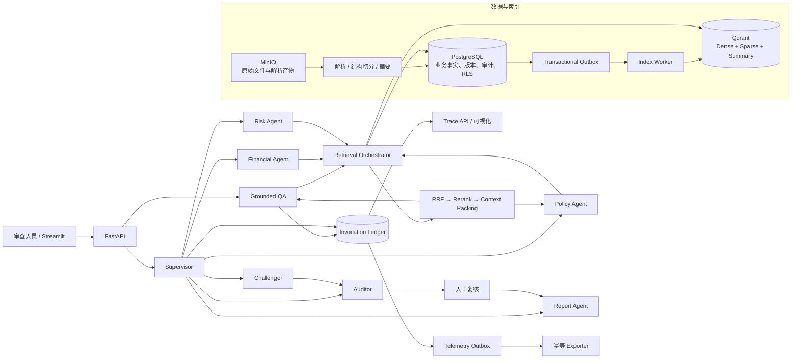

# CreditLens：面向小微企业授信预审业务的 RAG 系统原型

[](https://github.com/sanxiyusxy-droid/creditlens/actions/workflows/ci.yml)
[](https://www.python.org/)
[](https://fastapi.tiangolo.com/)

## 项目简介
CreditLens 关注的是授信审查过程中“**政策必须使用正确版本、历史审查不能偷看未来材料、任意财务数字必须可重算、冲突问题交给人工复核**”的问题。将分散在授信政策、监管文件、企业年报和财务事实中的信息组织为可追溯证据，
通过多路检索、中心化 Agent 编排、人工复核和完整调用 Trace，生成“有依据、可回放、
能拒答”的审查辅助结果。

> 本项目只使用合成数据，用于技术演示和面试交流。系统不自动作出授信、拒贷、定价、
> 额度或放款决定，最终结论必须由具备权限的人员复核。

## 项目亮点

| 能力 | 实现方式 | 解决的问题 |
|---|---|---|
| 深度 RAG | QuerySpec、Query Rewrite、Dense/Sparse/Summary/Exact 多路召回、RRF、精排、Context Packing | 单一向量检索容易漏掉专有名词、数字、跨文档证据和长文档深层条款 |
| 时点正确性 | `as_of_date`、`decision_cutoff_at`、`source_available_at`、版本有效期和 Snapshot | 防止历史审查误用未来政策或事后入库材料 |
| 证据闭环 | EvidenceRef、页码/段落定位、内容 Hash、PostgreSQL 回表复核、PDF 原文预览 | 避免模型引用不存在、越权或已失效的证据 |
| 中心化 Multi-Agent | Supervisor 固定 DAG 编排 Policy、Financial、Risk、Challenger、Auditor、Report 六类职责 | 将复杂审查拆成可控步骤，避免 Agent 自由协作导致流程和权限失控 |
| Grounded QA | 模型只生成受限 Claim 草稿，服务端校验证据白名单、数字、阈值方向和状态转换 | 技术失败、证据不足和业务拒答不再混为一类 |
| Human-in-the-loop | 阻断项、行锁、乐观锁、幂等键、冻结审批白名单 | AI 只提供审查辅助，关键决定保留人工责任边界 |
| 可审计调用链 | Invocation Ledger、Telemetry Outbox、RunEvent、Trace 完整性校验 | 可以回答“调用了什么、是否成功、证据从哪来、遥测是否送达” |
| 可复现评测 | 冻结数据集、稳定证据锚点、Git/语料/配置 Hash、Leakage 审计、消融实验 | 防止调参污染测试集、重复种子和历史结果冒充新评测 |

## 系统架构



### 一次审查如何运行

1. 上传材料后，系统保存不可变原始文件，解析标题层级、页码、段落和财务事实。
2. PostgreSQL 作为事实源提交文档版本和 Outbox；Index Worker 将可重建索引写入 Qdrant。
3. 问题先被解析为 QuerySpec，再生成多种查询表达，进入 Dense、Sparse、Summary 和 Exact 通道。
4. 候选在召回前执行租户、ACL、时点、版本和质量硬过滤，融合后再精排和打包上下文。
5. 专业 Agent 只能基于验证后的 Evidence 生成结构化中间结果；Challenger 主动寻找反证，
   Auditor 检查引用、数字和禁止结论。
6. 存在阻断项时流程进入 `HUMAN_REVIEW`；只有人工解决全部阻断项后才生成
   `APPROVED_DRAFT` 报告。
7. Model、Tool、RunEvent 和遥测投递状态可通过 Trace 页面回放。

## 一次任务如何完成
- Phase 1：材料入库
  - 用户上传尽调材料，FastAPI 接收后保存原件到 MinIO，PostgreSQL 保存文档版本、租户和案件、入库时间、用户权限等
  - 文档 Chunking，建立索引，生成 Dense 和 BM25 Sparse 向量
- Phase 2：创建任务
  - 用户点击“开始完整审查”，前端调用 [POST /api/v1/cases/{case_id}/runs]
  - FastAPI 检查：当前用户属于哪个租户、是否有权限访问、案件是否存在、参数是否合法
- Phase 3：Supervisor 创建任务上下文
  - 创建并冻结本次 Run 的上下文，如案件、产品、审查日期、材料截止时间等。
  - 冻结快照主要为了防止任务过程中上传了新文件，导致同一个 Run 前后可能看到不同材料的问题
  - Supervisor 按照固定的 DAG 调用子 Agent
- Phase 4：Policy 分析政策并检索得出结论
  - Policy 负责回答：适用哪个版本的政策、企业是否满足政策准入要求，查询时调用 Retrieval Orchestrator
  - Query → QuerySpec → Query Rewrite → Dense/Sparse/Summary/Exact → 时点、租户、案件过滤 → RRF → Rerank → Context Packing → Evidence
  - 最终生成结构化的结果 Claim：政策要求、当前结论、证据
- Phase 5：Financial 分析财务
  - 获取财务事实、计算指标、分析偿债能力等
  - 输出：指标、结果、计算公式、状态是否完整
- Phase 6：Risk：综合风险
  - 消费 Policy 和 Financial 的结构化结果，生成高风险观察
  - 比较指标和政策阈值，识别接近临界值的情况、生成风险点
- Phase 7：主动找反证
  - 专门寻找：是否存在相反证据、是否遗漏政策、财务数据是否互相矛盾、是否证据不足、是否有材料在审查截止事件之后入库
  - 如有反证会输出：发现潜在反证，虽然资产负债率满足政策阈值，但现金流和短期债务趋势可能削弱偿债能力，当前正面结论需要补充说明
- Phase 8：Auditor 门禁
  - 检查每一条 Claim 的：Evidence ID、案件和租户、时点、Hash、页码是否一致
- Phase 9：人工复核
  - 如果 Auditor 发现以下情况会进入 HUMAN_REVIEW：数据缺失；证据冲突；数字与引用不一致；存在无法自动解决的反证；模型输出越权决定；关键 Claim 证据不足
  - 并且前端显示阻断并输出建议动作
- Phase 10：Report 生成报告
  - Auditor 通过后消费已被批准的结构化内容，整理成报告
  - 系统还会为报告生成：报告版本；Canonical Hash；关联 Run；使用的 Evidence；人工复核记录
- Phase 11：Trace 记录全过程
  - 记录信息包括：调用 ID；Agent 类型；Model 或 Tool；父调用 ID；开始和结束时间；SUCCESS、FAILED、DENIED 或 CANCELLED；输入输出 HMAC 指纹；Token 和成本信息是否完整；Telemetry Outbox 是否成功投递

## 各个 Agent 的输入输出
| Agent | 输入 | 输出 |
|---|---|---|
| Supervisor | 案件、审查日期、截止时间、任务类型 | 执行计划、Run 状态、子任务调度 |
| Policy Agent | 产品、行业、政策证据 | 适用政策、准入条件、例外条款 |
| Financial Agent | 年报、财务事实、确定性公式 | 指标、趋势、数据质量问题 |
| Risk Agent | 政策结果、财务结果、其他证据 | 风险观察、待核实事项 |
| Challenger | 当前所有 Claim 和 Evidence | 反证、遗漏、冲突 |
| Auditor | Claim、Evidence、计算结果、反证 | PASS、NEEDS_REWORK、HUMAN_REVIEW |
| Report Agent | 已通过审核的结构化结果 | APPROVED_DRAFT 报告 |

## 技术栈

| 层次 | 选型 |
|---|---|
| API 与数据模型 | FastAPI、Pydantic v2 |
| 关系数据库 | PostgreSQL 16、SQLAlchemy 2、Alembic、Row Level Security |
| 向量与稀疏检索 | Qdrant Named Vectors、Dense Embedding、BM25/Jieba Sparse |
| 对象存储 | MinIO；离线模式可使用本地目录 |
| Agent 与模型适配 | 中心化 Supervisor DAG、OpenAI-compatible LLM/Embedding/Rerank Adapter |
| 前端演示 | Streamlit |
| 可靠性 | Transactional Outbox、幂等键、lease/reclaim、指数退避、dead-letter |
| 工程质量 | uv、Pytest、Ruff、Docker Compose、GitHub Actions |

## 快速开始

### 环境要求

- Windows PowerShell
- Python 3.12+
- [uv](https://docs.astral.sh/uv/)
- Docker Desktop（运行完整 PostgreSQL、Qdrant、MinIO 和 Redis 演示栈）

### 一键启动完整演示

```powershell
git clone https://github.com/sanxiyusxy-droid/creditlens.git
Set-Location creditlens
powershell -ExecutionPolicy Bypass -File scripts\start_demo.ps1
```

启动器依次完成：

- 校验本机 Docker Context，拒绝远程 Docker Daemon；
- 启动基础设施，但不删除已有 volume；
- 安装依赖，执行 Alembic、RLS 和最小权限角色校验；
- 幂等写入 3 个合成案件、8 个文档版本和财务事实；
- 校验 PostgreSQL、Qdrant、MinIO 的数据一致性；
- 启动 API，执行真实 TCP HTTP 演示验收；
- 启动 Streamlit 页面。

访问地址：

- 演示页面：<http://127.0.0.1:8501>
- API 文档：<http://127.0.0.1:8000/docs>
- 就绪检查：<http://127.0.0.1:8000/health/ready>

只执行环境准备和一致性检查：

```powershell
powershell -ExecutionPolicy Bypass -File scripts\start_demo.ps1 -BootstrapOnly
```

默认使用确定性的本地模型替代，不会把数据发送到外部模型服务。只有在已正确配置模型且明确
允许发送合成演示数据时，才使用：

```powershell
powershell -ExecutionPolicy Bypass -File scripts\start_demo.ps1 -UseConfiguredModels
```

## 演示路径

推荐按照 8–12 分钟五幕流程展示：

1. **政策时点切换**：同一个问题使用不同审查日期，命中不同版本的政策条款。
2. **深 RAG Trace**：展开 Query Rewrite、四路召回、候选拒绝、RRF、精排和 Context Packing。
3. **完整预审 DAG**：运行六职责 Agent，查看带 Evidence 的 Claim 和反证处理。
4. **证据与 HITL**：从结论返回 PDF 原文页，处理阻断项并生成审批后的报告草稿。
5. **调用审计**：查看 Model/Tool 终态、Invocation Ledger、Outbox 和 RunEvent。

详细话术见 [演示脚本](docs/演示脚本.md)。


## 主要 API

| 方法 | 路径 | 用途 |
|---|---|---|
| GET | `/health/live`、`/health/ready` | 存活和就绪检查 |
| GET | `/api/v1/cases/{case_id}` | 查询案件详情 |
| POST | `/api/v1/cases/{case_id}/questions` | 发起 Grounded QA |
| POST | `/api/v1/cases/{case_id}/runs` | 创建完整审查 Run |
| GET | `/api/v1/runs/{run_id}/events` | 获取执行事件 |
| POST | `/api/v1/runs/{run_id}/review-decisions` | 提交人工复核决定 |
| GET | `/api/v1/runs/{run_id}/report` | 获取审查报告草稿 |
| GET | `/api/v1/runs/{run_id}/trace` | 获取调用账本和 Trace 完整性 |
| GET | `/api/v1/evidence/preview` | 返回证据原文预览 |

## 评测结果

所有公开指标均来自合成数据，只用于比较方案和证明工程闭环，不代表真实银行业务效果。

### 检索消融

冻结 `frozen_v2` test split 包含 3 个案件、121 题，其中 110 题可答。正式三轮使用
bge-m3、bge-reranker-v2-m3、BM25/Jieba，并在 PostgreSQL 16 + Qdrant + RLS 业务角色环境运行。

| 配置 | Recall@10 | Recall@20 | MRR@10 |
|---|---:|---:|---:|
| Dense-only | 0.9545 | 0.9682 | 0.9485 |
| Dense + Sparse + RRF | 0.9561 | 0.9606 | 0.9016 |
| Dense + Summary | 0.7833 | 0.9682 | 0.7623 |
| 加入 QuerySpec Rewrite | 0.9515 | 0.9606 | 0.8712 |
| **全链路默认配置** | **0.9682** | **0.9909** | **0.8912** |

全链路相对 Dense-only 提升了深位证据覆盖，但增加了延迟且 MRR@10 更低；因此项目没有把
“模块更多”包装成“所有指标都更好”。Summary 单独召回效果较弱，只作为融合通道使用。
三轮独立 Leakage 审计均为 0。

### 答案层重评

`answer_eval_v1` 包含 3 个合成案件、41 题（30 可答、11 不可答）。当前 clean-commit
确定性评测结果：

| 指标 | 结果 |
|---|---:|
| Lexical Correctness | 16.67% |
| Key-point Recall | 29.09% |
| Numeric Accuracy | 23.53% |
| Citation Precision / Recall / F1 | 65.79% / 75.76% / 70.42% |
| Refusal Accuracy | 90.91% |
| Technical Failure | 4.88% |
| Forbidden Violation | 0 |

这里的 Citation F1 是“引用集合匹配度”，不是 Faithfulness；Lexical Correctness 也不是
语义正确率。完整限制、运行根目录和证据 Hash 见
[v1.6 演示闭环与评测实证](docs/v1.6_演示闭环与评测实证.md)。

### Multi-Agent 消融

项目执行了 6 个场景 × 4 个变体的确定性组件级消融：

| 变体 | 不支持结论拦截 | 反证处理 | 进入 HITL |
|---|---:|---:|---:|
| Full | 3/3 | 2/2 | 4/6 |
| 去 Challenger | 3/3 | 0/2 | 3/6 |
| 去 Auditor | 0/3 | 2/2 | 0/6 |
| Single Agent 基线 | 0/3 | 0/2 | 0/6 |

该实验用于解释 Challenger 和 Auditor 的职责差异，但它是
`DETERMINISTIC_COMPONENT_HARNESS`，没有执行外部 LLM、HTTP、数据库或完整 RAG，
不能当作端到端效果或线上延迟。

## 测试

运行静态检查和非集成测试：

```powershell
uv sync --group dev
uv run ruff format --check .
uv run ruff check .
uv lock --check --offline
uv run pytest -m "not integration" -q --timeout=180
```

运行真实 PostgreSQL/Qdrant/RLS 集成测试：

```powershell
powershell -ExecutionPolicy Bypass -File scripts\run_integration.ps1
```

最近一次 v1.6 候选验证：

- 非集成：673 passed、16 skipped、23 deselected；
- 真实栈：23 passed、23 deselected，0 skip/fail；
- GitHub PR 检查：lint、unit、integration 全部通过。

## 目录结构

```text
apps/
  api/                 FastAPI 服务
  demo/                Streamlit 演示与 HTTP Client
src/creditlens/
  agents/              六职责 Agent、Supervisor 和 Grounded QA
  retrieval/           QuerySpec、多路召回、RRF、精排、Context Packing
  ingestion/           上传、解析、结构切分、摘要和索引 Outbox
  evidence/            EvidenceRef 与原文预览
  observability/       Invocation Ledger、Telemetry Outbox、Exporter
  evaluation/          检索、答案、消融和 fail-closed 评测
  infrastructure/      PostgreSQL、Qdrant、MinIO、LLM Adapter
evaluation/
  datasets/            冻结评测集和稳定证据锚点
  schemas/             评测产物 JSON Schema
  reports/             可提交的历史评测报告
migrations/            Alembic 数据库迁移
scripts/               Bootstrap、Seed、验收、评测和运维脚本
tests/                 unit、security、e2e 和真实栈测试
```

## 安全与一致性设计

- PostgreSQL 是业务事实源，Qdrant 是可重建索引。
- 租户、案件、ACL、质量和时点约束在召回前硬过滤，不能只做降权。
- Qdrant 命中必须回 PostgreSQL 复核；失效候选记录明确的拒绝原因。
- `logical_key + version_label` 定义同一逻辑文档版本，Seed 可重复执行但不会制造重复材料。
- `source_available_at` 表示材料进入审查系统后最早可被使用的时间，防止历史 Run 被事后材料污染。
- Invocation 只保存必要元数据与 HMAC 指纹，不持久化 Prompt、模型原文、异常正文或 traceback。
- Outbox 使用 at-least-once 投递和 Invocation UUID 幂等键，不宣称 exactly-once。
- 数字证据错绑或模型生成越权授信决定时，系统 fail closed：转人工复核、Claim 标记
  `NEEDS_REWORK`，且不生成报告。

## 当前边界

CreditLens 是面向面试和技术验证的在线化原型，还不是生产系统：

- 没有接入真实银行 OIDC、组织权限和密钥管理平台；
- 异步任务仍以进程内执行为主，没有生产级持久任务队列和 Run reconciler；
- Telemetry Worker 默认关闭，生产环境仍需要独立 Worker 身份、Exporter、指标和告警；
- 尚未完成容量、压力、灾备和大规模并发测试；
- 合成数据评测不能替代真实业务回测、模型风险管理和合规审批。

## 文档导航

- [技术实现文档](CreditLens_技术实现文档.md)：需求、选型、数据模型、RAG 与 Agent 详细设计
- [v1.6 演示闭环与评测实证](docs/v1.6_演示闭环与评测实证.md)：命令、证据 Hash、结果和限制
- [进度报告](docs/进度报告.md)：版本历史、验收记录和剩余事项
- [面试演示脚本](docs/演示脚本.md)：8–12 分钟演示流程与常见追问
- [v1.5 调用账本与遥测投递](docs/v1.5_持久调用账本与遥测投递.md)
- [v1.4 语义盲审与调用观测](docs/v1.4_语义盲审与调用观测.md)

## 版本说明

项目代码版本为 `1.6.0`。本 README 面向当前 v1.6 候选能力；最终发布状态以
[GitHub Releases](https://github.com/sanxiyusxy-droid/creditlens/releases) 和 CI Badge 为准
